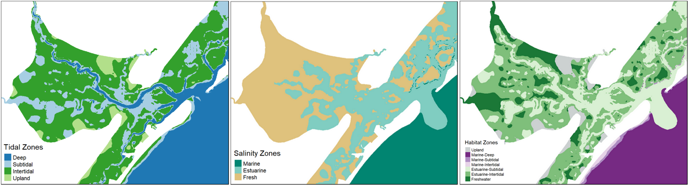

# Conceptualization

The foundation of ecological modeling is a clear conceptualization of the ecosystem and an approach for translating the conceptual model into a numerical representation. This chapter describes an overarching conceptual model for the ecosystems of the New York Bight. A strategy is then presented for assessing these ecosystems relative to a habitat-style modeling approach, where the quantity and quality of each ecosystem type are computed separately and combined into an index of ecosystem integrity (i.e., a "habitat unit"). 


## Conceptual Model

Conceptual ecological models are required for all USACE ecosystem restoration projects to increase understanding, identify potential alternatives, and facilitate team dialog [@fischenich_application_2008; @us_army_corps_of_engineers_assuring_2011]. These same benefits apply for assessing environmental effects of proposed coastal storm risk management actions. Additionally, conceptual models also inform and structure the development of quantitative ecological models [@grant_ecological_2008; @swannack_ecological_2012] such as the NYBEM. Conceptual models of the New York Bight were iteratively developed through the mediated workshops described in Section 2.3. Workshop ideas and content were synthesized with available literature, conceptual models of similar ecosystems (e.g., wetland function in Coastal Louisiana; @twilley_formulation_2004), and existing regional conceptual models [e.g., @montagna_conceptual_2013]. A seven step conceptual model development process was interactively applied as workshops proceeded (Table 3.1).

```{r echo=FALSE}
#Create empty table
Table3.1 <- as.data.frame(matrix(NA, nrow = 7, ncol = 2))
colnames(Table3.1) <- c("Step", "NYBEM Application")

#Specify rows of the table
Table3.1[1,] <- c("1. State the model objectives.", "Our numerical modeling objective is to articulate the mechanisms and magnitude of environmental effects of proposed coastal storm risk management actions in the New York Bight Ecosystem. This conceptual model is intended to communicate the overarching scope of model development to a broad audience.")
Table3.1[2,] <- c("2. Bound the system of interest.", "NYBEM is limited to the New York Bight Watershed with a seaward limit of a 20m depth contour. The models are further limited to aquatic ecosystems within the NJBB and HATS project areas. The NYBEM focuses only on effects to regional ecosystem, and other forms of environmental impacts (e.g., air quality, historic preservation) are addressed elsewhere in NEPA documentation.")
Table3.1[3,] <- c("3. Identify critical model components within the system.", "This overarching conceptual model focuses on key ecosystem types and system-wide connectivity. Patch-scale models are defined from a combined classification based on @cowardin_classification_1979, USFWS (1997), and @montagna_conceptual_2013. A series of workshops and literature search were then used to identify ecosystem-specific model components associated with habitat quality (Chapter 4).")
Table3.1[4,] <- c("4. Articulate relationships among model components.", "Only ecosystem types are presented, given the communication-driven purpose of this overarching model. More mechanistic conceptual models are presented for each ecosystem type in Chapter 4, which show connections between drivers and stressors, ecosystem states, and ecological outcomes.")
Table3.1[5,] <- c("5. Represent the conceptual model.", "A simple graphic representation of the conceptual model (Figure 3.1) was developed to facilitate communication between project team members, sponsors, partner agencies, and other interested parties.")
Table3.1[6,] <- c("6. Describe the expected pattern of behavior.", "The team qualitatively assessed the model along with potential gaps in ecosystem types and environmental impacts.")
Table3.1[7,] <- c("7. Test, review, and revise.", "This overarching conceptual model was developed, presented, and refined based on a series of modeling workshops over a three year timeframe.")

#Send output table
rownames(Table3.1) <- NULL
knitr::kable(Table3.1, caption="Stepwise development of the overarching NYBEM conceptual model (following steps in Fischenich 2008).")
```


Ultimately, multiple conceptual models were developed for the New York Bight with different purposes. We first developed an overarching conceptual model communicating how a mosaic of regional ecosystems function together at a system-scale, which is intended for broad use within both technical and non-technical audiences (Figure 3.1). Three overarching systems were identified to frame model development: (1) nearshore / marine ecosystems, (2) estuarine ecosystems, and (3) system connectivity between multiple ecosystem types. These systems were distinguished based on differences in ecosystem processes such as wave energy and salinity dynamics, likely effects of proposed management alternatives, and potential differences in modeling philosophy (e.g., habitat models for nearshore and estuarine systems and a network approach to connectivity). Cumulatively, these three categories provide a means of assessing nearshore and estuarine ecosystems at a patch-scale as well as a means of assessing system-scale outcomes associated with connectivity. Notably, freshwater non-tidal ecosystems were not included in this analysis, although sea level rise could ultimately affect these systems. The ecosystem types were derived from existing classifications as described below. In addition to this overarching model, mechanistic conceptual models were developed for each ecosystem type to guide quantitative model development (see Chapter 4), which are intended for technical audiences focused on the scientific details of ecological assessments. 


```{r, echo=FALSE, fig.cap="Overarching conceptual model for the New York Bight."}
knitr::include_graphics("ZZ_Fig03.01_NYBEM.ConModel.jpg")
```


## Major Ecosystem Types

Patch-scale assessments were developed for both the marine and estuarine ecosystems. Models were developed for each of six major ecosystem types (Table 3.2). These ecosystems are defined from a combined classification based on multiple sources, namely:

- @cowardin_classification_1979 and FGDC (2013): This seminal work and the associated update differentiate wetland types and deepwater habitats. The reports define deepwater limits as all permanently flooded areas for marine and estuarine systems and 2.5m below low water for freshwater systems. The marine-estuarine boundary is classified based on multiple factors, including salinity greater than 30 ppt "with little or no dilution except outside the mouths of estuaries" and geographic factors such as "an imaginary line closing the mouth of a river, bay, or sound". The estuarine-freshwater boundary extends "upstream and landward to where ocean-derived salts measure less than 0.5 ppt during the period of average annual low flow". 
- Coastal and Marine Ecological Classification Standard ([CMECS](https://iocm.noaa.gov/standards/cmecs-home.html)): CMECS classifies ecosystems based on aquatic and biogeographic settings. The aquatic setting is defined relative to salinity, depth, and tidal zones. The estuarine-marine boundary is define at the mouth of the estuary as "an imaginary line connecting the seaward-most points of land that enclose the estuarine water mass at MLLW". The freshwater-estuarine boundary is defined as the "tidally influenced part of the estuary [that] may occur in a fresh reach where salinity is <0.5 [PSUs]". Depth and tidal limits are defined relative to intertidal and subtidal limits as well as open waters up to 4m depth. The biogeographic setting is defined by regional setting, and a series of increasingly detailed filters related to water column, geoform, substrate, and biotic components. The New York Bight's biogeography can generally be described from its location in the temperate Northern Atlantic region, but detailed data were unavailable to map and forecast system types based on the more detailed filters.  
- @us_fish_and_wildlife_service_usfws_significant_1997: The USFWS definitions for the New York Bight provide a more regionally specific view of habitat types. The "nearshore" ecosystem is defined by a 20m depth contour for the ocean, and extend landward to watershed divides. The estuarine-marine and freshwater-estuarine boundaries are defined as 30 ppt and 0.5 ppt, respectively.  
- NY/NJ Port Habitat Functional Assessment Model (USACE 2020): This suite of models was developed to assess environmental impacts associated with the NY/NJ Harbor Deepening Program. The models define two habitat types. First, a "permanently submerged shallow subtidal zone, which comprises the depth range from 0 to 6 feet below Mean Lower Low Water (MLLW)". Second, an intertidal zone comprising the "depth range between MLLW and Mean Higher High Water (MHHW)".

Salinity and tidal range were used to differentiate six ecosystems, both of which can change under futures with and without management actions. While other analyses have developed ecosystem-scale assessments and models based on similar or more refined divisions in physical properties (e.g., CMECS,  @clough_modeling_2016), the current criteria represent a compromise between the need for detailed assessment of the type and location of infrastructure impacts, and the need for a readily implementable rule set applicable at the broad spatial scale of the NYBEM. The tidal/depth and salinity thresholds were chosen based on a combination of the systems described above. For instance, a 2m depth contour represented a compromise between 2.5 m recommended by @cowardin_classification_1979 and 6 feet (1.83m) used in USACE (2020). Similarly, salinity zones were classified based on a 10th percentile salinity (i.e., 90% exceedence) to represent the "period of average annual low flow" identified by @cowardin_classification_1979. However, the threshold of 30 PSU was adjusted to 28 PSU to align with "an imaginary line connecting the seaward-most points of land that enclose the estuarine water mass at MLLW" (CMECS). Figure 3.2 shows a representative outcome of these thresholds for Great Egg Inlet, New Jersey, which is described in more detail in Chapter 6.3.


```{r echo=FALSE}
#Create empty table
Table3.2 <- as.data.frame(matrix(NA, nrow = 3, ncol = 4))
colnames(Table3.2) <- c("Tidal Limits", "Marine (Salinity >= 28psu)", "Estuarine (Salinity = 0.5 to 28psu)", "Freshwater (Salinity <= 0.5psu)")

#Specify rows of the table
Table3.2[1,] <- c("Deepwater (-2m to -20m)", "Marine, Deep", "Estuarine, Subtidal", "Freshwater")
Table3.2[2,] <- c("Subtidal (MLLW to -2m)", "Marine, Subtitdal", "Estuarine, Subtidal", "Freshwater")
Table3.2[3,] <- c("Intertidal (MHHW to MLLW)", "Marine, Intertidal", "Estuarine, Intertidal", "Freshwater")

#Send output table
rownames(Table3.2) <- NULL
knitr::kable(Table3.2, caption="Definition of NYBEM ecosystem types. Cowardin et al. (1979) define the marine-estuarine salinity transition based on a period of average annual low flow, which we define here as a 90% exceedence probability (or 10th percentile salinity).") 
```


```{r, echo=FALSE, fig.cap="Demonstration of habitat zonation functions for delineating ecosystems based on tidal range, salinity, and the combined assessment for habitat types in the area surrounding the Great Egg Inlet, New Jersey."}

```

## Habitat-Style Modeling Philosophy

Dozens of ecological modeling tools focus on coastal ecosystems. These models vary based on factors such as disciplinary perspective (e.g., hydrologic, geomorphic, ecological), the level of ecological hierarchy addressed (e.g., individuals, populations, communities, ecosystems), the basic approach to modeling (e.g., statistical, theoretical), input requirements (e.g., few parameters vs. extensive geospatial layers), the treatment of time and space (e.g., lumped vs. distributed), and the degree of development (e.g., long history vs. ad hoc). However, multiple gaps in these tools are the driving motivation for developing the New York Bight Ecological Model (NYBEM). 

- *Comprehensive view of regional ecosystems*: Many existing ecological models focus on a subset of regional ecosystems (e.g., estuarine subtidal, but not marine subtidal) or focal taxa (e.g., fish, but not seagrass). The large spatial scope of the USACE study requires seamless landscape coverage of the study areas, as well as a consistent approach for assessing multiple ecosystem types simultaneously.

- *Connection to USACE management actions*: Existing tools often emphasize important physical forcings on ecosystems without a direct connection to USACE's proposed project action. For instance, a model may include marsh response to sea level rise, but be unable to incorporate marsh response to sea level rise in the presence of a storm surge barrier.  

- *Indirect effects*: Models often emphasize direct changes at a site-scale rather than indirect effects of off-site changes. For instance, a model may assess habitat quality associated with substrate, but be unable to link to changes in substrate as a result of distant infrastructure effects (e.g., a storm surge barrier).

- *System-wide data*: Many valuable ecological tools have been developed at small spatial scales based on detailed site data (e.g., vegetation surveys or field assessment procedures). However, the extremely large scale of these projects makes field data collection infeasible given time and resource limits, and NYBEM inputs must be available for the entire model extent. 

- *Rapid and phased application*: The USACE studies are assessing project outcomes within limited analytical timeframes. Therefore certain tools that might be applicable on longer time horizons (i.e., years) are not feasible in these short periods (i.e., months).

Given these challenges, the NYBEM seeks to build from the wide breadth of existing knowledge and models to develop a comprehensive set of tools that are directly applicable to the unique needs of planning USACE coastal storm risk management projects. The NYBEM draws from two distinct modeling approaches that are applicable at different scales. First, six patch-scale models are developed here, which use an index-based modeling philosophy assessing the quantity and quality of a given ecosystem type. Second, system-scale models will be developed in the future, which apply network-analytic methods to assess organismal connectivity. This report documents only the patch-scale models applicable in the six ecosystems shown in Table 3.2.

The NYBEM takes a common approach to ecological modeling based on quantity and quality of habitat. “Index” models [@swannack_ecological_2012] were originally developed for species-specific habitat applications (e.g., slider turtles), but the general approach has also been adapted to guilds (e.g., salmonids), communities (e.g., floodplain vegetation), and ecosystem processes (e.g., the Hydrogeomorphic Method). An index-based modeling approach is used for multiple reasons. First, index models directly respond to changes in physical properties and provide a clear link to changes in ecosystem quantity and quality resulting from future conditions with and without proposed actions. Second, index-based models align well with a phased model development approach. Third, index-based models are familiar to USACE decision-makers from diverse applications in other regions such as Louisiana coastal restoration (i.e., the Wetland Value Assessment), California bay restoration (i.e., East San Pedro Bay), and Gulf Coast harbor expansion (i.e., Mobile Bay). Notably, these examples each assess multiple habitat types (e.g., oyster, seagrass) and aggregate outcomes into an overall metric of ecological impacts or benefits.


In NYBEM, the quantity and quality of each ecosystem type are assessed separately. For instance, ecosystem extent and habitat quantity is rapidly delineated from modeled hydrodynamic conditions. Ecosystem quality is then assessed based on patch-specific data and known thresholds in ecological response (e.g., on a normalized 0 to 1 scale indicating ecological quality or function). The product of habitat quality and quantity provides a consistent metric across ecosystem types (i.e., “habitat units”). Here, the terms "habitat" and "ecosystem" are used synonymously to indicate a given location or patch on the landscape.

