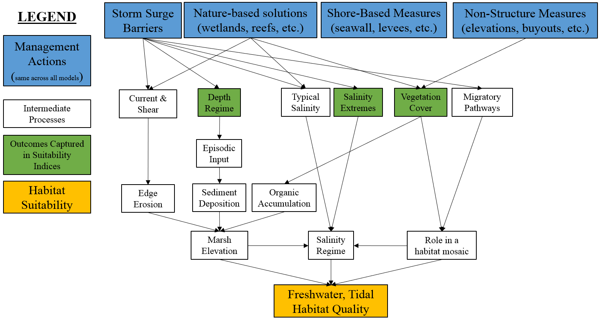

## Freshwater, Tidal Zone


Tidal freshwater marshes are found in the topmost region of the estuary where the entry of saltwater from tidal action is mitigated by a significantly higher amount of freshwater from upstream. These unique environments are highly influenced by inflows of freshwater and sediment from rivers. Salt concentrations in tidal freshwater are typically less than 0.5 psu, although larger salinity pulses can occur during spring tides or periods of extremely low river discharge.

Tidal freshwater marshes provide significant nesting sites for a variety of species, including the marsh wren and other organisms dwelling in emergent vegetation. Sea-level rise pushes additional salinity into these systems, causing vegetation to shift and some tidal freshwater marshes to become oligohaline wetlands. Many migratory fish species also rely on this habitat as key resting and stopover areas during migration [@pasternack_biogeomorphology_2000]. Mussels, sturgeon, herring, and marsh wren are some of the taxa of greatest management focus in this ecosystem.

Figure 4.2 presents a conceptual model of the freshwater, tidal ecosystem. In general, this ecosystem can be thought of as strongly driven by marsh elevations and salinity regimes as well as its role as a key transitional habitat between freshwater and saltwater systems. Marsh elevations are governed by interlinked dynamics related to edge erosion, sediment deposition, and organic matter accretion. Salinity regimes are affected by the complex interplay of coastal connectivity and freshwater flows. Migratory processes can be thought of relative to physical barriers affecting pathways (e.g., culverts, tide gates) as well as the value of any given patch for supporting migration via resting and foraging. 

```{r, fig.cap="Conceptual model for the freshwater, tidal submodel."}

```


Within NYBEM, three general metrics are used to reflect these complex dynamics (Figure 4.3): salinity, vegetation cover, and sediment deposition. Salinity concentration influences many chemical and physical ecological processes within the tidal freshwater ecosystem and supports euryhaline organisms. Emergent vegetation coverage provides habitat, mitigates inland flooding, affects organic matter accretion, and supports water quality within the tidal freshwater ecosystem. Water depth fluctuations support sediment deposition that bring an influx of inorganic sediment and organic nutrients into the ecosystem to mitigate against sea level change. The overall habitat suitability of the freshwater, tidal zone may then be aggregated into a single metric via an arithmetic mean of suitability indices for these three metrics.

$I_{fresh.tid} = \frac{salinity + veg.cover + deposition}{3}$ 

Where $I_{fresh.tid}$ is an overarching index of ecosystem quality for the freshwater, tidal zone, $salinity$ is a suitability index relative to salinity, $veg.cover$ is a suitability index relative to vegetative cover, and $deposition$ is a suitability index relative to episodic deposition of sediment. All indices are quality metrics scaled from 0 to 1, where 0 is unsuitable and 1 is ideal.


```{r echo=FALSE, fig.width=8, fig.height=8, fig.cap="Suitability index curves for the freshwater, tidal zone."}
#Create data frame with freshwater tidal submodel
NYBEM.fresh.tid <- data.frame(matrix(NA,nrow=4,ncol=6))
colnames(NYBEM.fresh.tid) <- c("salinity.per", "salinity.SIV", "veg.cover.per", "veg.cover.SIV", 
                             "deposition", "deposition.SIV")
NYBEM.fresh.tid$salinity.per <- c(0, 20, 100, NA)
NYBEM.fresh.tid$salinity.SIV <- c(1, 0, 0, NA)
NYBEM.fresh.tid$veg.cover.per <- c(0, 57, 100, NA)
NYBEM.fresh.tid$veg.cover.SIV <- c(0.1, 0.5, 1, NA)
NYBEM.fresh.tid$deposition <- c(1, 2, 5, NA)
NYBEM.fresh.tid$deposition.SIV <- c(0, 1, 1, NA)

##########
#Create summary figure for fresh.tid submodel
par(mfrow=c(2,2), cex=1.0)

  #salinity.per
  plot(NYBEM.fresh.tid$salinity.per, NYBEM.fresh.tid$salinity.SIV, xlim=c(0,100), ylim=c(0,1), type="l",
       xlab="Salinity duration (%time greater than 0.5 psu)", ylab="Suitability Index (salinity)")
  abline(h=seq(0,1,0.1), lty=3)
  points(NYBEM.fresh.tid$salinity.per, NYBEM.fresh.tid$salinity.SIV, pch=19, cex=2)
  lines(NYBEM.fresh.tid$salinity.per, NYBEM.fresh.tid$salinity.SIV, lwd=3)
  
  #veg.cover.per
  plot(NYBEM.fresh.tid$veg.cover.per, NYBEM.fresh.tid$veg.cover.SIV, xlim=c(0,100), ylim=c(0,1), type="l",
       xlab="Vegetation Cover (%)", ylab="Suitability Index (veg.cover)")
  abline(h=seq(0,1,0.1), lty=3)
  points(NYBEM.fresh.tid$veg.cover.per, NYBEM.fresh.tid$veg.cover.SIV, pch=19, cex=2)
  lines(NYBEM.fresh.tid$veg.cover.per, NYBEM.fresh.tid$veg.cover.SIV, lwd=3)
  
  #deposition
  plot(NYBEM.fresh.tid$deposition, NYBEM.fresh.tid$deposition.SIV, xlim=c(0,5), ylim=c(0,1), type="l",
       xlab="Relative Depth", ylab="Suitability Index (deposition)")
  abline(h=seq(0,1,0.1), lty=3)
  points(NYBEM.fresh.tid$deposition, NYBEM.fresh.tid$deposition.SIV, pch=19, cex=2)
  lines(NYBEM.fresh.tid$deposition, NYBEM.fresh.tid$deposition.SIV, lwd=3)
  

```


### Salinity

Freshwater tidal wetlands are regularly flooded marshes and swamps with water that is less saline than brackish. The salinity of the water varies from totally fresh to oligohaline (0 psu to 0.5 psu). Salinity influences physical and chemical processes such as flocculation and the amount of dissolved oxygen (DO) in the water column, as well as the types of organisms that reside in a freshwater tidal ecosystem. Hurricanes and other storms may bring brackish water into the system, which is a significant natural disturbance. Because many plant species in these wetlands are not tolerant to brackish conditions, vegetation can be harmed as a result of these occurrences. 

For NYBEM, the salinity regime is summarized through a metric of the percent of time salinity is greater than the freshwater tidal ecosystem threshold of 0.5 psu. These plant communities cannot withstand long periods of increased salinity (over 0.5 ppt). However, this approach assumes that although saltwater inputs serve as disturbance, some amount of saltwater input can stimulate marshes. Salinity may be computed or measured over an annual or multi-annual period. These data may then be summarized as an “exceedence curve” with thresholds from 0-100% in 10% intervals. This exceedence curve may then be used to calculate the percent of time salinity is greater than or equal to 0.5 psu. 

```{r echo=FALSE, eval=FALSE}
#Examples of exceedence duration calculation
exceedence <- seq(0,100,10)

salinity.ex1 <- c(0, 0, 0, 0, 0, 0, 0, 0, 1, 2, 5)
100-approx(salinity.ex1, exceedence, xout = 0.5, method = "linear", rule = 2, ties = "ordered")$y

salinity.ex2 <- c(0, 0, 1, 1.2, 1.4, 2, 3, 4, 5, 6, 7)
100-approx(salinity.ex2, exceedence, xout = 0.5, method = "linear", rule = 2, ties = "ordered")$y

salinity.ex3 <- c(0, 0, 0, 0.1, 0.2, 0.3, 0.4, 0.45, 0.5, 0.6, 0.8)
100-approx(salinity.ex3, exceedence, xout = 0.5, method = "linear", rule = 2, ties = "ordered")$y

```

This duration metric is then translated into a suitability metric as follows:

$$salinity.high.dur = \begin{pmatrix} 0.05*sal_{dur} & sal_{dur}=0-20\\
1.0 & sal_{dur}=20-100
\end{pmatrix}$$

Where $salinity.high.dur$ is a suitability index relative to high salinity periods and $sal_{dur}$ is the percent of time salinity is greater than the threshold for freshwater tidal habitat (i.e., salinity > 0.5 psu).


### Vegetation Cover

Freshwater tidal marshes are characterized by the dominance of herbaceous, shrubby, or emergent aquatic vegetation, with little tree canopy. Emergent vegetation coverage plays a crucial role in the ecosystem. For avian taxa like the marsh wren, reproductive appropriateness may be determined by the relative availability of emergent plants for nesting birds (Gutzwiller and Anderson 1987). Vegetation coverage within a freshwater marsh also provides crucial habitat to a variety of other unique animals and organisms. Further, excessively moist or dry periods can cause additional stress to vegetation leaving the habitat susceptible to a salt intrusion event which can destroy vegetation and make the habitat totally unsuitable. 

For the NYBEM tidal freshwater ecosystem submodel, vegetation cover is quantified as the percentage of emergent aquatic vegetation. Emergent aquatic vegetation is a key habitat resource for species found within this ecosystem like marsh wren, and marsh wren are a key indicator species of ecosystem health because they are drawn to ideal wetland conditions. These important avian taxa rarely breed in marshes with less than 57% emergent vegetation [@gutzwiller_habitat_1987], which is used as a threshold for declines (and increases) in ecosystem condition. However, marshes can continue to provide ecological functions even at low levels of vegetation cover, so ecosystem condition only declines to 0.1 for vegetation cover of 0% (following the example of CWPPRA 2007). The cover metric should be computed relative to a "neighborhood effect" of surrounding patches, which would be indicative of the general condition of the area surrounding the marsh patch.  

$$veg.cover = \begin{pmatrix} 0.0070*cover_{per}+0.10 & cover_{per}=0-57\\
0.0116*cover_{per}-0.16 & cover_{per}=57-100
\end{pmatrix}$$ 

Where $veg.cover$ is a suitability index relative to vegetation coverage and $cover_{per}$ is the percent of vegetation coverage.


### Episodic Sediment Deposition

Tidal oscillations control the short-term dynamics of freshwater tidal wetlands, which feed nutrients into the environment and make them more fruitful and productive than some non-tidal wetlands [@propato_evaluating_2018]. These tidal oscillations, as well as irregular weather events, deposit sediment and nutrients into the ecosystem. Increased inundation depths in tidal freshwater marshes can lead to more inorganic sediment deposition, which can assist tidal wetlands keep up with rising sea levels. As a result, marshes can migrate vertically to preserve their position in the tidal frame to some extent. 

This metric in NYBEM seeks to capture the benefits of episodic deposition of sediment relative to those of tidal flooding. Episodic sediment deposition requires large magnitude flooding events beyond typical tidal inundation. As such, we developed a metric to assess the relative difference in depth beyond the common tidal datum of MHHW (see equation below). This relative depth metric is one when flood magnitude is equal to MHHW, and the metric increases as flood magnitude increases beyond MHHW. The metric cannot be less than one because the maximum flood is, by definition, greater than a regularly occurring datum.

$$H_{rel} = \frac{H_{max} - H_{median}}{H_{MHHW} - H_{median}}$$ 

Where $H_{rel}$ is a relative depth metric assessing the role of episodic floods, $H_{max}$ is the maximum depth observed over a period of record, $H_{median}$ is the median depth observed over a period of record, and $H_{MHHW}$ is the depth at mean higher high water.

The relationship between relative depth and habitat suitability is shown below. We assume that low values of this metric lead to less sediment deposition and are therefore less preferred, and higher values are more ideal. Suitability levels off beyond $$H_{rel}=2.0$$ because of a potential for extremely large storms to induce erosion rather than deposit sediment. 

$$deposition = \begin{pmatrix} H_{rel}-1.0 & H_{rel}=1-2\\
1.0 & H_{rel}=2-5
\end{pmatrix}$$ 

Where $deposition$ is a suitability index relative to episodic sediment deposition and $H_{rel}$ is the change in depth in meters.


### Potential extension of freshwater, tidal model

Freshwater, tidal ecosystems are complex, dynamic environments, and this NYBEM submodel provides a simple proxy for the relative integrity of these environments. Future improvements to this modeling approach could include the following:  

- Organic matter accretion is important in freshwater tidal ecosystem, particularly for marsh adaptation under sea level change (@schile_modeling_2014). Accretion is characterized as the accumulation of plant material, including roots and degraded material, from plants growing in the marsh, as well as growth via deposition of suspended particles during floods (@schile_modeling_2014). Accretion rates are becoming a more common practice in sea level rise adaptation tools (e.g., @morris_responses_2002;@propato_evaluating_2018).  
-Edge erosion can also provide a key mechanism of marsh loss in some systems, and this process could be incorporate through hydrodynamic outputs or proxies such as fetch (@morris_responses_2002;@propato_evaluating_2018).  
- Within NYBEM, freshwater tidal areas currently include all depth ranges of freshwater systems (e.g., large rivers, marshes, etc.). An important area of model improvement could arise through a more depth stratified approach to assessing freshwater tidal systems.
