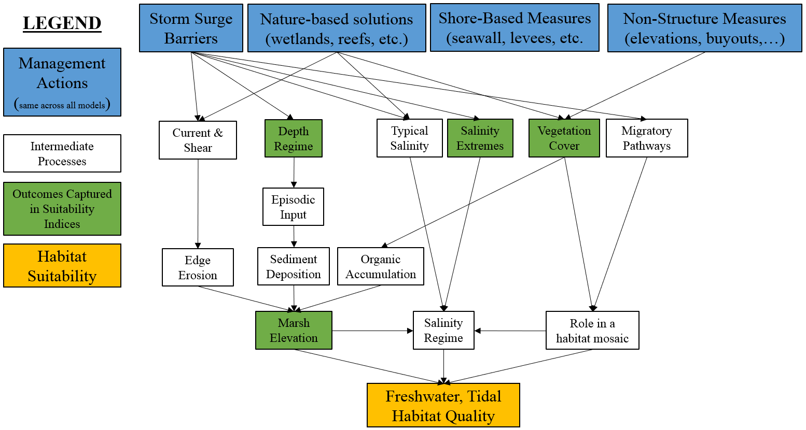

## Freshwater, Tidal Submodel (fresh.tid)


Freshwater marshes are found in the topmost region of the estuary zone, from New York to North Carolina, where the entry of saltwater from tidal action is mitigated by a significantly higher amount of freshwater from upstream. These unique environments are ideally developed from sediments deposited by inflows from major freshwater rivers. Salt concentrations in tidal freshwater are typically less than 0.5 ppt, although larger salinity pulses can occur during spring tides or periods of extremely low river discharge.

Tidal freshwater marshes provide significant nesting sites for a variety of species, including the marsh wren, and offer the primary habitat for emergent aquatic plants. Chronic sea-level rise is pushing the salt gradient upstream in rivers around the Atlantic Coast, causing vegetation to shift and some tidal freshwater marshes to become oligohaline wetlands. Many migratory (diadromous) fish species also rely on this habitat system, which is characterized by tidally impacted freshwater systems (Passernak). Mussels, sturgeon, herring, and marsh wren are some of the species that live in this zone along with many micro-organisms.

The ability for the tidal freshwater ecosystem to support these various organisms can be modeled using salinity, vegetation coverage, episodic sediment deposition, and edge accretion parameters. Salinity concentration influences many chemical and physical ecological processes within the tidal freshwater ecosystem and supports euryhaline organisms. Emergent vegetation coverage provides habitat, mitigates inland flooding, and supports water quality within the tidal freshwater ecosystem. Water depth fluctuations support sediment deposition that bring an influx of organic nutrients into the ecosystem and mitigates sea-level rise. These quantifiable parameters all have influences on ecosystem services and habitat suitability within a tidal freshwater ecosystem. 

Figure XX presents a conceptual model of the freshwater, tidal ecosystem. This ecosystem is strongly influenced by effects on marsh elevations, salinity regimes, and the role of the system as a migratory corridor. 




The overall habitat suitability of the freshwater, tidal zone may then be aggregated into a single metric via an arithmetic mean of suitability indices for these four metrics.


$I_{fresh.tid} = \frac{salinity + veg.cover + deposition + edge.change}{4}$ 

Where $I_{fresh.tid}$ is an overarching index of ecosystem quality for the freshwater, tidal zone, $salinity$ is a suitability index relative to salinity, $veg.cover$ is a suitability index relative to vegetative cover, $deposition$ is a suitability index relative to episodic deposition of sediment, and $edge.change$ is a suitability index relative to edge accretion. All indices are quality metrics scaled from 0 to 1, where 0 is unsuitable and 1 is ideal.


```{r echo=FALSE, fig.width=8, fig.height=8}
#Create data frame with freshwater tidal submodel
NYBEM.fresh.tid <- data.frame(matrix(NA,nrow=4,ncol=8))
colnames(NYBEM.fresh.tid) <- c("salinity.per", "salinity.SIV", "veg.cover.per", "veg.cover.SIV", 
                             "deposition", "deposition.SIV", "edge.change.m", "edge.change.SIV")
NYBEM.fresh.tid$salinity.per <- c(0, 10, 30, NA)
NYBEM.fresh.tid$salinity.SIV <- c(1, 1, 0, NA)
NYBEM.fresh.tid$veg.cover.per <- c(50, 57, 100, NA)
NYBEM.fresh.tid$veg.cover.SIV <- c(0, 0.5, 1, NA)
NYBEM.fresh.tid$deposition <- c(0, 1, 2, 5)
NYBEM.fresh.tid$deposition.SIV <- c(0, 1, 0, 0)
NYBEM.fresh.tid$edge.change.m <- c(0, 10, 30, 100)
NYBEM.fresh.tid$edge.change.SIV <- c(1, 0.8, 0.5, 0)

##########
#Create summary figure for fresh.tid submodel
par(mfrow=c(2,2), cex=1.0)

  #salinity.per
  plot(NYBEM.fresh.tid$salinity.per, NYBEM.fresh.tid$salinity.SIV, xlim=c(0,30), ylim=c(0,1), type="l",
       xlab="Salinity (%deviation)", ylab="Suitability Index (salinity)")
  abline(h=seq(0,1,0.1), lty=3)
  points(NYBEM.fresh.tid$salinity.per, NYBEM.fresh.tid$salinity.SIV, pch=19, cex=2)
  lines(NYBEM.fresh.tid$salinity.per, NYBEM.fresh.tid$salinity.SIV, lwd=3)
  
  #veg.cover.per
  plot(NYBEM.fresh.tid$veg.cover.per, NYBEM.fresh.tid$veg.cover.SIV, xlim=c(0,100), ylim=c(0,1), type="l",
       xlab="Vegetation Cover (%)", ylab="Suitability Index (veg.cover)")
  abline(h=seq(0,1,0.1), lty=3)
  points(NYBEM.fresh.tid$veg.cover.per, NYBEM.fresh.tid$veg.cover.SIV, pch=19, cex=2)
  lines(NYBEM.fresh.tid$veg.cover.per, NYBEM.fresh.tid$veg.cover.SIV, lwd=3)
  
  #deposition
  plot(NYBEM.fresh.tid$deposition, NYBEM.fresh.tid$deposition.SIV, xlim=c(0,5), ylim=c(0,1), type="l",
       xlab="Depth (m)", ylab="Suitability Index (deposition)")
  abline(h=seq(0,1,0.1), lty=3)
  points(NYBEM.fresh.tid$deposition, NYBEM.fresh.tid$deposition.SIV, pch=19, cex=2)
  lines(NYBEM.fresh.tid$deposition, NYBEM.fresh.tid$deposition.SIV, lwd=3)
  
  #edge.change.m
  plot(NYBEM.fresh.tid$edge.change.m, NYBEM.fresh.tid$edge.change.SIV, xlim=c(0,100), ylim=c(0,1), type="l",
       xlab="Change in Bed Elevation (%)", ylab="Suitability Index (edge.change)")
  abline(h=seq(0,1,0.1), lty=3)
  points(NYBEM.fresh.tid$edge.change.m, NYBEM.fresh.tid$edge.change.SIV, pch=19, cex=2)
  lines(NYBEM.fresh.tid$edge.change.m, NYBEM.fresh.tid$edge.change.SIV, lwd=3)

```


### Salinity

Freshwater tidal wetlands are marshes and swamps with water that is less saline than brackish and is flooded on a regular lunar or irregular wind tidal basis. The salinity of the water varies from oligohaline to totally fresh (0 ppt to 0.5 ppt). 

Salinity influences physical and chemical processes such as flocculation and the amount of dissolved oxygen (DO) in the water column, as well as the types of organisms that reside in a freshwater tidal ecosystem. Hurricanes and other storms may bring brackish water into them, which is a significant natural disturbance. Because many plant species in these wetlands are not tolerant to brackish conditions, much of the vegetation is harmed as a result of these occurrences. 

The NYBEM tidal freshwater sub model relies on a percent in deviation of salinity regime to represent change in tidal inundation and freshwater flow input across the ecosystem.  As the percentage of deviation from the baseline salinity regime increases, habitat suitability for taxa within the estuarine intertidal ecosystem will decrease. When there are zero changes in salinity regime the HSI (habitat suitability index) is equal to 1. As the percent in deviation of salinity regime increases from 10% to 30%, the HSI will decrease from 1 to 0. 

$$salinity = \begin{pmatrix} 1.0 & salinity_{per}=0-10\\
-0.05*salinity_{per}+1.5 & salinity_{per}=10-30\\
0.0 & salinity_{per}>30
\end{pmatrix}$$ 

Where $salinity$ is a suitability index relative to salinity and $salinity_{per}$ is the percent increase in salinity over the existing condition.

### Vegetation Coverage

Freshwater Tidal Marshes are characterized by the dominance of herbaceous, shrubby, or emergent aquatic vegetation, with only a slight canopy of trees. Emergent vegetation coverage plays a crucial role in the tidal freshwater ecosystem. For avian taxa like the marsh wren, cover/reproduction appropriateness must be determined by the relative availability of emergent plants for nesting marsh wrens (Gutzwiller and Anderson 1987). Microorganisms frequently occupy headwater marshes because they are contiguous with tidal creeks and contain an abundance of emergent vegetation (Rozas).

Vegetation coverage within a freshwater marsh provides crucial habitat to a variety of unique animals and organisms. Vegetation within a tidal freshwater marsh is mainly brackish and cannot withstand long periods of increased salinity (over 0.5 ppt). Further, excessively moist or dry periods can cause additional stress to vegetation leaving the habitat susceptible to a salt intrusion event which can destroy vegetation and make the habitat totally unsuitable. 

For the NYBEM tidal freshwater ecosystem submodel, vegetation coverage is quantified as the percentage of emergent aquatic vegetation. Emergent aquatic vegetation is a key habitat resource for species found within this ecosystem like marsh wren. Marsh wren are a key indicator species of ecosystem health because they are drawn to ideal wetland conditions. These important avian taxa are highly territorial and have a minimum habitat area of 50% emergent vegetation coverage (@gutzwiller_habitat_1987). Marsh wrens rarely breed in marshes with less than 57% emergent vegetation (@gutzwiller_habitat_1987). As a result, if there is less than this quantity of wetland habitat (emergent vegetation), the HSI is presumed to be 0. Vegetation coverage is a vital parameter of habitat suitability within a tidal freshwater ecosystem.


$$veg.cover = \begin{pmatrix} 0.0 & cover_{per}=0-50\\
0.0714*cover_{per}-3.57 & cover_{per}=50-57\\
0.0116*cover_{per}-0.16 & cover_{per}=57-100
\end{pmatrix}$$ 

Where $veg.cover$ is a suitability index relative to vegetation coverage and $cover_{per}$ is the percent of vegetation coverage.


### Episodic Sediment Deposition

Tidal oscillations control the short-term dynamics of freshwater tidal wetlands, which feed nutrients into the environment and make them more fruitful and productive than most non-tidal wetlands (@propato_evaluating_2018). These tidal oscillations and irregular weather events deposit sediment and nutrients into the ecosystem. 

Increased inundation in tidal freshwater marshes leads to more inorganic sediment deposition, which can assist tidal wetlands keep up with rising sea levels. As a result, marshes can migrate vertically to preserve their position in the tidal frame to some extent. In contrast, tidal freshwater ecosystems are frequently coupled with complicated geometry, such as a meandering channel with uneven depth and cross-section. Because of the complicated geometry and huge fluctuations in freshwater discharge, there are strong seasonal variations in depth, which might affect pollution transfer and algae development. When the depth of water within the ecosystem increases, it’s more susceptible to HABs, pollution, and habitat degradation.

The relationship between sediment deposition and water level rise can be used to quantify habitat suitability within the freshwater tidal ecosystem. When water depth increases, sediment deposition will be at an optimal level to support tidal freshwater habitat. For the NYBEM Model, HSI equals 0.8 when water depth increases by 1 meter. When there is no increase in water depth, HSI equals zero because there is minimal episodic deposition.

$$deposition = \begin{pmatrix} depth_{m} & depth_{m}=0-1\\
-depth_{m}+2 & depth_{m}=1-2\\
0.0 & depth_{m}>2
\end{pmatrix}$$ 

Where $deposition$ is a suitability index relative to episodic sediment deposition and $depth_{m}$ is the change in depth in meters.


### Edge Accretion

Salt marsh accretion is characterized as the accumulation of plant material, including roots and degraded material, from plants growing in the marsh, as well as growth via deposition of suspended particles during floods (allochthonous growth) (autochthonous growth)(@schile_modeling_2014). This submodel draws from the Marsh Equilibrium Model (MEM) to predict habitat suitability from the change in marsh platform elevation (@morris_responses_2002). Many tidal freshwater ecosystems have survived despite a rise in sea level, with tidal marsh heights remaining constant under freshwater circumstances, but future anticipated increases in relative sea-level rise might outpace marsh accretion rates, potentially resulting in the loss of these elevation-dependent coastal ecosystems (@schile_modeling_2014). 

In SLAMM, marsh erosion is exclusively modeled at the marsh-to-open-water interface, and erosion occurs only if fetch is sufficient. As a result, marshes have been proven to be less sensitive to this parameter than accretion parameters (MEM)(SLAMM)(@morris_responses_2002)(@propato_evaluating_2018). This is why for the freshwater tidal ecosystem submodel edge accretion is used in place of edge erosion. Edge Accretion is quantified through percent change in marsh platform elevation. As the marsh platform deviates in baseline elevation, habitat suitability will decrease because the marsh will experience more edge accretion. When the marsh platform experiences 100% change in elevation HSI equals 0. The key outputs are change in elevation above mean sea-level from 0%-100% deviation, and associated HSI for edge accretion.


$$deposition = \begin{pmatrix} -0.02*elev_{m}+1 & elev_{m}=0-10\\
-0.015*elev_{m}+0.95 & elev_{m}=10-30\\
-0.0071*elev_{m}+0.71 & elev_{m}=30-100
\end{pmatrix}$$ 

Where $deposition$ is a suitability index relative to episodic sediment deposition and $elev_{m}$ is the percent change in marsh elevation.


### fresh.int Code

Numerical code for assessing habitat quality (<span style="color: red;">Dougherty and McKay to write.</span>)


```{r echo=TRUE}
#Load ecorest
library(ecorest)

#Test mar.int with ecorest
fresh.tid.test <- c(20, 80, 1.5, 40)
ecorest::SIcalc(NYBEM.fresh.tid, fresh.tid.test)

```


### Future Extension of fresh.tid

(<span style="color: red;">ADD NOTES HERE.</span>)

