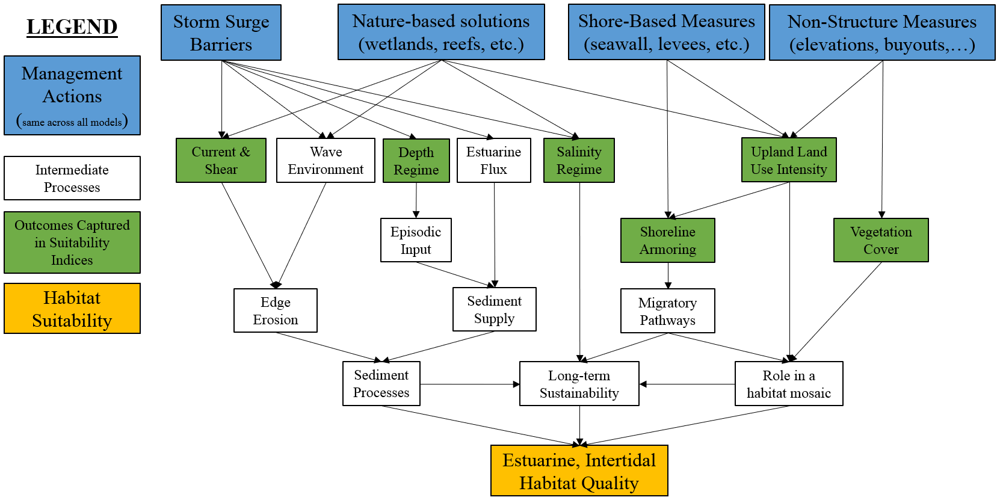

## Estuarine, Intertidal Zone


Estuarine environments include marine water that has been diluted by freshwater input to varying degrees [@prosser_impacts_2018]. Intertidal ecosystems are found between high and low tide, and thus experience varying influences from both upland and aquatic drivers and stressors. The estuarine intertidal ecosystem considers areas with salinity values from 0.5 to 30 psu and elevation from MHHW to MLLW. 

Tidal marshes are vegetated intertidal ecosystems found at the land-sea interface that serve as crucial transition zones for marine, freshwater, and terrestrial processes [@colombano_climate_2021]. Their location exposes them to a number of environmental factors (e.g., ocean currents, watershed hydrology) and environmental gradients (e.g., salinity)[@lauchlan_species_2020]. Figure 4.4 presents a general conceptual model of this system. Generally speaking, the function of these systems is highly related to sediment processes like edge erosion and episodic deposition, long-term shifts in salinity, and the role of these systems as transitional ecotones from fresh-salt water and upland-aquatic.

```{r, fig.cap="Conceptual model for the estuarine, intertidal submodel."}

```


Within NYBEM, five metrics are used to reflect the condition of these systems related to edge erosion, vegetative cover, episodic sediment deposition, development of adjacent uplands, and the presence/absence of shoreline armoring. The overall habitat suitability of the estuarine, intertidal zone may then be aggregated into a single metric via an arithmetic mean of suitability indices for these five metrics.

$I_{est.int} = \frac{erosion + veg.cover + deposition + upland + shoreline}{5}$ 

Where $I_{est.int}$ is an overarching index of ecosystem quality for the marine intertidal zone, $erosion$ is a suitability index relative to the edge erosion, $veg.cover$ is a suitability index relative to vegetative cover, $deposition$ is a suitability index relative to episodic sediment deposition, $upland$ is a suitability index relative to adjacent upland land uses, and $shoreline$ is a suitability index relative to shoreline armoring. All indices are quality metrics scaled from 0 to 1, where 0 is unsuitable and 1 is ideal.

```{r echo=FALSE, fig.width=8, fig.height=12, fig.cap="Suitability index curves for the estuarine, intertidal zone."}
#Create data frame with est.int submodel
NYBEM.est.int <- data.frame(matrix(NA,nrow=3,ncol=10))
colnames(NYBEM.est.int) <- c("erosion", "erosion.SIV",
                             "veg.cover.per", "veg.cover.SIV", "deposition", "deposition.SIV", 
                             "land.use.per", "land.use.SIV", "shoreline.m", "shoreline.SIV")
NYBEM.est.int$erosion <- c(-50, 10, 50)
NYBEM.est.int$erosion.SIV <- c(1, 1, 0)
NYBEM.est.int$veg.cover.per <- c(0, 100, NA)
NYBEM.est.int$veg.cover.SIV <- c(0.1, 1, NA)
NYBEM.est.int$deposition <- c(0, 1, NA)
NYBEM.est.int$deposition.SIV <- c(1, 0, NA)
NYBEM.est.int$land.use.per <- c(0, 50, 100)
NYBEM.est.int$land.use.SIV <- c(1, 1, 0)
NYBEM.est.int$shoreline.m <- c(0, 100, 500)
NYBEM.est.int$shoreline.SIV <- c(0.5, 1, 1)

##########
#Create summary figure for mar.int submodel
par(mfrow=c(3,2), cex=1.0)
  
  #erosion
  plot(NYBEM.est.int$erosion, NYBEM.est.int$erosion.SIV, xlim=c(-50,50), ylim=c(0,1), type="l",
       xlab="Percent Change in Velocity from Existing", ylab="Suitability Index (erosion)")
  abline(h=seq(0,1,0.1), lty=3)
  points(NYBEM.est.int$erosion, NYBEM.est.int$erosion.SIV, pch=19, cex=2)
  lines(NYBEM.est.int$erosion, NYBEM.est.int$erosion.SIV, lwd=3)
  
  #veg.cover.per
  plot(NYBEM.est.int$veg.cover.per, NYBEM.est.int$veg.cover.SIV, xlim=c(0,100), ylim=c(0,1), type="l",
       xlab="Vegetation Cover (%)", ylab="Suitability Index (veg.cover)")
  abline(h=seq(0,1,0.1), lty=3)
  points(NYBEM.est.int$veg.cover.per, NYBEM.est.int$veg.cover.SIV, pch=19, cex=2)
  lines(NYBEM.est.int$veg.cover.per, NYBEM.est.int$veg.cover.SIV, lwd=3)
  
  #deposition
  plot(NYBEM.est.int$deposition, NYBEM.est.int$deposition.SIV, xlim=c(0,1), ylim=c(0,1), type="l",
       xlab="Relative Depth", ylab="Suitability Index (deposition)")
  abline(h=seq(0,1,0.1), lty=3)
  points(NYBEM.est.int$deposition, NYBEM.est.int$deposition.SIV, pch=19, cex=2)
  lines(NYBEM.est.int$deposition, NYBEM.est.int$deposition.SIV, lwd=3)
  
  #land.use.per
  plot(NYBEM.est.int$land.use.per, NYBEM.est.int$land.use.SIV, xlim=c(0,100), ylim=c(0,1), type="l",
       xlab="Developed Area within 100m (%)", ylab="Suitability Index (land.use)")
  abline(h=seq(0,1,0.1), lty=3)
  points(NYBEM.est.int$land.use.per, NYBEM.est.int$land.use.SIV, pch=19, cex=2)
  lines(NYBEM.est.int$land.use.per, NYBEM.est.int$land.use.SIV, lwd=3)
  
  #shoreline.m
  plot(NYBEM.est.int$shoreline.m, NYBEM.est.int$shoreline.SIV, xlim=c(0,500), ylim=c(0,1), type="l",
       xlab="Distance to Armored Shoreline (m)", ylab="Suitability Index (shoreline)")
  abline(h=seq(0,1,0.1), lty=3)
  points(NYBEM.est.int$shoreline.m, NYBEM.est.int$shoreline.SIV, pch=19, cex=2)
  lines(NYBEM.est.int$shoreline.m, NYBEM.est.int$shoreline.SIV, lwd=3)

```

### Edge Erosion

Marsh sediment budgets are a geographically integrated measure of opposing constructive and destructive forces: a surplus of sediment can lead to vertical growth and/or lateral expansion, while a shortfall can lead to drowning and/or lateral contraction [@ganju_spatially_2017]. Many estuarine marshes face sediment deficits along the shoreline as a result of increased edge erosion. Edge degradation causes morphological changes that make it easier for waves to propagate to the marsh borders and promote the resuspension and export of sediments from the estuary [@li_wave-driven_2019].

A relative change in velocity from a baselin condition is used as a proxy for more complex edge erosion processes. This assumes that all things being equal, if currents and velocities increase significantly then erosion is likely to increase as well. We assume that any increase in average velocity beyond 10% is detrimental, and that increases beyond 30% would fundamentally alter the character of a given marsh.

$$erosion = \begin{pmatrix} 1.0 & vel_{delta}<10\\
-0.05*vel_{delta}+1.5 & vel_{delta}=10-30\\
0.0 & vel_{delta}>30
\end{pmatrix}$$

Where $erosion$ is a suitability index relative to edge erosion and $vel_{delta}$ is the percent change in velocity relative to a baseline condition.


### Vegetation Cover

Vegetation provides various ecological services within the estuarine intertidal ecosystem, including providing a fish nursery environment, food for migratory birds, nutrient cycling, carbon storage, and sediment stability. Therefore reductions of vegetative cover can have a significant impact on system functionality. The loss of vegetative cover changes the dynamics in locations that were formerly vegetated. This loss transforms huge areas of the estuary from a deposition and accretion-friendly environment to one that favors suspension and erosion. For estuaries, high amounts of suspended particles and sediment-associated nutrients create a variety of environmental management issues [@cotton_effects_2006]. 

For the NYBEM, habitat suitability increases as the percentage of vegetative cover increases throughout the habitat. We adopt a comparable suitability curve from the Wetland Value Assessment in the Gulf Coast. When vegetative cover is equal to 100 percent, the estuarine intertidal ecosystem will have a high suitability value (greater than 90%).

$$veg.cover = 0.9*cover_{per}+0.1$$ 

Where $veg.cover$ is a suitability index relative to vegetation cover and $cover_{per}$ is the percent of vegetation coverage.


### Episodic Sediment Deposition

Estuaries are efficient sediment traps. Marine materials are deposited from the continental shelf into estuarine, littoral habitats. Due to disparities in tidal currents (ebb versus flood tide), sediments are carried to supply sediment on varying time frames. In the estuarine intertidal ecosystem, sediment transport capacity is mostly determined by river discharge, by the timing of discharge events in relation to the spring–neap cycle, and subtidal oscillations in sea level [@prosser_impacts_2018]. 

Periodic flood and storm events are major drivers in sediment dynamics and contribute disproportionately to the total sediment discharge [@ralston_sediment_2013]. During these episodes of retreating salinity intrusions and increasing bed pressures, sediment deposition episodes can induce considerable bed resuspension in the estuary. The duration of high-discharge episodes in relation to the estuarine reaction time, a feature that fluctuates seasonally with discharge and estuarine length, also affects sediment transport capacity  [@palinkas_sediment_2014]. These short-term events can cause changes in the local biological community and affect seabed stability and strength. 

These event then affect sediment mixing and activation, as well as tides, which affect water infiltration and exfiltration through the sediment [@nancy_jackson_armoring_2010]. During storms, erosion of the shoreline can result in the removal of material from the upper foreshore and deposition on the lower foreshore, or the foreshore moving horizontally landward. In coastal and estuary environments across the world, harmful algal blooms (HABs) have substantial economic, public health, and ecological consequences. The influx of additional nutrients following an episode of sediment deposition have been known to cause harmful algal blooms (HABs)[@ralston_temperature_2014]. Further, the frequent upturn of sediment can displace biological organisms. For example, horseshoe crabs are significantly affected by the above mentioned foreshore processes caused by episodic storms. 

The relationship between sediment deposition and water level rise can be used to quantify habitat suitability within the esturarine intertidal ecosystem. When water level increases, sediment deposition will be at an optimal level to support esturarine intertidal habitat. Episodic sediment deposition requires large magnitude flooding events beyond typical tidal inundation. As such, we develop a metric to assess the relative difference in depth beyond the common tidal datum of MHHW (see equation below). This relative depth metric goes to zero when there is no flooding beyond MHHW, and the metric equals one when flood magnitude is equal to MHHW. This metric provides a relative accounting for the variances in depth across the ecosystem. 

$$H_{rel} = \frac{H_{MHHW} - H_{median}}{H_{max} - H_{median}}$$ 
Where $H_{rel}$ is a relative depth metric assessing the role of episodic floods, $H_{max}$ is the maximum depth observed over a period of record, $H_{median}$ is the median depth observed over a period of record, and $H_{MHHW}$ is the depth at mean higher high water.

The relationship between relative depth and habitat suitability is shown below. We assume that low values of this metric lead to more sediment deposition and are therfore preferred, and higher values are less ideal. 

$$deposition = -H_{rel}+1$$ 

Where $deposition$ is a suitability index relative to episodic sediment deposition and $H_{rel}$ is the change in depth in meters.

### Developement of Adjacent Upland

The development of uplands within a watershed can have a direct and indirect impact on a variety of essential aspects in estuarine intertidal ecosystems. The combination of coastal erosion and upland development causes a “coastal squeeze,” in which low-lying, intertidal regions, that would usually recede inland in the face of sea-level rise, are diminished because man-made structures (e.g. shoreline armoring) prevent such retreat [@prosser_impacts_2018]. This means that tidal marshes will need to shift upslope onto nearby uplands to survive during a period of rapid sea-level rise. Land management methods on the tidal marsh's upland border can help or hinder ecosystem migration in response to increasing sea levels [@anisfeld_upslope_2017].

For the NYBEM, habitat suitability is modeled as a function of urban development for adjacent uplands. When the percentage of adjacent urban land uses is greater than 50%, habitat suitability in the estuarine intertidal ecosystem declines. When the development of adjacent upland reaches 100% of the estuarine intertidal ecosystem, the habitat is no longer be considered suitable. 

$$land.use = \begin{pmatrix} 1.0 & urban_{per}=0-50\\
-0.02*urban_{per}+2 & urban_{per}=50-100
\end{pmatrix}$$ 

Where $land.use$ is a suitability index relative to adjacent upland land uses and $urban_{per}$ is the percent of adjancent upland in developed (i.e., urban) land uses within 500m.

### Shoreline Armoring 

Natural biological processes and human-induced changes to the estuarine intertidal shoreline boundary are considered as components to a complex ecological system. The mean high-tide line is commonly used to determine shoreline boundaries and extent [@kittinger_shoreline_2010]. Shoreline modification called armoring has resulted in a considerable loss of coastal ecosystems from erosion, as well as a reduction in the resilience of these systems to disturbance [@kittinger_shoreline_2010]. Shoreline armoring involves placing hardened structures like bulkheads and revetments along the shoreline and as sea levels rise, these structures can prevent coastal marshes from spreading upland over time [@gardner_is_2021]. 

Armoring is widespread throughout the United States, with extensive armoring found near urban areas [@morley_ecological_2012]. Shoreline armoring occupies 50-70% of shorelines along urban coastal areas [@dugan_generalizing_2018]. Increasing shoreline development pressure and predicted sea-level rise suggest that the demand for shoreline armoring will continue to rise and expand throughout the future [@gardner_is_2021]. Shoreline armoring is correlated with decreased habitat complexity, and a reduction in connectivity to adjacent habitats [@morley_ecological_2012].

The environmental consequences of armoring are context dependent, relying on characteristics of the environment and armoring structural factors [@dugan_generalizing_2018]. The type of structure placed (e.g., seawalls, bulkheads, revetments) and its relative placement on the coast profile will influence the biological reactions to armoring. Estuarine intertidal habitats that lack shoreline armoring have increased habitat suitability. For the NYBEM, the distance to the nearest armored shoreline is used as a proxy to predict the ability for multiple taxa to use the shoreline as migratory pathways. 


$$shoreline = \begin{pmatrix} 0.05*dist_{armor}+0.5 & dist_{armor}=0-100m\\
1.0 & dist_{armor}>100m
\end{pmatrix}$$ 

Where $shoreline$ is a suitability index relative to shoreline armoring and $dist_{armor}$ is the distance to the nearest armored shoreline in meters.


### Potential extension of estuarine, intertidal models 

Estuarine, intertidal ecosystems are incredibly well-studied environments, and many methods exist for assessing this system. NYBEM combines a few common metrics to obtain a general representation of ecosystem condition. However, future analyses could be expanded to include the following:  

- Field-based protocols (e.g., Bartoldus 1994, McKinney et al. 2009ab, Raposa et al. 2018) are available for this system, and methods could be adapted to incorporate field-style processes into models through remote sensing or proxy variables.  
- The intertidal zone could be further subdivided to capture differences in tidal flats, low marsh, high marsh, and other subdivisions of this important ecosystem.  

