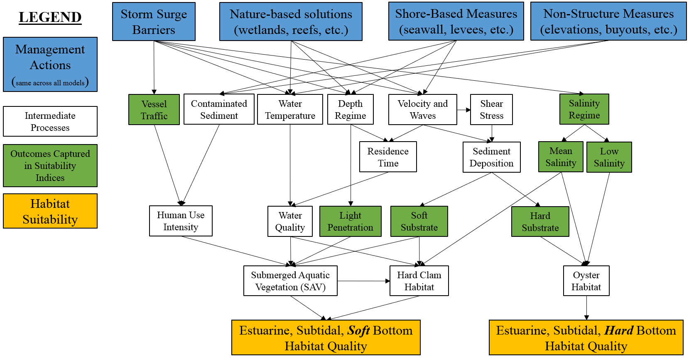

## Estuarine, Subtidal Zone


This section presents development of the estuarine, subtidal submodel. Estuarine subtidal habitat was defined as areas with elevations between MLLW and -20m with salinities ranging from 0.5 to 30 psu. In general, this submodel seeks to capture the general condition and trajectory of the estuarine subtidal habitat using three different taxa (oysters, submerged aquatic vegetation/SAV, and clams) as indicators of ecosystem quality, each of which provides critical contributions to the overall quality of the ecosystem. 

A conceptual model of the estuarine subtidal habitat was developed at a mediated modeling workshop (Appendix A). The conceptual model represented the major components affecting the quality of the ecosystem, and three main categories of drivers were identified: physical (water quality, velocity, sedimentation), anthropogenic (vessel traffic and development stress), and biological (SAV, benthic organisms, fish) with interactions among the categories. Conceptual models were then refined in two key ways (Figure 4.6). First, it was assumed that essential fish habitat would be present if oysters, SAV, and clams were present, so this variable was removed. Second, substrate type is a major driver of SAV, oysters, and clams and became a point of stratification within the model. The ecosystem was coarsely divided into hard bottom and soft bottom habitats roughly correlated with oysters and SAV/clams, respectively. The unique characteristics and drivers of these habitats led to splitting the estuarine subtidal sub-model into modules for each of these substrate types. 


```{r, fig.cap="Conceptual model for the estuarine, subtidal submodel."}

```

The model was split into hard and soft bottom habitats (`est.sub.hard` and `est.sub.soft`, respectively). Hard bottom substrates are crucial for oyster reef establishment and recruitment. Historically, this region was extremely wide distribution of hard bottom substrate, but anthropogenic influences on water quality, sedimentation, and overfishing have reduced the extent significantly. Here, we use a historical map of oyster reef extent as a proxy for hard bottom with the assumption that hard substrate is relatively immobile and these locations would likely have higher potential for oyster reestablishment. 


### Hard Bottom Habitats


Oysters are a major indicator of the integrity of hard bottom habitats in the New York Bight, and the hard bottom submodel is represented by an _adaptation_ of the Oyster Habitat Suitability Index Model (OHSIM, @swannack_robust_2014). The OHSIM is a USACE-certified model for the Eastern oyster (_Crassostrea virginica_). OHSIM is a spatially-explicit, grid-based index model that uses a series of linear equations to calculate habitat suitability for _C. virginica_. The model consists of four variables: (1) hard substrate or cultch, (2) mean salinity during spawning season, in which spawning and spat set have a higher optimal salinity than for survival of adults, (3) annual mean salinity, which is the expected range over which adult oysters are viable, and (4) minimum annual salinity, which defines the impacts of high mortality events resulting from lower salinities due to freshwater influxes [@soniat_understanding_2012]. Variables are briefly described below, and more details can be found in @swannack_robust_2014 and USACE model certification reports. 

For the NYBEM, spawning season salinity data were not available, so only three variables are used. The overall habitat suitability of the estuarine, subtidal, hard bottom ecosystem is aggregated into a single metric via a geometric mean of these three suitability indices (following the OHSIM).

$I_{est.sub.hard} = {(cultch * sal.min.ann * sal.mean.ann)}^{1/3}$ 

Where $I_{est.sub.hard}$ is an overarching index of ecosystem quality for the estuarine, subtidal, hard bottom habitats, $cultch$ is a suitability index relative to hard bottom composition, $sal.min.ann$ is a suitability index relative to minimum annual salinity, and $sal.mean.ann$ is a suitability index relative to mean annual salinity. All indices are quality metrics scaled from 0 to 1, where 0 is unsuitable and 1 is ideal.


```{r echo=FALSE, fig.width=8, fig.height=8, fig.cap="Suitability index curves for hard bottom habitats in the esturaine, subtidal zone."}
#Create data frame with est.sub.hard submodel
NYBEM.est.sub.hard <- data.frame(matrix(NA,nrow=9,ncol=6))
colnames(NYBEM.est.sub.hard) <- c("cultch", "cultch.SIV",  
                             "MAS", "MAS.SIV", "AS", "AS.SIV")
NYBEM.est.sub.hard$cultch <- c(0, 100, NA, NA, NA, NA, NA, NA, NA)
NYBEM.est.sub.hard$cultch.SIV <- c(0, 1, NA, NA, NA, NA, NA, NA, NA)
NYBEM.est.sub.hard$MAS <- c(0, 2, 4, 6, 8, 40, NA, NA, NA)
NYBEM.est.sub.hard$MAS.SIV <- c(0, 0, 0.05, 0.5, 1, 1, NA, NA, NA)
NYBEM.est.sub.hard$AS <- c(0, 5, 10, 15, 20, 25, 30, 40, NA)
NYBEM.est.sub.hard$AS.SIV <- c(0, 0, 1, 1, 0.6, 0.25, 0.1, 0, NA)

##########
#Create summary figure for mar.int submodel
par(mfrow=c(2,2), cex=1.0)

  #cultch
  plot(NYBEM.est.sub.hard$cultch, NYBEM.est.sub.hard$cultch.SIV, xlim=c(0,100), ylim=c(0,1), type="l",
       xlab="Hard Substrate (%)", ylab="Suitability Index (cultch)")
  abline(h=seq(0,1,0.1), lty=3)
  points(NYBEM.est.sub.hard$cultch, NYBEM.est.sub.hard$cultch.SIV, pch=19, cex=2)
  lines(NYBEM.est.sub.hard$cultch, NYBEM.est.sub.hard$cultch.SIV, lwd=3)
  
  #MAS
  plot(NYBEM.est.sub.hard$MAS, NYBEM.est.sub.hard$MAS.SIV, xlim=c(0,40), ylim=c(0,1), type="l",
       xlab="Minimum Annual Salinity (psu)", ylab="Suitability Index (MAS)")
  abline(h=seq(0,1,0.1), lty=3)
  points(NYBEM.est.sub.hard$MAS, NYBEM.est.sub.hard$MAS.SIV, pch=19, cex=2)
  lines(NYBEM.est.sub.hard$MAS, NYBEM.est.sub.hard$MAS.SIV, lwd=3)
  
  #AS
  plot(NYBEM.est.sub.hard$AS, NYBEM.est.sub.hard$AS.SIV, xlim=c(0,40), ylim=c(0,1), type="l",
       xlab="Annual Mean Salinity (psu)", ylab="Suitability Index (AS)")
  abline(h=seq(0,1,0.1), lty=3)
  points(NYBEM.est.sub.hard$AS, NYBEM.est.sub.hard$AS.SIV, pch=19, cex=2)
  lines(NYBEM.est.sub.hard$AS, NYBEM.est.sub.hard$AS.SIV, lwd=3)

```

#### Oyster Substrate

Cultch is hard substrate that provides points of attachment and recruitment for spat. Substrate is represented as the percent of the bottom covered with hard substrate, such as existing reefs, or other hard surfaces. We assume that oyster habitat suitability increases linearly from 0 to 100% cultch cover. 

$$cultch = 0.01*hard_{per}$$ 

Where $cultch$ is a suitability index relative to hard bottom composition and $hard_{per}$ is the percent of the substrate that is hard bottom.

#### Minimum Annual Salinity

Per @swannack_robust_2014, Minimum Annual Salinity (MAS) is the minimum value of the 12 monthly mean salinities. This variable is essential to describe freshwater impacts (e.g., freshets, high rainfall years, or freshwater diversions) on oysters and is analogous to the frequency of killing floods variable used by @cake_habitat_1983. For NYBEM, we use a representative low salinity (i.e., the tenth percentile, $sal_{10}$) rather than a minimum of monthly average. The relationship between MAS and its suitability index is formulated as a linear step-function as follows: 

$$sal.min.ann = \begin{pmatrix} 0.0 & MAS=0-2\\
0.025*MAS-0.05 & MAS=2-4\\
0.225*MAS-0.85 & MAS=4-6\\
0.250*MAS-1.00 & MAS=6-8\\
1.0 & MAS>8
\end{pmatrix}$$ 

Where $sal.min.ann$ is a suitability index relative to minimum annual salinity, $MAS$ is the minimum value of the 12 monthly mean salinities, and $sal_{10}$ is the tenth percentile of an annual time series of salinity values, a proxy for MAS.

#### Annual Mean Salinity

Annual Mean Salinity (AS) represents the range of salinities over which adult oysters are viable [@cake_habitat_1983]. The relationship between AS and its suitability index is formulated as a linear step-function as follows:

$$sal.mean.ann = \begin{pmatrix} 0.0 & AS=0-5\\
0.2*AS-1.00 & AS=5-10\\
1.00 & AS=10-15\\
0.08*AS-2.2 & AS=15-20\\
0.07*AS-2.0 & AS=20-25\\
0.03*AS-1.0 & AS=25-30\\
0.01*AS-0.4 & AS=30-40\\
0.0 & AS>40
\end{pmatrix}$$ 

Where $sal.mean.ann$ is a suitability index relative to mean annual salinity and $AS$ is the mean annual salinity.


### Soft Bottom Habitats


Estuarine, subtidal soft bottom habitats comprise large portions of the study areas and host a variety of taxa of interest to environmental management. Specifically, submerged aquatic vegetation (SAV) beds and hard clams are key targets of management. However, these two outcomes have different ecological drivers. As such, the soft bottom model represents a hybridized approach that attempts to assess the general condition of this habitat type relative to both major outcomes. 

Habitat suitability is assessed separately for SAV and hard clams. The overall habitat suitability of the estuarine, subtidal, soft bottom ecosystem is aggregated into a single metric via a maximum of the separate suitability indices. This approach assumes that a given patch does not need to be perfect for both taxa simultaneously, but instead, the habitat could have high quality relative to one or the other outcome.

$I_{est.sub.soft} = max({I_{sav},I_{clam})}$ 

Where $I_{est.sub.soft}$ is an overarching index of ecosystem quality for the estuarine, subtidal, soft bottom habitats, $I_{sav}$ is a suitability index relative to submerged aquatic vegetation, and $I_{clam}$ is a suitability index relative to hard clams. All indices are quality metrics scaled from 0 to 1, where 0 is unsuitable and 1 is ideal.

#### Submerged Aquatic Vegetation Module

The SAV model is represented by three variables critical for growth and reproduction of seagrass, (1) substrate, (2) light availability, and (3) development stress. Suitability scores are represented either as discrete categories or as step functions with linear interpolations between steps. 

$I_{sav} = \frac{substrate.sav + light + vessel.density}{3}$ 

Where $I_{sav}$ is an overarching index of ecosystem quality relative to submerged aquatic vegetation, $substrate.sav$is a suitability index relative to fine substrate, $light$ is a suitability index relative to light penetration, and $vessel.density$ is a suitability index relative to boat traffic and human uses (a proxy for development stress). All indices are quality metrics scaled from 0 to 1, where 0 is unsuitable and 1 is ideal.

```{r echo=FALSE, fig.width=8, fig.height=8, fig.cap="Suitability index curves for seagrass in soft bottom habitats in the esturaine, subtidal zone."}
#Create data frame with est.sub.hard submodel
NYBEM.est.sub.soft.sav <- data.frame(matrix(NA,nrow=4,ncol=6))
colnames(NYBEM.est.sub.soft.sav) <- c("substrate.sav", "substrate.sav.SIV", "light.PLA", "light.SIV",
                                      "vessel.density", "vessel.density.SIV")
NYBEM.est.sub.soft.sav$substrate.sav <- c(0, 70, 100, NA)
NYBEM.est.sub.soft.sav$substrate.sav.SIV <- c(1, 1, 0, NA)
NYBEM.est.sub.soft.sav$light.PLA <- c(0, 10, 22, NA)
NYBEM.est.sub.soft.sav$light.SIV <- c(0, 0, 1, NA)
NYBEM.est.sub.soft.sav$vessel.density <- c(0, 1000, 10000, NA)
NYBEM.est.sub.soft.sav$vessel.density.SIV <- c(1, 1, 0.1, NA)

##########
#Create summary figure for est.sub.soft submodel
par(mfrow=c(2,2), cex=1.0)

  #substrate.sav
  plot(NYBEM.est.sub.soft.sav$substrate.sav, NYBEM.est.sub.soft.sav$substrate.sav.SIV, xlim=c(0,100), ylim=c(0,1), type="l",
       xlab="Fine Substrate Composition (%)", ylab="Suitability Index (substrate.sav)")
  abline(h=seq(0,1,0.1), lty=3)
  points(NYBEM.est.sub.soft.sav$substrate.sav, NYBEM.est.sub.soft.sav$substrate.sav.SIV, pch=19, cex=2)
  lines(NYBEM.est.sub.soft.sav$substrate.sav, NYBEM.est.sub.soft.sav$substrate.sav.SIV, lwd=3)
  
  #light.PLA
  plot(NYBEM.est.sub.soft.sav$light.PLA, NYBEM.est.sub.soft.sav$light.SIV, xlim=c(0,40), ylim=c(0,1), type="l",
       xlab="Percent of Light Available (%)", ylab="Suitability Index (light)")
  abline(h=seq(0,1,0.1), lty=3)
  points(NYBEM.est.sub.soft.sav$light.PLA, NYBEM.est.sub.soft.sav$light.SIV, pch=19, cex=2)
  lines(NYBEM.est.sub.soft.sav$light.PLA, NYBEM.est.sub.soft.sav$light.SIV, lwd=3)
  
  #vessel.density
  plot(NYBEM.est.sub.soft.sav$vessel.density, NYBEM.est.sub.soft.sav$vessel.density.SIV, xlim=c(0,10000), ylim=c(0,1), type="l",
       xlab="Total Vessel Usage (tracks/year)", ylab="Suitability Index (vessel.density)")
  abline(h=seq(0,1,0.1), lty=3)
  points(NYBEM.est.sub.soft.sav$vessel.density, NYBEM.est.sub.soft.sav$vessel.density.SIV, pch=19, cex=2)
  lines(NYBEM.est.sub.soft.sav$vessel.density, NYBEM.est.sub.soft.sav$vessel.density.SIV, lwd=3)

```


Substrate is represented as the presence of soft-bottom sediments conducive for SAV  growth. Based on Short et al. (2002), optimal conditions for growth were identified as non-cobble substrates with less than 70% fine sediment. Soft-bottom, non-cobble substrates with greater than 70% fine sediment were considered sub-optimal/adequate. Suitability scores for SAV substrate are represented as follows:

$$substrate.sav = \begin{pmatrix} 1.0 & fines_{per}=0-70\\
-0.033*fines_{per}-3.33 & fines_{per}>70\\
\end{pmatrix}$$ 

Where $substrate.sav$ is a suitability index relative to fine substrate and $fines_{per}$ is the percent of fine substrate (silt and clay).

Light availability drives photosynthesis in SAV. Light attenuates within the water column based on depth and water clarity (i.e., the deeper and more turbid the water, the less light reaches the bottom). For the this model, light availability depends on depth and is calculated algorithmically, then converted into a suitability index. Light availability ($I_{z}$) at the plant surface is estimated based on @van_nes_charisma_2003 is calculated as follows: 

$$I_{z} = PAR * exp(-K_{d}*z)$$ 

where $PAR$ represents the photosynthetically active radiation at the surface, $K_{d}$ is the light attenuation coefficient for water clarity matching the conditions of the study site, and $z$ is water depth. 

Light attenuation in aquatic systems is a long studied process, although direct measurement of an extinction coefficient ($K_{d}$) remains less common. However, Secchi disk depth ($z_{sd}$) is a common surrogate for light extinction, and Kd is often estimated (Idso and Gilbert 1974) as:

$$K_{d} = 1.7 / z_{sd}$$

Where $z_{sd}$ is Secchi depth in meters.

Secchi depth would vary depending on algal productivity, sediment load, water color, and other factors. However, we adopt a regional guideline as a general boundary condition for desirable water clarity. New York State does not have an official standard for Secchi depth, but the state Department of Health requires 1.22 meters (4 feet) of clarity to locate a swimming beach [@lake_george_water_2022]. This general target aligns with ranges of observations of Secchi depth for the region [@DEP_harbor_2017]. Using this standard as a generalized guide for the region, light extinction may be calculated as shown below. 

$$K_{d} = 1.7 / 1.22 = 1.39$$

$$PLA = exp(-K_{d}*z) = exp(-1.39 *z)$$
Where $z$ is depth in meters.


Light at the plant surface is converted to a percent of light available (PLA) at that depth, which is used to calculate a suitability score. 

$$PLA = \frac{I_{z}}{PAR} * 100$$ 

The relationship between PLA and its suitability index for SAV is represented as follows:

$$light = \begin{pmatrix} 0.0 & PLA<10\\
0.0833*PLA-0.83 & PLA>70\\
1.0 & PLA>22\\
\end{pmatrix}$$ 

Where $light$ is a suitability index relative to light penetration and $PLA$ is percent light available.

Human-mediated disturbances (e.g., urban development, increased vessel traffic, etc.) can negatively impact SAV abundance. We quantify these disturbances through a proxy of vessel traffic per year. Vessel traffic is obtained from the Automatic Identification System database. Lower traffic (less than 1,000 tracks per year) is considered optimal and the suitability decreases with increasing vessel traffic. Suitability scores for are quantified as follows: 

$$vessel.density = \begin{pmatrix} 1.0 & ves_{AIS}=0-1000\\
-0.0001*ves_{AIS}+1.1 & ves_{AIS}=1000-10000\\
0.1 & ves_{AIS}>10000
\end{pmatrix}$$ 

Where $vessel.density$ is a suitability index relative to ship traffic and $ves_{AIS}$ is the annual vessel tracks over a patch from the Automated Information System.


#### Hard Clam Module

The clam habitat suitability submodel is based on Thompson et al. (2021). Ideal depth for hard clams has been reported as 4 to 8 m, however hard clams can be found in shallower depths, but the habitat is considered suboptimal. This submodel consists of three variables (1) salinity, (2) substrate, and (3) SAV suitability. 

$I_{clam} = \frac{salinity.clam + substrate.clam + sav.prob}{3}$ 

Where $I_{clam}$ is an overarching index of ecosystem quality relative to hard clam habitat, $salinity.clam$ is a suitability index relative to salinity, $substrate.clam$ is a suitability index relative to fine substrate, and $sav.prob$ is an overarching index of ecosystem quality relative to submerged aquatic vegetation coverage. All indices are quality metrics scaled from 0 to 1, where 0 is unsuitable and 1 is ideal.


```{r echo=FALSE, fig.width=8, fig.height=8, fig.cap="Suitability index curves for clams in soft bottom habitats in the esturaine, subtidal zone."}
#Create data frame with est.sub.soft.clam submodel
NYBEM.est.sub.soft.clam <- data.frame(matrix(NA,nrow=7,ncol=6))
colnames(NYBEM.est.sub.soft.clam) <- c("salinity.clam", "salinity.clam.SIV", "substrate.clam.sand", "substrate.clam.SIV", 
                                      "Isav", "Isav.SIV")
NYBEM.est.sub.soft.clam$salinity.clam <- c(0, 12, 12.5, 20, 25, 35, 45)
NYBEM.est.sub.soft.clam$salinity.clam.SIV <- c(0, 0, 0.25, 0.5, 1, 1, 0)
NYBEM.est.sub.soft.clam$substrate.clam.sand <- c(0, 30, 70, 100, NA, NA, NA)
NYBEM.est.sub.soft.clam$substrate.clam.SIV <- c(0, 0.25, 0.75, 1, NA, NA, NA)
NYBEM.est.sub.soft.clam$Isav <- c(0, 0.2, 0.8, 1, NA, NA, NA)
NYBEM.est.sub.soft.clam$Isav.SIV <- c(1, 1, 0, 0, NA, NA, NA)

##########
#Create summary figure for est.sub.soft submodel
par(mfrow=c(2,2), cex=1.0)

  #salinity.clam
  plot(NYBEM.est.sub.soft.clam$salinity.clam, NYBEM.est.sub.soft.clam$salinity.clam.SIV, xlim=c(0,45), ylim=c(0,1), type="l",
       xlab="Salinity (psu)", ylab="Suitability Index (light)")
  abline(h=seq(0,1,0.1), lty=3)
  points(NYBEM.est.sub.soft.clam$salinity.clam, NYBEM.est.sub.soft.clam$salinity.clam.SIV, pch=19, cex=2)
  lines(NYBEM.est.sub.soft.clam$salinity.clam, NYBEM.est.sub.soft.clam$salinity.clam.SIV, lwd=3)
  
  #substrate.clam
  plot(NYBEM.est.sub.soft.clam$substrate.clam.sand, NYBEM.est.sub.soft.clam$substrate.clam.SIV, xlim=c(0,100), ylim=c(0,1), type="l",
       xlab="Sand Composition (%sand)", ylab="Suitability Index (substrate.sav)")
  abline(h=seq(0,1,0.1), lty=3)
  points(NYBEM.est.sub.soft.clam$substrate.clam.sand, NYBEM.est.sub.soft.clam$substrate.clam.SIV, pch=19, cex=2)
  lines(NYBEM.est.sub.soft.clam$substrate.clam.sand, NYBEM.est.sub.soft.clam$substrate.clam.SIV, lwd=3)
  

  #Isav
  plot(NYBEM.est.sub.soft.clam$Isav, NYBEM.est.sub.soft.clam$Isav.SIV, xlim=c(0,1), ylim=c(0,1), type="l",
       xlab="SAV Index", ylab="Suitability Index (Isav)")
  abline(h=seq(0,1,0.1), lty=3)
  points(NYBEM.est.sub.soft.clam$Isav, NYBEM.est.sub.soft.clam$Isav.SIV, pch=19, cex=2)
  lines(NYBEM.est.sub.soft.clam$Isav, NYBEM.est.sub.soft.clam$Isav.SIV, lwd=3)

```

The salinity metric describes the range of salinities over which clams can survive. Optimal salinity for hard clams ranges from 25 to 35 psu. Hyper- and hypo-saline conditions (> 45 or <12.5 psu, respectively) are considered unsuitable when clams are exposed to these conditions for three to six consecutive days. Habitat suitability increases with increasing salinity for intermediate values. The relationship between salinity and its suitability index is formulated as follows: 

$$salinity.clam = \begin{pmatrix} 0.0 & MAS=0-12\\
0.5*MAS-6.0 & MAS=12-12.5\\
0.033*MAS-0.17 & MAS=12.5-20\\
0.1*MAS-1.5 & MAS=20-25\\
1.0 & MAS=25-35\\
-0.1*MAS+4.5 & MAS=12.5-20\\
0.0 & MAS>45
\end{pmatrix}$$ 

Where $salinity.clam$ is a suitability index relative to salinity and $MAS$ is mean annual salinity.

Similar to seagrass and oysters, substrate is a critical parameter for hard clam viability. Optimal substrate is shelly soft bottom. As the substrate composition increases in sand and/or mud, the substrate is less suitable for clams. Suitability scores for clam substrate are quantified as follows:

$$substrate.clam = \begin{pmatrix} 0.0083*sand_{per} & sand_{per}=0-30\\
0.0125*sand_{per}-0.13 & sand_{per}=30-70\\
0.0083*sand_{per}+0.17 & sand_{per}=70-100
\end{pmatrix}$$ 

Where $substrate.clam$ is a suitability index relative to fine substrate and $sav.prob$ is sand composition of the substrate (%sand).

Optimal habitat for hard clams is sandy bottom without seagrass. As seagrass coverage increases, the suitability for clams decreases. As a proxy for seagrass coverage, we use the index of seagrass suitability ($I_{clam}$). The relationship between seagrass suitability and hard clam suitability is formulated as follows:

$$sav.prob = \begin{pmatrix} 1.0 & I_{sav}=0-0.2\\
-1.667*I_{sav}+1.33 & I_{sav}=0.2-0.8\\
0.0 & I_{sav}=0.8-1.0
\end{pmatrix}$$ 

Where $sav.prob$ is an overarching index of ecosystem quality relative to submerged aquatic vegetation coverage and $I_{clam}$ is an overarching index of ecosystem quality relative to submerged aquatic vegetation coverage.

#### Potential extension of estuarine, subtidal model

As described, the estuarine subtidal ecosystem is a complex environment with multiple ecological outcomes of interest. Any model represents a simplifying set of assumptions, and future modeling could be extended in multiple ways.  

Th hard bottom model relies on an oyster habitat suitability model, although mean salinity during spawning season was omitted from the NYBEM formulation. This process reflects the higher optimal salinities required for spawning and larval stages (@butler_summary_1954,@cake_habitat_1983) and is an important part of the OHSIM framework, which could be expanded with a more temporally distributed view of processes within NYBEM.  

Similarly, the soft bottom model omits some important variables and processes such as:  

- _Temperature for SAV_: Temperature is not presently included but represents a crucial variable for both SAV and clams. Like all vascular plants, temperature is a major driver for SAV viability. At low temperatures, physiological processes are constrained, while metabolic temperature increases with higher temperatures (Staehr et al. 2011). At temperatures above optimal range for SAV, metabolic activity is significantly reduced or halted as a result of protein denaturation or inactivation (@atkin_thermal_2003, @jensen_psi-k_2000).

- _Temperature for Clams_: Water temperature can have significant impacts on hard clams. For future models, temperatures below biological zero (5°C) and above 33°C are likely unsuitable. Temperatures between 12.5°C and above 32°C range in suitability with optimal temperatures between 22.5°C and 30°C.
