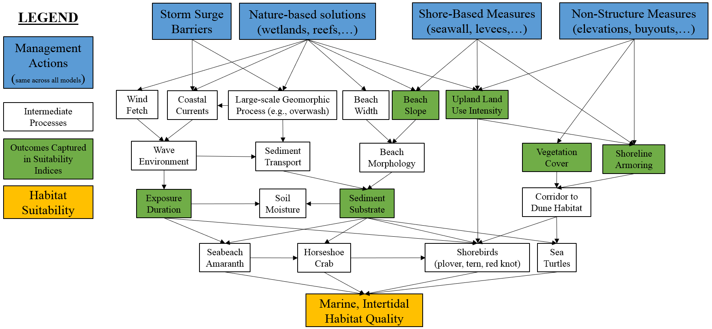

## Marine, Intertidal Zone


Marine, intertidal ecosystems include the areas of high salinity (> 28 psu) bracketed by tidal limits of the mean higher high water (MHHW) and mean lower low water (MLLW). In the context of NYBEM, these systems tend to directly front the Atlantic Ocean as beaches or occur in high salinity zones near inlets. 

Figure 4.10 presents a conceptual model of the marine, intertidal ecosystem. For NYBEM, we focus the assessment of habitat quality primarily on sandy beaches due to the large extent of this habitat type in the region. This nearshore ecosystem is strongly influenced by two major pressures, the physical drivers of the ocean environment (e.g., currents, sediment transport) and human uses of the system (e.g., beaches and associated upland development). Ecologically, this ecosystem hosts a variety of species of management interest such as horseshoe crabs and shorebirds (e.g., piping plover, terns, red knot).  

Coastal storm risk management actions have the potential to affect this ecosystem through two primary mechanisms. First, some risk management actions (e.g., storm surge barriers) could be directly constructed in this area. Second, large-scale features have the potential to alter coastal dynamics indirectly, although this affect may occur to a lesser extent given the overarching dominance of ocean effects.

```{r, fig.cap="Conceptual model for the marine, intertidal submodel."}

```


The tension between human uses of this landscape and ecological outcomes has long been acknowledged, and many models have been developed to assess ecological outcomes in marine, intertidal zones of the region, specifically for sandy beaches. This submodel drew heavily from four general bodies of knowledge, specifically:

- USFWS Habitat Evaluation Procedure models: tern [@carreker_habitat_1985, @us_fish_and_wildlife_service_usfws_gulf_2001], Plover [@us_fish_and_wildlife_service_usfws_gulf_2001], Horseshoe Crab [@us_fish_and_wildlife_service_usfws_gulf_2001], and Red Knot [@us_fish_and_wildlife_service_usfws_gulf_2001].
- Other habitat suitability models: Plover [@farmer_habitat_2000, @seavey_effect_2011], Horseshoe Crab [@avissar_modeling_2006, @nancy_jackson_armoring_2010, @lathrope_mapping_2013], and amaranth [@sellars_habitat_2007] (upper intertidal only)  
- Fire Island to Montauk Point Habitat Evaluation Procedure OceanBeach Sub-Model [@usace_evaluation_2009].  
- Empirical studies of the system: Virginia Tech shorebird program [@herman_unpacking_2019], Rutgers Horseshoe Crab Mapping [@lathrope_mapping_2013], and International Shorebird Survey (Manomet).


Four classes of processes and dynamics were identified from a review of these models and studies: long-term and large-scale wave and sediment dynamics, beach morphology, benthic food supplies, and the role of this system as a corridor between aquatic and upland environments. From these processes, four surrogate metrics were identified, which collectively reflect the condition of the marine, intertidal zone. Notably, variables reflecting wave and sediment dynamics are minimally included in this phase of modeling due to assessment challenges. The sections below describe each metric and the rationale in detail, but briefly:

* Beach slope was identified as a proxy for larger effects on overall morphology and grain size.  

* The proportion of time a beach is exposed provides a metric of benthic food supplies and availability of foraging habitat.  

* Upland land use intensity and shoreline armoring metrics describe the general human use pressures on a given system and viability of corridor functions.  

The overall habitat suitability of the marine, intertidal zone may then be aggregated into a single metric via an arithmetic mean of suitability indices for these metrics.


$I_{mar.int} = \frac{beach.slope + exp.dur + land.use + shoreline}{4}$ 

Where $I_{mar.int}$ is an overarching index of ecosystem quality for the marine intertidal zone, $beach.slope$ is a suitability index relative to beach slope, $exp.dur$ is a suitability index relative to the duration of beach exposure, $land.use$ is a suitability index relative to adjacent upland land uses, and $shoreline$ is a suitability index relative to shoreline armoring. All indices are quality metrics scaled from 0 to 1, where 0 is unsuitable and 1 is ideal.


```{r echo=FALSE, fig.width=8, fig.height=8, fig.cap="Suitability index curves for the marine, intertidal zone."}
#Create data frame with mar.int submodel
NYBEM.mar.int <- data.frame(matrix(NA,nrow=4,ncol=8))
colnames(NYBEM.mar.int) <- c("beach.slope.per", "beach.slope.SIV", "trel", "exp.dur.SIV",
                             "land.use.per", "land.use.SIV", "shoreline.m", "shoreline.SIV")
NYBEM.mar.int$beach.slope.per <- c(0, 10, 30, NA)
NYBEM.mar.int$beach.slope.SIV <- c(1, 1, 0, NA)
NYBEM.mar.int$trel <- c(0, 0.25, 0.75, 1.00)
NYBEM.mar.int$exp.dur.SIV <- c(0, 1, 1, 0)
NYBEM.mar.int$land.use.per <- c(0, 10, 100, NA)
NYBEM.mar.int$land.use.SIV <- c(1, 1, 0, NA)
NYBEM.mar.int$shoreline.m <- c(0, 100, 500, NA)
NYBEM.mar.int$shoreline.SIV <- c(0, 1, 1, NA)

##########
#Create summary figure for mar.int submodel
par(mfrow=c(3,2), cex=1.0)

  #beach.slope.per
  plot(NYBEM.mar.int$beach.slope.per, NYBEM.mar.int$beach.slope.SIV, xlim=c(0,30), ylim=c(0,1), type="l",
       xlab="Slope of Intertidal Zone (%)", ylab="Suitability Index (beach.slope)")
  abline(h=seq(0,1,0.1), lty=3)
  points(NYBEM.mar.int$beach.slope.per, NYBEM.mar.int$beach.slope.SIV, pch=19, cex=2)
  lines(NYBEM.mar.int$beach.slope.per, NYBEM.mar.int$beach.slope.SIV, lwd=3)
  
  #exp.dur.per
  plot(NYBEM.mar.int$trel, NYBEM.mar.int$exp.dur.SIV, xlim=c(0,1), ylim=c(0,1), type="l",
       xlab="Relative duration of exposure (trel)", ylab="Suitability Index (exp.dur)")
  abline(h=seq(0,1,0.1), lty=3)
  points(NYBEM.mar.int$trel, NYBEM.mar.int$exp.dur.SIV, pch=19, cex=2)
  lines(NYBEM.mar.int$trel, NYBEM.mar.int$exp.dur.SIV, lwd=3)
  
  #land.use.per
  plot(NYBEM.mar.int$land.use.per, NYBEM.mar.int$land.use.SIV, xlim=c(0,100), ylim=c(0,1), type="l",
       xlab="Developed Area within 100m (%)", ylab="Suitability Index (land.use)")
  abline(h=seq(0,1,0.1), lty=3)
  points(NYBEM.mar.int$land.use.per, NYBEM.mar.int$land.use.SIV, pch=19, cex=2)
  lines(NYBEM.mar.int$land.use.per, NYBEM.mar.int$land.use.SIV, lwd=3)
  
  #shoreline.m
  plot(NYBEM.mar.int$shoreline.m, NYBEM.mar.int$shoreline.SIV, xlim=c(0,500), ylim=c(0,1), type="l",
       xlab="Distance to Armored Shoreline (m)", ylab="Suitability Index (shoreline)")
  abline(h=seq(0,1,0.1), lty=3)
  points(NYBEM.mar.int$shoreline.m, NYBEM.mar.int$shoreline.SIV, pch=19, cex=2)
  lines(NYBEM.mar.int$shoreline.m, NYBEM.mar.int$shoreline.SIV, lwd=3)

```

### Beach Slope


Beach morphology directly affects habitat use by multiple focal taxa (e.g., shorebirds, turtles, horseshoe crab). Beach shape and morphologic character can be described through parameters of width, slope, elevation, and other summaries of topography [@bridges_use_2015]. Beach width is indirectly captured in NYBEM through metrics of habitat quantity and patch size and is not considered here. Beach slope integrates morphologic outcomes and is directly tied to grain size and wave environment [@lodder_chapter_2021]. Beach slope, thus, provides an important and synthetic metric of marine, intertidal habitat quality. Beach slope would only be directly altered for actions in the intertidal zone, but it is included here as a general proxy for intertidal ecosystem condition.

Beach slope is identified as a general indicator of ecosystem condition for Long Island ecosystems (@usace_evaluation_2009), and as an important driving component of habitat use by multiple taxa in the New York Bight. Specifically, habitat is most suitable for horseshoe crabs between ~5-10% slopes [@brady_habitat_1996]. Notably, not all taxa may respond in kind to these generalization. NYBEM assesses suitability relative to beach slope as follows:

$$beach.slope = \begin{pmatrix} 1.0 & slope_{per}=0-10\\
-0.05*slope_{per}+1.5 & slope_{per}=10-30\\
0.0 & slope_{per}>30
\end{pmatrix}$$ 

Where $beach.slope$ is a suitability index relative to beach slope and $slope_{per}$ is the slope of the beach perpendicular to the mean tide line in percent.


### Exposure Duration


Intertidal zones are a key foraging habitat for shorebirds. The benthic food availability is related in part to soil moisture [@brady_habitat_1996] and the time to forage in these zones. Soil moisture is also a key determinant of horseshoe crab spawning [@avissar_modeling_2006]. For instance, in the lower intertidal, we would anticipate higher density of food but less exposure time for foraging; conversely, the higher intertidal would experience lower density of benthic resources but longer exposure time. For NYBEM, a proxy variable is used to account for these processes. Specifically, a ratio of depth ranges to the tidal range is used as a relative duration of exposure, which we calculate as follows:

$$t_{rel} = \frac{H_{max} - H_{min}}{MHHW-MLLW}$$ 

Where $t_{rel}$ is a relative duration of exposure, $H_{max}$ is the maximum depth observed over a hydrodynamic simulation period, $H_{min}$ is the minimum depth observed over a hydrodynamic simulation period, $MHHW$ is mean higher high water, and $MLLW$ is mean lower low water.

This metric provides a relative accounting for the amount of exposure a given path experiences. For instance, $t_{rel}>1$ occurs in portions of the intertidal that remain underwater most of the time, and $t_{rel}=0$ occurs in areas where the elevation exceeds the intertidal range. In terms of habitat suitability, we assume that ideal values of this metric occur near the mean tide level ($0.25<t_{rel}<0.75$) and suitability declines on either side of this plateau as follows: 

$$exp.dur = \begin{pmatrix} 0.04*t_{rel} & t_{rel}<0.25\\
1.0 & 0.25<t_{rel}<0.75\\
-0.04*t_{rel}+4.0 & t_{rel}>0.75
\end{pmatrix}$$ 

Where $exp.dur$ is a suitability index relative to exposure duration.


### Upland Land Use


Marine, intertidal zones are a key transitional habitat between aquatic and upland systems. Fully functional intertidal areas would include high-quality adjacent uplands and subtidal areas. A variety of surrogates have been used to assess human impacts on this system, including diverse metrics like foot traffic, vehicle use of beaches, beach grooming and maintenance practices, physical barriers along the beach [@farmer_habitat_2000]; direct human development such as buildings; trash and debris presence [@usace_evaluation_2009]; and general levels of land use intensity [@seavey_effect_2011].

For the NYBEM, habitat suitability is modeled based on a relative metric of development for adjacent uplands within 100m. When the percentage of developed adjacent uplands is greater than 10%, habitat suitability in the estuarine intertidal ecosystem declines. When the development of adjacent upland reaches 100% of the estuarine intertidal ecosystem, the habitat will no longer be considered suitable. 

$$land.use = \begin{pmatrix} 1.0 & urban_{per}=0-10\\
-0.011*urban_{per}+1.11 & urban_{per}=10-100
\end{pmatrix}$$ 

Where $land.use$ is a suitability index relative to adjacent upland land uses and $urban_{per}$ is the percent of adjacent upland in developed (i.e., urban) land uses within 100m.


### Shoreline Armoring


Intertidal areas provide important habitat corridors for organism movement. However, shoreline armoring such as bulkheads or revetments can inhibit movement of the resident taxa (as well as the ecosystem migrating inland with sea level change). Numerous authors have highlighted the negative role that shoreline armoring can play in marine intertidal systems [@usace_evaluation_2009, @lathrope_mapping_2013]. Ideal habitat suitability would occur in the absence of shoreline armoring, but many shorelines are extensively hardened in the developed New York Bight region. 

For NYBEM, the distance to the nearest armored shoreline is used as a relative measure of habitat suitability. Habitat is considered more suitable with increasing distance to armoring. NOAA's [Environmental Sensitivity Index (ESI)](https://response.restoration.noaa.gov/resources/environmental-sensitivity-index-esi-maps) contains mapped extent of shoreline armoring and is used to assess presence or absence consistently across the region. A suitability index is then assessed as follows:

$$shoreline = \begin{pmatrix} 0.01*dist_{armor} & dist_{armor}=0-100m\\
1.0 & dist_{armor}>100m
\end{pmatrix}$$ 

Where $shoreline$ is a suitability index relative to shoreline armoring and $dist_{armor}$ is the distance to the nearest armored shoreline in meters.


### Potential extension of marine, intertidal models


The marine, intertidal model represents trade-offs between habitat needs for multiple taxa and availability of data at regional scales. Future model development could be expanded to include more processes and outcome, specifically:  

- A vegetative cover metric may be appropriate for some ecological processes such as the role of this system as a corridor. However, different habitat needs presented a challenge for scoping this metric, and some authors have distinguished the difference in the upper, vegetated intertidal zone and the lower, unvegetated areas [@usace_evaluation_2009].  
- Substrate is a key driver of beach outcomes in many contexts [@lodder_chapter_2021], and specifically, substrate is often included in regional models of this system (e.g., @brady_habitat_1996, @avissar_modeling_2006). However, high quality substrate data were unavailable, which created a major data gap for incorporating this variable.  
- Other assessment procedures (@farmer_habitat_2000, @usace_evaluation_2009) have included a variety of human development pressures related to local features (e.g., vehicle and foot traffic), which could provide important refinement of the human use intensity metrics for land use and shoreline development.  
- Wave environments clearly affect the morphology of beaches, and additional hydrodynamic variables could be assessed in future models.

