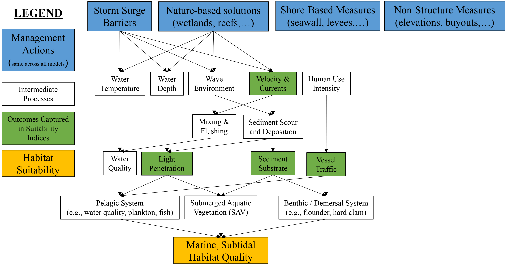

## Marine, Subtidal Zone


Marine, subtidal ecosystems include the areas of high salinity (> 30 psu) bracketed by tidal limits of the mean lower low water (MLLW) and 2m below Mean Tide Level (MTL). In the context of NYBEM, these systems tend to directly front the Atlantic Ocean or occur in high salinity zones near inlets. 

Figure 4.12 presents a conceptual model of the marine, subtidal ecosystem. This nearshore ecosystem hosts a variety of species of management interest such as hard clams, winter flounder, and seagrasses. As such, this model generally centers on the pelagic systems, submerged aquatic vegetation, and the benthic system. In general, coastal storm risk management actions are more likely to have direct effects on this ecosystem (e.g., footprint of constructed storm surge barriers) than indirect, offsite concerns more common in the estuarine systems.

```{r, fig.cap="Conceptual model for the marine, subtidal submodel."}

```


The tension between human uses of this landscape and ecological outcomes has long been acknowledged, and many models have been developed to assess ecological outcomes in marine, subtidal zones of the region. This submodel drew heavily from three primary bodies of knowledge, specifically:

- NY/NJ harbor mitigation functional assessment models [@usace_new_2000]  

- Habitat suitability models for winter flounder [@banner_usfws_2001] and hard clam [@mulholland_habitat_1984-1].

- Regional monitoring data associated with NY/NJ Harbor Deepening (@usace_application_2012, @usace_demersal_2015a, @usace_dredge_2015b), essential fish habitat mapping [@usace_essential_2013], and water quality data for the lower bay (DEP 2018, @usace_dredge_2015b).


Four main classes of processes and dynamics were identified from a review of these models and studies: (1) substrate-driven habitat use, (2) physical currents and mixing, (3) light penetration, and (4) human uses of the system. For each process, surrogate metrics were identified, which collectively reflect the condition of the marine, subtidal zone. The sections below describe each metric and the rationale in detail, but briefly:

*	Current velocity is a major driver of sediment dynamics as well as water quality processes.

*	Fine substrate affects utilization of habitats by a variety of taxa.  

*	Light penetration is a proxy for both water quality outcomes and potential SAV growth.  

*	Vessel traffic density is a proxy for human use intensity.  

The overall habitat suitability of the marine, subtidal zone may then be aggregated into a single metric via an arithmetic mean of suitability indices for these four metrics.

$I_{mar.sub} = \frac{velocity + substrate + light + vessel.density}{4}$ 

Where $I_{mar.sub}$ is an overarching index of ecosystem quality for the marine subtidal zone, $velocity$ is a suitability index relative to beach slope, $substrate$ is a suitability index relative to fine substrate, $light$ is a suitability index relative to light penetration, and $vessel.density$ is a suitability index relative to boat traffic and human uses. All indices are quality metrics scaled from 0 to 1, where 0 is unsuitable and 1 is ideal.

```{r echo=FALSE, fig.width=8, fig.height=8, fig.cap="Suitability index curves for the marine, deepwater zone."}
#Create data frame with mar.deep submodel
NYBEM.mar.sub <- data.frame(matrix(NA,nrow=4,ncol=8))
colnames(NYBEM.mar.sub) <- c("velocity", "velocity.SIV", "substrate.fines", "substrate.SIV", 
                             "light.PLW", "light.SIV", "vessel.density", "vessel.density.SIV")
NYBEM.mar.sub$velocity <- c(0, 25, 50, 100)
NYBEM.mar.sub$velocity.SIV <- c(0.6, 1, 1, 0)
NYBEM.mar.sub$substrate.fines <- c(0, 100, NA, NA)
NYBEM.mar.sub$substrate.SIV <- c(1, 0.1, NA, NA)
NYBEM.mar.sub$light.PLW <- c(0, 10, 22, 100)
NYBEM.mar.sub$light.SIV <- c(0, 0, 1, 1)
NYBEM.mar.sub$vessel.density <- c(0, 1000, 10000, NA)
NYBEM.mar.sub$vessel.density.SIV <- c(1, 1, 0.1, NA)

##########
#Create summary figure for mar.int submodel
par(mfrow=c(2,2), cex=1.0)

  #velocity
  plot(NYBEM.mar.sub$velocity, NYBEM.mar.sub$velocity.SIV, xlim=c(0,100), ylim=c(0,1), type="l",
       xlab="Velocity (cm/s)", ylab="Suitability Index (velocity)")
  abline(h=seq(0,1,0.1), lty=3)
  points(NYBEM.mar.sub$velocity, NYBEM.mar.sub$velocity.SIV, pch=19, cex=2)
  lines(NYBEM.mar.sub$velocity, NYBEM.mar.sub$velocity.SIV, lwd=3)
  
  #substrate.fines
  plot(NYBEM.mar.sub$substrate.fines, NYBEM.mar.sub$substrate.SIV, xlim=c(0,100), ylim=c(0,1), type="l",
       xlab="Fine Substrate Composition (%fines)", ylab="Suitability Index (substrate.fines)")
  abline(h=seq(0,1,0.1), lty=3)
  points(NYBEM.mar.sub$substrate.fines, NYBEM.mar.sub$substrate.SIV, pch=19, cex=2)
  lines(NYBEM.mar.sub$substrate.fines, NYBEM.mar.sub$substrate.SIV, lwd=3)
  
  #light.PLW
  plot(NYBEM.mar.sub$light.PLW, NYBEM.mar.sub$light.SIV, xlim=c(0,100), ylim=c(0,1), type="l",
       xlab="Percent of Light Available (%)", ylab="Suitability Index (light)")
  abline(h=seq(0,1,0.1), lty=3)
  points(NYBEM.mar.sub$light.PLW, NYBEM.mar.sub$light.SIV, pch=19, cex=2)
  lines(NYBEM.mar.sub$light.PLW, NYBEM.mar.sub$light.SIV, lwd=3)
  
  #vessel.density
  plot(NYBEM.mar.sub$vessel.density, NYBEM.mar.sub$vessel.density.SIV, xlim=c(0,10000), ylim=c(0,1), type="l",
       xlab="Total Vessel Usage (tracks/year)", ylab="Suitability Index (vessel.density)")
  abline(h=seq(0,1,0.1), lty=3)
  points(NYBEM.mar.sub$vessel.density, NYBEM.mar.sub$vessel.density.SIV, pch=19, cex=2)
  lines(NYBEM.mar.sub$vessel.density, NYBEM.mar.sub$vessel.density.SIV, lwd=3)

```


### Velocity


Velocity, currents, and wave environment are a key determinant of habitat suitability as well as critical drivers of sediment dynamics and water quality processes. For example, hard clam habitat suitability is generally in low to moderate velocity environments (<50 cm/s) with declines in suitability up to 100 cm/s. For NYBEM, the velocity suitability for hard clams is adopted directly from @mulholland_habitat_1984-1 as shown below. We assess velocity as the median velocity observed over an annual hydrodynamic simulation. 

$$velocity = \begin{pmatrix} 0.016*V_{50}+0.6 & V_{50}=0-1\\
1.0 & V_{50}=1-10\\
-0.02*ves_{AIS}+2 & V_{50}=10-100\\
0.0 & V_{50}>100
\end{pmatrix}$$ 

Where $velocity$ is a suitability index relative to currents and velocity and $ves_{AIS}$ is the vessel density from the Automated Information System.


### Substrate

Sediment quality drives multiple aspects of ecosystem integrity such as benthic habitat provision, nutrient dynamics, and erodibility. Fine sediment composition (i.e., %fine) is a common metric in multiple assessment procedures in the region (e.g., @mulholland_habitat_1984-1, @usace_new_2000, @USACE_port_2021). Specifically, the suitability curve from the hard clam model [@mulholland_habitat_1984-1] is used as the basis for this rapid metric of ecosystem quality. Notably, the curve was modified such that the suitability index is 0.1 when fines are 100%; this change was made in response to more recent literature showing the value of fine sediment patches as part of a habitat mosaic (Kritzer et al. 2016). For marine environments, sediment data are obtained from the [usSEABED](https://www.usgs.gov/programs/cmhrp/science/accessing-usseabed) data set throughout the region. Habitat suitability is then quantified as follows:

$$substrate = -0.009*fines_{per}+1$$ 

Where $substrate$ is a suitability index relative to sediment substrate and $fines_{per}$ is the proportion of fine sediment (silt and clay) at the location.


### Light

Light penetration provides an important metric of general water quality as well as suitability for submerged aquatic vegetation. Specifically, light availability drives photosynthesis in SAV. Light attenuates within the water column based on depth and water clarity (i.e., the deeper and more turbid the water, the less light reaches the bottom). For the marine subtidal submodel, light availability and suitability are modeled following the same algorithms described for the estuarine subtidal model (See Section 4.4.2.1), which can be summarized in suitability terms as as:

$$light = \begin{pmatrix} 0.0 & PLA<10\\
0.0833*PLA-0.83 & PLA>70\\
1.0 & PLA>22\\
\end{pmatrix}$$ 

Where $light$ is a suitability index relative to light penetration and $PLA$ is percent light available (PLA).


### Vessel Density

Human-mediated disturbances (e.g., urban development, increased vessel traffic, etc.) can negatively impact SAV abundance. We quantify these disturbances through a proxy of vessel traffic per year. Vessel traffic is obtained from the Automatic Identification System database. Lower traffic (less than 1,000 tracks per year) is considered optimal and the suitability decreases with increasing vessel traffic. Suitability scores for are quantified as follows: 

$$vessel.density = \begin{pmatrix} 1.0 & ves_{AIS}=0-1000\\
-0.0001*ves_{AIS}+1.1 & ves_{AIS}=1000-10000\\
0.1 & ves_{AIS}>10000
\end{pmatrix}$$ 

Where $vessel.density$ is a suitability index relative to ship traffic and $ves_{AIS}$ is the annual vessel tracks over a patch from the Automated Information System.


### Potential extension of marine, subtidal model

NYBEM's marine subtidal submodel provides a simple framework for estimating general ecosystem condition, which was centered on indicator species of hard clam and seagrasses. Other indicator taxa, variables, and processes should be addressed in future iterations where possible. Specifically, substrate is a dynamic feature through time, particularly with sea level change, and substrate could be linked to sediment transport algorithms in coastal dynamics models. Similarly, wave environment is an important feature of this ecosystem, and additional wave metrics could be incorporated. In the present iteration of NYBEM, light attenuation is assumed to be dependent on a single light coefficient ($K_{d}$). However, light attenuation can vary significantly based on suspended sediment concentration, algal processes, or water color, all of which may vary in time. Future version of the model could also consider spatially distributed data sets of light coefficients such as those by [NOAA](https://www.fisheries.noaa.gov/inport/item/66148).

