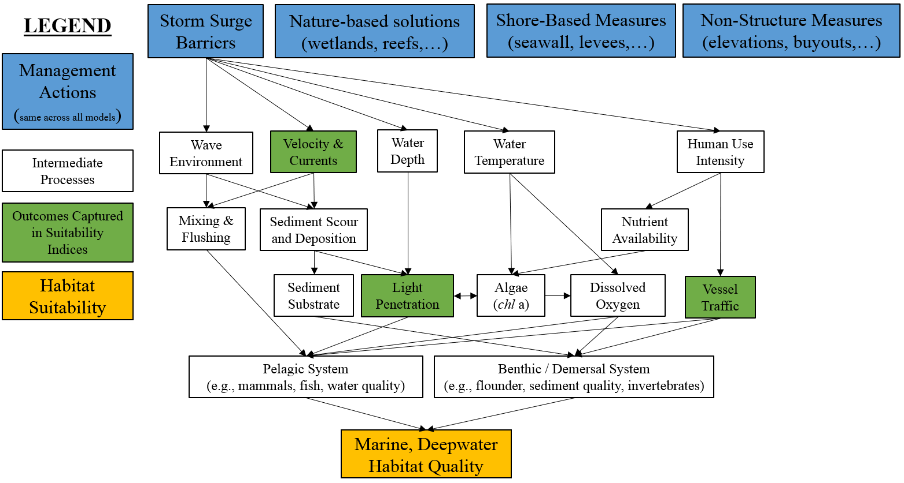

## Marine, Deepwater Submodel (`mar.deep`)


The marine, deepwater ecosystem considers areas with salinity values greater or equal to 30 psu and depths between 2 – 20 m. Physical, biological and chemical variables may be compounded by anthropogenic and climatic pressures to influence the overall integrity of this system. **Figure XX** presents a conceptual model of the marine, deepwater ecosystem. This ecosystem is strongly dominated by large-scale oceanographic processes and less so by potential coastal storm risk management features. Ecologically, this ecosystem hosts a variety of species of management interest such as mammals, turtles, surf clams, migratory fish, and flounder (winter). 


```{r, fig.cap="Conceptual model for the marine, deepwater submodel."}

```


The following variables are used to assess the marine deepwater submodel: a) salinity, b) velocity and currents, c) light attenuation, and d) vessel traffic. Salinity acts as a proxy for vertical mixing of the water column and influence of freshwater inputs [@smit_assessing_2021]. Current velocities represent mixing and flushing of the system, sediment suspension, and benthic scouring. Light penetration depths within the water column indicate water column turbidity, nutrient loading and algal production levels. Finally, vessel traffic provides an index for development pressures, both i) commercial and recreational fishing pressure on the pelagic, demersal and benthic systems, and ii) commercial and recreational vessel density pressures on the marine mammal populations within the area (population stress from ship strikes and noise pollution). The overall habitat suitability of the marine, deepwater zone may then be aggregated into a single metric via an arithmetic mean of suitability indices for these four metrics.

$I_{mar.deep} = \frac{salinity.low.dur + velocity.low.change + light + vessel.density}{4}$ 

Where $I_{mar.deep}$ is an overarching index of ecosystem quality for the marine intertidal zone, $salinity.low.dur$ is a suitability index relative to low salinity periods, $velocity.low.change$ is a suitability index relative to changes in low velocity, $light$ is a suitability index relative to light penetration through water, and $vessel.density$ is a suitability index relative to ship traffic. All indices are quality metrics scaled from 0 to 1, where 0 is unsuitable and 1 is ideal.


```{r echo=FALSE, fig.width=8, fig.height=8, fig.cap="Suitability index curves for the NYBEM marine, deepwater submodel."}
#Create data frame with mar.deep submodel
NYBEM.mar.deep <- data.frame(matrix(NA,nrow=4,ncol=8))
colnames(NYBEM.mar.deep) <- c("salinity.low.dur", "salinity.low.SIV", "velocity.low.change", "velocity.low.SIV", 
                             "light.PLW", "light.SIV", "vessel.density", "vessel.density.SIV")
NYBEM.mar.deep$salinity.low.dur <- c(0, 50, 100, NA)
NYBEM.mar.deep$salinity.low.SIV <- c(1, 0, 0, NA)
NYBEM.mar.deep$velocity.low.change <- c(-100, -10, 10, 100)
NYBEM.mar.deep$velocity.low.SIV <- c(0, 1, 1, 0.8)
NYBEM.mar.deep$light.PLW <- c(0, 10, 22, 100)
NYBEM.mar.deep$light.SIV <- c(0, 0, 1, 1)
NYBEM.mar.deep$vessel.density <- c(0, 1, 10, 100)
NYBEM.mar.deep$vessel.density.SIV <- c(1, 1, 0.5, 0)

##########
#Create summary figure for mar.int submodel
par(mfrow=c(2,2), cex=1.0)

  #salinity.low.dur
  plot(NYBEM.mar.deep$salinity.low.dur, NYBEM.mar.deep$salinity.low.SIV, xlim=c(0,100), ylim=c(0,1), type="l",
       xlab="Percent of Time Salinity < 30psu", ylab="Suitability Index (salinity.low.dur)")
  abline(h=seq(0,1,0.1), lty=3)
  points(NYBEM.mar.deep$salinity.low.dur, NYBEM.mar.deep$salinity.low.SIV, pch=19, cex=2)
  lines(NYBEM.mar.deep$salinity.low.dur, NYBEM.mar.deep$salinity.low.SIV, lwd=3)
  
  #velocity.low.change
  plot(NYBEM.mar.deep$velocity.low.change, NYBEM.mar.deep$velocity.low.SIV, xlim=c(-100,100), ylim=c(0,1), type="l",
       xlab="Change in Low Velocity (%)", ylab="Suitability Index (velocity.low.change)")
  abline(h=seq(0,1,0.1), lty=3)
  points(NYBEM.mar.deep$velocity.low.change, NYBEM.mar.deep$velocity.low.SIV, pch=19, cex=2)
  lines(NYBEM.mar.deep$velocity.low.change, NYBEM.mar.deep$velocity.low.SIV, lwd=3)
  
  #light.PLW
  plot(NYBEM.mar.deep$light.PLW, NYBEM.mar.deep$light.SIV, xlim=c(0,100), ylim=c(0,1), type="l",
       xlab="Light Penetration (% Light Reaching Bottom)", ylab="Suitability Index (substrate.fines)")
  abline(h=seq(0,1,0.1), lty=3)
  points(NYBEM.mar.deep$light.PLW, NYBEM.mar.deep$light.SIV, pch=19, cex=2)
  lines(NYBEM.mar.deep$light.PLW, NYBEM.mar.deep$light.SIV, lwd=3)
  
  #vessel.density
  plot(NYBEM.mar.deep$vessel.density, NYBEM.mar.deep$vessel.density.SIV, xlim=c(0,100), ylim=c(0,1), type="l",
       xlab="Vessel Density (tracks/m2/year)", ylab="Suitability Index (vessel.density)")
  abline(h=seq(0,1,0.1), lty=3)
  points(NYBEM.mar.deep$vessel.density, NYBEM.mar.deep$vessel.density.SIV, pch=19, cex=2)
  lines(NYBEM.mar.deep$vessel.density, NYBEM.mar.deep$vessel.density.SIV, lwd=3)

```

### Salinity

Salinity, often used as a proxy for the total concentration of all dissolved salts in the water, is a key factor in water density that controls the vertical mixing of nutrients and chemicals throughout the water column. Salinity constrains dissolved oxygen concentration and limits speciation of marine zones to euryhaline taxa that are physiological adapted to tolerate hypoosmotic processes (are able to maintain a lower internal ionic concentration than seawater).

For NYBEM, the salinity regime is summarized through a metric of the percent of time salinity is less than the marine ecosystem threshold of 30 psu. This approach assumes that freshwater inputs serve as disturbance on the ecosystem, and higher marine levels of salinity are preferred. Depth-averaged salinity is computed or measured at small time steps over and annual timeframe. These data may then be summarized as an “exceedence curve” with thresholds from 0-100% in 10% intervals. For NYBEM, this exceedence curve is used to calculate the percent of time salinity is less than or equal to 30 psu.

```{r echo=FALSE, eval=FALSE}
#Examples of exceedence duration calculation
exceedence <- seq(0,100,10)

salinity.ex1 <- c(22, 23, 24, 29.5, 29.9, 31, 32, 33, 34, 35, 37)
approx(salinity.ex1, exceedence, xout = 30, method = "linear", rule = 2, ties = "ordered")$y

salinity.ex2 <- c(24, 26, 27, 28, 30.1, 32, 34, 36, 38, 40, 42)
approx(salinity.ex2, exceedence, xout = 30, method = "linear", rule = 2, ties = "ordered")$y

salinity.ex3 <- c(24, 31, 32, 33, 34, 35, 36, 37, 38, 39, 40)
approx(salinity.ex3, exceedence, xout = 30, method = "linear", rule = 2, ties = "ordered")$y

salinity.ex4 <- c(30.5, 31, 32, 33, 34, 35, 36, 37, 38, 39, 40)
approx(salinity.ex4, exceedence, xout = 30, method = "linear", rule = 2, ties = "ordered")$y
```

This duration metric is then translated into a suitability metric as follows:

$$salinity.low.dur = \begin{pmatrix} -0.02*sal_{dur}+1 & sal_{dur}=0-50\\
0.0 & sal_{dur}=50-100
\end{pmatrix}$$

Where $salinity.low.dur$ is a suitability index relative to low salinity periods and $sal_{dur}$ is the percent of time salinity is less than the threshold for marine habitat (i.e., salinity < 30 psu).


### Current Velocity

The marine deepwater environment is subjected to velocity effects from ocean currents and tides that affect vertical and horizontal mixing and flushing of the system, suspended sediment and solids, substrate settlement of taxa, as well as the operation of small and recreational vessels. Low flow conditions allow for the settlement of sediment, possibly burying viable habitat, reducing mixing and flushing, and potentially facilitating hypoxic conditions. Conversely, high velocities scour the benthic environment, prohibiting settling in the substrate by benthic taxa.

Low flow conditions are particularly of concern for these processes, so a representative low velocity (i.e., 10% exceedance probability) is used within NYBEM as a key indicator metric. Suitability is then calculated based on the change in this low velocity relative to a baseline condition. For NYBEM, the baseline condition is assessed as the existing condition for a representative tidal year. Suitability declines linearly beyond a 10% change in this metric from the baseline with sharper decreases as velocities slow.

$$velocity.low.change = \begin{pmatrix} 0.011*vel_{rel}+1.11 & vel_{rel}=-100-10\\
1.0 & vel_{rel}=-10-10\\
-0.0022*vel_{rel}+1.02 & vel_{rel}>10
\end{pmatrix}$$ 

Where $velocity.low.change$ is a suitability index relative to change in low velocity and mixing and $vel_{rel}$ is the relative change in low velocity from a baseline condition assessed as:

$vel_{rel}=\frac{vel_{10,f}-vel_{10,b}}{vel_{10,b}}$.

Where $vel_{10,f}$ is the 10% exceedence velocity for a focal condition and $vel_{10,b}$ is a 10% exceedence velocity for a baseline condition.


### Light

The depth that light reaches within the water column acts as a proxy for the viability of water column turbidity, nutrient loading, and chlorophyll-a production (an essential building block for ocean productivity). As light controls chlorophyll-a production, it may be seen as a limiting factor for algal and particulate organic matter densities, and ultimately the development of harmful algal blooms. Therefore, light provides a meaningful metric for a variety of biological processes in this ecosystem. For the `mar.deepsub`, light availability and suitability are modeled following the same algorithms described for the `est.sub` model (See Section 4.4), which can be summarized in suitability terms as as:

$$light = \begin{pmatrix} 0.0 & PLA<10\\
0.0833*PLA-0.83 & PLA>70\\
1.0 & PLA>22\\
\end{pmatrix}$$ 

Where $light$ is a suitability index relative to light penetration and $PLA$ is percent light available (PLA).

### Vessel Traffic

Vessel traffic density provides an index for development pressures, both commercial and recreational fishing pressure, and commercial and recreational vessel density pressures on the marine mammal populations within the area (population stress from ship strikes and noise pollution). Vessel use density from the historical Automatic Identification System (AIS) vessel data from the MARCOS portal are assessed within the NYBEM to identify the general use of waterways. These data also indicate frequently visited fishing locations and offshore structures. Suitability is computed for this metric analogously to `est.sub` and `mar.sub` algorithms as follows:

$$vessel.density = \begin{pmatrix} 1.0 & ves_{AIS}=0-1\\
-0.0556*ves_{AIS}+1.06 & ves_{AIS}=1-10\\
-0.00556*ves_{AIS}+0.56 & ves_{AIS}=10-100\\
0.0 & ves_{AIS}>100
\end{pmatrix}$$ 

Where $vessel.density$ is a suitability index relative to ship traffic and $slope_{per}$ is the slope of the beach perpendicular to the mean tide line in percent.


### mar.deep Code

Numerical code for assessing habitat quality (<span style="color: red;">Dougherty and McKay to write.</span>)


```{r echo=TRUE}
#Load ecorest
library(ecorest)

#Test mar.int with ecorest
mar.deep.test <- c(10, -20, 10, 30)
ecorest::SIcalc(NYBEM.mar.deep, mar.deep.test)
```

### Future Development of `mar.deep`

The marine deepwater zone is affected by many processes not included in NYBEM. Future model development could explore the following:  

- Dissolved oxygen concentration, a key element for the survival of marine species, limits speciation of marine zones through hypoxia, where low oxygen levels may cause die-offs in marine species. Dissolved oxygen concentrations act as a proxy for pelagic, demersal and benthic fauna biomass (abundance/diversity of phytoplankton, zooplankton, fish, marine turtles, birds and mammals). Data could potentially be integrated from sources such as permanent monitoring stations, as supported by NYC DEP Monitoring Stations (2018), Jamaica Bay Eutrophication Model [@fischbach_building_2018], frameworks such as the Chesapeake Bay model [@cerco_threedimensional_1993], and the EPA Long Island Sound integrated model (underway).  
- Water temperature acts as a control for the majority of the chemical (dissolved nutrients, pH, density, and photosynthesis), biological (respiration and metabolic rates, taxa development, and migrations) and physical (ice formation and thermal stratification of the water column) properties of a marine ecosystem. Methods could be adapted from the Winter flounder habitat suitability model [@banner_usfws_2001] and VIMS 2018 habitat suitability models and the USACE Harbor monitoring [@usace_essential_2013], and data could potentially be extracted from MARACOOS Monthly Sea Surface Temperature via the MARCO Mid-Atlantic Ocean Data Portal or via hydrodynamic model outputs.  
- The wave environment affects many variables with the New York Bight: vertical and horizontal mixing and flushing of the physical and chemical properties of the water, suspended sediment and solids, substrate settlement of taxa, and commercial and recreational vessel traffic. Wave height and wave refraction could be assessed from analytical software such as STWAVE (@byrnes_effects_2004).  
- In the present iteration of NYBEM, light attenuation is assumed to be dependent on a single light coefficient ($K_{d}$). However, light attentuation can vary significantly based on suspended sediment concentration, algal processes, or water color, all of which may vary in time. Future version of the model could also consider spatially distributed data sets of light coefficients such as those by [NOAA](https://www.fisheries.noaa.gov/inport/item/66148).


