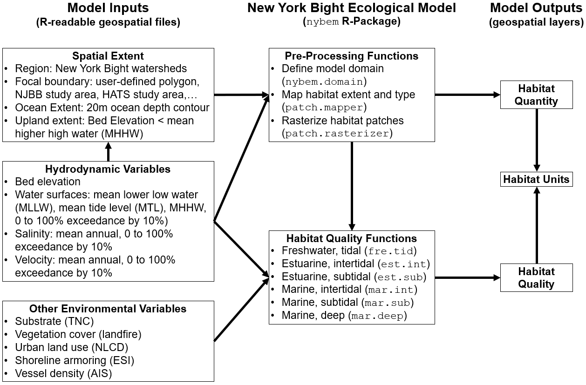

# Quantification

The quantification phase of ecological model development formalizes a conceptual model in terms of mathematical relationships, model parameters, and a numerical algorithm [@grant_ecological_2008]. This chapter describes the NYBEM relative to model structure, associated numerical tools, and the theoretical underpinnings of the sub-models. In general, the overarching quantitative architecture of the NYBEM can be summarized in three major elements (Figure 4.1). First, model inputs are assembled in a geospatial database. Second, the model code is prepared as a "package" in the [R Statistical Software](https://cran.r-project.org/). Finally, the model outputs habitat quantity and quality as well as habitat units for each patch in the model domain. 

Input variables to NYBEM consist of three major groups of data layers. First, the spatial extent of a given model run must be defined. The NYBEM is constrained to applications within the region of the New York Bight watersheds (Section 2.1). Within that region, a focal area for the simulation must be specified, which can consist of a particular project boundary (e.g., NJBB or HATS) or a user-specified domain (e.g., a particular back bay). Within that focal area, the downstream and upstream extents of the model are specified based on the 20m ocean depth contour and Mean Higher High Water (MHHW), respectively. The second major group of variables consists of hydrodynamic inputs. These inputs may be computed for varying temporal windows (e.g., a month, a year, or a decade) depending on the project focus, and the inputs could be provided by a variety of hydrodynamic models or empirical data sources.Hydrodynamic variables characterize the bed elevation, water surface, salinity, and current velocity distributed throughout the project area. Third, a variety of environmental variables are compiled from national and regional data sets to inform habitat quality calculations.

All model code for the NYBEM is contained within an R-package (`nybem`, [available via github](https://github.com/MVR-GIS)). Generally speaking, a package can be thought of as a fundamental unit of code that can include functions, data, documentation, and tests ([Wickham and Bryan 2019](https://r-pkgs.org/)). Packages then provide a transportable and reproducible mechanism for code sharing and publication. The `nybem` package contains nine functions and associated testing trials. This chapter describes each function in detail, but they can be summarized briefly as:  

* `nybem.domain`: This function defines the model domain based on the regional extent of the New York Bight watersheds, a user-specified focal area, a downstream extent of a 20m ocean depth contour, and an upstream extent based on bed elevations less than MHHW.  
* `patch.mapper`: This function maps the extent of NYBEM's six major ecosystem types (Table 3.2) based on user-specified data layers for bed elevation, MLLW, MTL, MHHW, and salinity.  
* `patch.rasterizer`: This function rasterizes the output of `patch.mapper` based on a specified grid resolution and aligns that layer with a specified spatial coordinate system.  
* `fre.tid`: This function computes habitat quality for any freshwater, tidal patches.  
* `est.int`: This function computes habitat quality for any estuarine, intertidal patches.  
* `est.sub`: This function computes habitat quality for any estuarine, subtidal patches.  
* `mar.int`: This function computes habitat quality for any marine, intertidal patches.  
* `mar.sub`: This function computes habitat quality for any marine, subtidal patches.  
* `mar.deep`: This function computes habitat quality for any marine, deepwater patches.

The first three functions can largely be thought of as fundamentally pre-processing the input data and mapping the extent of the six ecosystem types. For purposes of model development, these are relatively straight-forward and will be documented collectively. The latter six functions each compute a 0 to 1 metric of ecosystem condition (i.e., habitat quality) based on a unique set of input variables, equations, and parameters.

Each of these habitat quality sub-models followed a consistent set of development steps, which are documented throughout this chapter and briefly describe here. Preliminary variables were identified at a series of interagency workshops through a series of conceptual modeling exercises (Appendix A). Additional variables were added based on taxa-specific habitat suitability models (i.e., USFWS “blue books”), relevant tools (e.g., New England Marsh Model), and literature reviews. A conceptual model was then developed for each ecosystem type to better understand how key variables relate and influence each other. An overarching list of regional and national data sets were also compiled to ensure that model variables could be assessed throughout the broad spatial extent of the New York Bight. Potential model variables were compiled along with the rationale for inclusion or exclusion. Finally, a numerical “suitability index” was developed for each variable remaining in the sub-model, which were based on existing suitability indices, published thresholds / responses, and professional judgment.

Ultimately, the `nybem` allows users to assess the extent and integrity of the six major ecosystem types represented in the NYBEM. The size and quality of a given habitat patch can provide useful metrics in their own right, or they may be summarized as an overarching "habitat unit" (i.e., the quantity of habitat in acres * patch quality assessed on a 0 to 1 scale).

