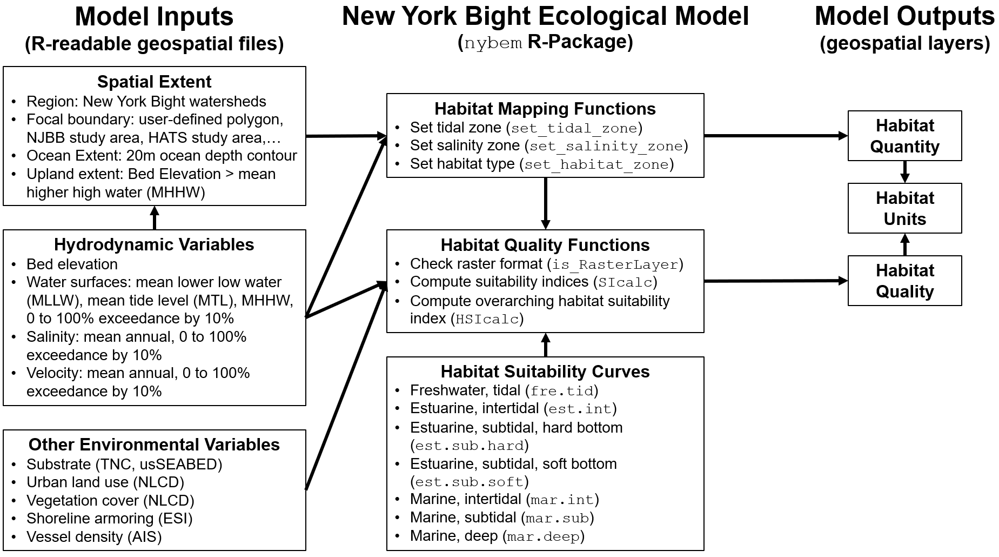

# Quantification


The quantification phase of ecological model development formalizes a conceptual model in terms of mathematical relationships, model parameters, and a numerical algorithm [@grant_ecological_2008]. This chapter describes the NYBEM relative to model structure, the theoretical underpinnings of the six ecosystem-specific sub-models, and associated numerical tools. In general, the overarching quantitative architecture of the NYBEM can be summarized in three major elements (Figure 4.1). First, model inputs are assembled in a geospatial database. Second, the model code is prepared as a "package" in the [R Statistical Software](https://cran.r-project.org/). Finally, the model outputs habitat quantity and quality as well as habitat units for each patch in the model domain. 

```{r, fig.cap="Quantitative architecture of the NYBEM."}

```


Variables input into NYBEM consist of three major groups of data layers. First, the spatial extent of a given model run must be defined. The NYBEM is constrained to applications within the region of the New York Bight watersheds (Section 2.1). Within that region, a focal area for the simulation must be specified, which can consist of a particular project boundary (e.g., NJBB or HATS) or a user-specified domain (e.g., a particular back bay). Within that focal area, the downstream and upstream extents of the model are specified based on the 20m ocean depth contour and Mean Higher High Water (MHHW), respectively. The second major group of input variables relate to hydrodynamics. These inputs may be computed over varying temporal windows (e.g., a month, a year, or a decade) depending on the project focus, and the inputs could be provided by a variety of hydrodynamic models or empirical data sources. Hydrodynamic variables characterize the bed elevation, water surface, salinity, and current velocity distributed throughout the project area. Third, a variety of environmental variables are compiled from national and regional data sets to inform habitat quality calculations.

The second major element is the model itself. All model code for the NYBEM is contained within an R-package (`nybem`, [available via github](https://github.com/MVR-GIS)). Generally speaking, a package can be thought of as a fundamental unit of code that can include functions, data, documentation, and tests ([Wickham and Bryan 2019](https://r-pkgs.org/)). Packages then provide a transportable and reproducible mechanism for code sharing and publication. The `nybem` package contains three main pieces. Three functions are presented to map the six major habitat types relative to tidal range and salinity. Three more functions contain the computational engine for habitat suitability calculations. Finally, the data for seven different ecosystem-specific suitability models is stored in a list object. Sections 4.1 describes the basis for delineating habitat zones, Sections 4.2-4.7 describe the theoretical (i.e., ecological) basis for assessing habitat quality in each zone, and Section 4.8 describes the numerical functions and code in detail.

Each of the habitat quality sub-models followed a consistent set of development steps, which are documented throughout this chapter and briefly described here. Preliminary variables were identified at a series of interagency workshops through a series of conceptual modeling exercises (Appendix A). Additional variables were added based on taxa-specific habitat suitability models (i.e., USFWS “blue books”), relevant tools (e.g., New England Marsh Model), and literature review. A conceptual model was then developed for each ecosystem type to better understand how key variables interact. Regional and national data sets were consulted to ensure that model variables could be assessed throughout the broad spatial extent of the New York Bight. Potential model variables were compiled along with the rationale for inclusion or exclusion. Finally, a numerical “suitability index” was developed for each variable remaining in the sub-model, which were based on existing suitability indices, published thresholds / responses, and professional judgment.

The final major element of the modeling framework is the outputs. Ultimately, the `nybem` package allows users to assess the extent (i.e., quantity) and integrity (i.e., quality) of six major ecosystem types. The size and quality of a given habitat patch can provide useful metrics in their own right, or they may be summarized as an overarching "habitat unit" (i.e., the quantity of habitat in acres * patch quality assessed on a 0 to 1 scale). While `nybem` outputs these quantities, post-processing is often required outside of the model to interogate, summarize, and visualize outcomes.
