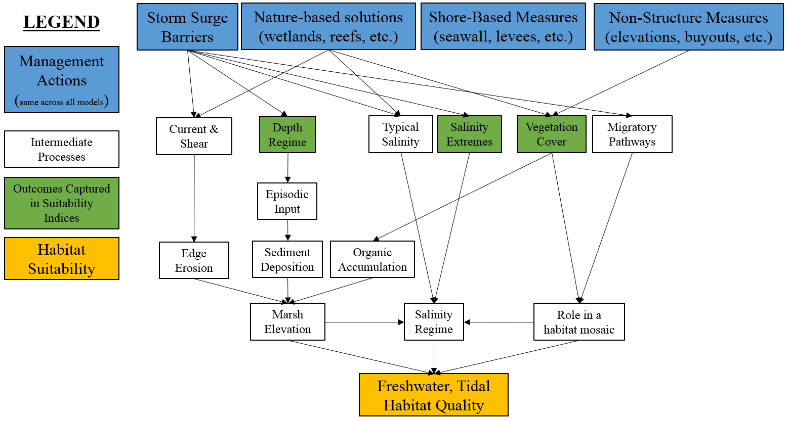

#  Application and Communication

The NYBEM has been explicitly designed to inform site screening and environmental impact assessment for the NJBB and HATS. A key component of this process is understanding the existing condition. This section presents a preliminary application of the NYBEM to assess ecosystem condition in the New Jersey Back Bays following three main activities: (1) Collection of hydrodynamic model outcomes, (2) Compilation of other environmental input data sets, and (3) Execution of the models. The objective of this chapter is to demonstrate the type of outcomes possible with the NYBEM, not to provide a comprehensive application to either project. 


## NJBB Hydrodynamic Modeling

NYBEM is capable of reading in hydrodynamic conditions from empirical or modeled data sources. However, hydrodynamic models provide the primary basis for USACE planning because of their capacity to forecast outcomes over long time horizons with and without project actions. 

Adaptive Hydraulics (AdH) is the numerical model code applied for hydrodynamic simulations in this study of the New Jersey Back Bays. For this study, the two-dimensional (2D) shallow water module of AdH is applied for all simulations. This code solves for depth-averaged velocity and salinity throughout the model domain. (More details of the 2D shallow water module of AdH and its computational philosophy and equations are available in Savant et al. 2014 and Savant and Berger 2015.) AdH version 4.6 was applied for this study.

A 2D AdH model was developed and validated for simulation of hydrodynamics and salinity (Details provided in McAlpin and Ross, _draft_). The model was validated to available field data for all parameters. Field data were collected in February 2019 for salinity and discharge/velocity data over a 13-hour tidal cycle at three major inlets – Barnegat, Little Egg, and Great Egg. Field data supported the use of a 2D model as opposed to a three-dimensional (3D) model due to lack of major salinity stratification.

The model domain was determined using aerial images and bathymetric/topographic data for the area. The Surface Water Modeling System was used to generate a 2D surface mesh and define material regions for applying specific model features, such as bed roughness. The domain is defined horizontally in Universal Transverse Mercator, zone 18 coordinates with units of meters. Vertically it is based on North American Vertical Datum of 1988 (NAVD88) with units of meters. All data applied to the model are shifted to this datum and coordinate system. Bathymetry data for the model were obtained from several sources: the Coastal Relief Model, sponsor collected hydrographic surveys, and the National Elevation Dataset. These data sets were combined such that the latest data were made a priority as well as data collected at finer resolution. The 2D AdH code can include areas that wet/dry; therefore, elevations were included in the domain up to 2 m NAVD88.

The model domain includes over 9,867 square miles, extending approximately 115 miles along the New Jersey Atlantic Ocean coastline from Lewes, DE, to Manasquan, NJ. The 2D mesh contains 324,881 elements and 165,514 nodes. Figure 6.1 shows horizontal node resolution for the model with an example region surrounding the Barnegat Bay Inlet. Resolution is finest in the small wetland channels to accurately capture the conveyance of flow in these areas as well as the salinity that migrates upstream in deeper channels. Finer resolution is also seen in areas where geometric features need to be defined accurately, such as in the inlets and around jetties. Ten AdH simulations were executed: seven project alternatives and three projects rerun with sea level change. However, only the existing condition scenario is presented here.

```{r, fig.cap="AdH node spacing as shown for a representative area of the NJBB study site around the Barnegat Bay Inlet. Color reflects bed elevation."}
knitr::include_graphics("ZZ_Fig06.01_AdH.Elev.jpeg")
```

AdH was executed for a "base" condition representing 2018 boundary conditions. For all simulations, the following variables were output:  

- Bed elevation  
- Water surface elevations: mean lower low water (MLLW), mean tide level (MTL), mean higher high water (MHHW), and 0 to 100% exceedence by 10% (calculated over the 2018 period of record)  
- Salinity levels: mean annual and 0 to 100% exceedence by 10% (calculated over the 2018 period of record)  
- Velocity: mean annual and 0 to 100% exceedence by 10% (calculated over the 2018 period of record)

AdH outputs were interpolated from point data using a spline technique with barriers separating the marine and estuarine data points (i.e., salinity data were not interpolated over the barrier island) using ESRI Spatial Analyst Tools. The interpolated surfaces were then rasterized throughout the model domain. A 10m grid cell size was used as a balance between data resolution from the model outcomes, over- vs. under-parameterization, and application resolution (i.e., the relevant size of wetlands in the region).


## Environmental Data Compilation

Other environmental inputs are required for NYBEM beyond hydrodynamic inputs. Specifically, model inputs are needed for hard bottom substrates, substrate composition, vegetation cover, urban land use composition, shoreline armoring, and vessel traffic. 

The estuarine, subtidal model distinguishes hard bottom ecosystems from soft bottom ecosystems (e.g., oysters vs. SAV/clams, respectively). Hard bottom habitats are generally required for reef environments, and this cultch substrate is often a limiting factor in the region. These substrates tend to be less mobile and persist through time. As such, we use a map of historical oyster beds as a proxy for the presence or absence of hard bottom substrate. <span style="color: red;">ADD 2-3 SENTENCES FROM STEVE.</span>

Substrate composition is a major driving factor in both the estuarine and marine subtidal models. Although many nuanced methods exist for assessing substrate (e.g., grain size, distributional metrics, compaction, etc.), simple composition metrics such as percent sand or fine sediment (silt/clay) suffice for the purpose of NYBEM. Furthermore, other substrate metrics are not available at the scale of the NYBEM model domain. Two data sets were combined for this analysis. First, the [usSEABED](https://www.usgs.gov/programs/cmhrp/science/usseabed) sampling points are available for much of the study area, but underrepresented in the back bay ecosystems. These data were augmented with additional substrate samples from Stockton University and The Nature Conservancy ([TNC](https://maps.coastalresilience.org/newjersey/#)), which focused explicitly on the NJBB area. Sampling points from these two data sets were combined into a single point cloud and composition metrics were interpolated across the region.

Vegetation cover provides an important and rapid measure of the plant community's role in ecological function. Cover classes from the [NLCD](https://www.usgs.gov/centers/eros/science/national-land-cover-database) were used to assess this variable. This data set provides cover as a binary (presence / absence) metric at a 30m cell resolution for the entire Nation. A neighborhood analysis was used to translate this binary metric into a continuous variable. Specifically, a moving window assessment was applied with a 50m buffer distance from each raster cell in the NYBEM domain. Vegetation cover percentage was assessed as the mean cover of the cells within this area. The buffer distance of 50m was chosen as large enough to capture multiple cover measurements relative to the grid resolution but small enough to capture the general role of vegetation in the area.


[NLCD](https://www.usgs.gov/centers/eros/science/national-land-cover-database) data were also used to assess the effects of urbanization on estuarine and marine intertidal systems. All urban land uses with the NLCD (codes 21, 22, 23, and 24) were reclassified as urban, and all other types were classified as non-urban. As was the case with vegetation cover, a moving window assessment was applied with a 100m buffer distance from each raster cell in the NYBEM domain. Neighboring urban land use was assessed as the mean cover of the cells within this area. The buffer distance of 100m was chosen to reflect the pervasive influence of urban processes (e.g., noise, light, and water quality) even at relatively large distances from a given patch.

Shoreline armoring also provides an important metric of human use intensity in the intertidal models. The shoreline armoring data layer is a linear dataset developed by the NOAA Office of Response and Restoration. The layer represents linear areas of the coastal shoreline that are armored (i.e., solid man-made structures, riprap, boulder rubble) as of 2014 (NJ) and 2016 (NY). The Environmental Sensitivity Index (ESI) guidelines define these uses for the preparation, evaluation, and/or response to threats to the coastal environment such as oil spills. The shoreline was originally delineated at mean higher high water (MHHW) using Light Detection and Ranging (LiDAR) and high resolution digital orthophotography datasets.

In subtidal and deepwater ecosystems, vessel density provides an important proxy for other human uses like fishing pressure, navigation, and resource extraction. An Automatic Identification Systems (AIS) vessel traffic density raster dataset was generated by the U.S. Coast Guard Navigation Center, Bureau of Ocean Energy Management, and NOAA Office for Coastal Management from AIS Marine Cadastral data. This layer represents 2019 annual vessel transit counts of all vessels (i.e., commercial and recreational) summarized at a 100 m by 100 m pixel cell resolution. A single vessel transit is counted each time a vessel track passes through, starts, or stops within a 100 m grid cell.  

These data sets each represent trade-offs deemed acceptable for this application of the NYBEM. However, different applications could compell use of other data sources. For instance, the NYBEM spatial scale required heavy reliance on regional and national data sets. However, more local applications (e.g., a single bay) could have access to higher resolution data (e.g., locally mapped substrate or shoreline armoring). Data quality and resolution are a common challenge in large scale modeling, and future applications could consider alternative approaches.


## Model Execution

For this analysis, all data sets were rasterized at the 10m resolution and aligned based on the AdH hydrodynamic data. <span style="color: red;">Insert text describing any backend data prep stuff people need to know (e.g., the rasterization of data sets, coordinate systems, and any numerical magic).</span> 

Bed elevation, water surface elevation (MHHW and MLLW), and salinity were input to the zonation functions (Sections 4.1 and 4.8.1) to identify tidal, salinity, and habitat zones. Figure 6.2 shows representative outputs from these functions for salinity and tidal zones as well as habitat types in the area surroudning Great Egg Inlet. Notably, these habitat zones represent only AdH outputs and do not necessarily reflect regulatory definitions of ecosystems. For instance, an area identified as an estuarine, subtidal ecosystem may (or may not) currently host submerged aquatic vegetation or hard-bottom reef environments, which would imply very different outcomes from a management perspective. Likewise, an estuarine, intertidal zone may currently be developed and non-functional from an ecological perspective. However, these outputs provide broad spatial coverage not feasible to collect for the entire study area. 

<span style="color: red;">FIGURE 6.2. A three panel figure zoomed in on a test area like Great Egg, which shows the tidal, salinity, and habitat zones for the site.</span>

```{r, fig.cap="Demonstration of habitat zonation functions for delineating ecosystems based on tidal range, salinity, and the combined assessment for habitat types in the area surrounding the Great Egg Inlet"}

```

Habitat quality may then be assessed for each ecosystem type as shown in Chapter 4. The `SIcalc` and `HSIcalc` functions (Section 4.8.2) are at the heart of all of the habitat quality calcuations. As such, it would be redundant to show multiple ecosystem applications for the purpose of demonstrating the NYBEM in this report. Here, we only present habitat quality for the estuarine intertidal ecosystem. 

The estuarine intertidal model (Section 4.3) assesses ecosystem integrity relative to five metrics: edge erosion, vegetative cover, episodic sediment deposition, development of adjacent uplands, and the presence/absence of shoreline armoring. Each of the input data sets described above was processed for use in these functions as described in Section 4.3. For instance, episodic sediment deposition relies on a metric calculated from multiple depth values based on AdH data. These inputs may then be translated into 0 to 1 suitability indices associated with each process (Figure 6.3).

<span style="color: red;">FIGURE 6.3. A 10-panel (5 rows X 2 columns) showing the input to the suitability curve and the suitability output (e.g., distance to shoreline and shoreline SIV).</span>

```{r, fig.cap="Example of suitability calculations for the estuarine intertidal model. Left panels show the input data to the suitability curve, and right panels show the normalized (0 to 1) suitability outcome."}

```

The five suitability index values provide important insights into the limiting factors within a given area. For instance, the erosion metric provides no distinguishing effect across this domain because the metric is presented relative to a baseline condition of the existing condition (i.e., there is no percent change in this scenario). Conversely, the urban land use and shoreline armoring metrics behave as anticipated with greater effects near developed parts of the system and along roadways. Ultimately, these suitability data may also be aggregated into an overarching habitat suitability index for the area (Figure 6.4). 

<span style="color: red;">FIGURE 6.4. A six-panel figure showing: suitability indices for the 5 input variables and the overarching HSI. Same site and zoom as Figure 6.2. The figure should show no data (e.g., no fill) for non-est.int areas and a color gradient for the est.int areas. All maps and suitability indices should be scaled from 0 to 1 for consistency.</span>

```{r, fig.cap="Summary of the example application of the estuarine intertidal model in the Great Egg Inlet."}

```

As described at the beginning of Chapter 4, all NYBEM applications exist relative to three main elements: inputs, the model itself, and outputs. In this sample application, all of these elements have been briefly described. However, different applications may require varying types of post-processing. For instance, a table or summary statistics may be appropriate for "rolling up" impacts of different management actions at the bay scale, whereas an interactive map may be more appropriate for working with specific stakeholders on local concerns. Post-processing of outcomes is beyond the scope of the NYBEM code, but it represents an important element of effectively communicating an application of the NYBEM.
