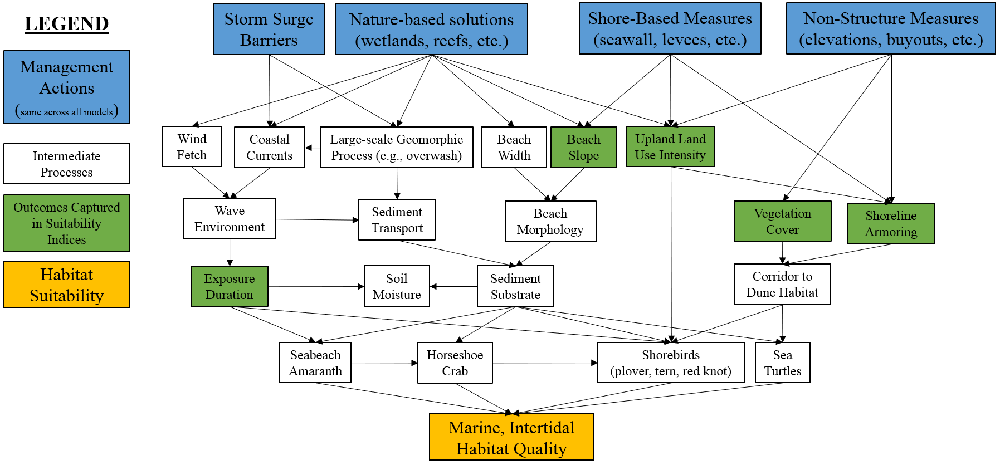

--- 
title: 'New York Bight Ecological Model (NYBEM)'
author: "S. Kyle McKay, Vanessa Mahan, Michael P. Dougherty, Toddd M. Swannack, Candice Hall, Christina L. Saltus, Molly K. Reif, Steve Allen"
date: "`r Sys.Date()`"
site: bookdown::bookdown_site
documentclass: book
bibliography: ["Draftbooksubmodel.bib", "packages.bib"]
biblio-style: "apalike"
link-citations: False
description:
  This is a minimal example of using the bookdown package to write a book.
  set in the _output.yml file.
  The HTML output format for this example is bookdown::gitbook,
github-repo: rstudio/bookdown-demo
---

# Front Matter {-}

Point of Contact

S. Kyle McKay, Ph.D., P.E.  
kyle.mckay at usace.army.mil  
Phone: 970-980-9747  
Environmental Laboratory  
New York, NY 10278

<span style="color: red;">DRAFT FOR MODEL CERTIFICATION REVIEW ONLY</span>

## Abstract {-}

The U.S. Army Corps of Engineers (USACE) is conducting three large-scale coastal storm risk management feasibility studies in the New York Bight ecosystem, specifically: the New Jersey Back Bays, the New York-New Jersey Harbor & Tributaries Study, and the Nassau County Back Bays. In these study areas, the USACE is considering a diversity of measures for mitigating flood risks, including structural actions (e.g., levees, floodwalls, storm surge barriers), non-structural measures (e.g., buy-outs, elevation of structures, flood-proofing), and natural and nature-based features (e.g., wetland creation, reefs for breakwaters). Environmental outcomes and acceptability are important constraints on plan selection, and the studies are applying a “tiered” approach to compliance with the National Environmental Policy Act. The New York Bight Ecological Model (NYBEM) is being developed as a tool for partially assessing the direct and indirect effects of agency actions on regional ecosystems. The NYBEM assesses changes in habitat quantity and quality associated with changing hydrodynamic conditions in six major ecosystem types: freshwater tidal, estuarine intertidal, estuarine subtidal, marine intertidal, marine subtidal, and marine deepwater. The numerical code for NYBEM was programmed in the R Statistical Software Language, and the model code is contained within an R-package (`nybem`), which is [available via github](https://github.com/MVR-GIS). This report documents the development of this tool, including information on model scoping, the development process, conceptualization, quantification, and evaluation. The NYBEM is then applied to assess the existing condition of ecosystems in the New Jersey Back Bay study area.

## Acknowledgements {-}

Model development was funded by two U.S. Army Corps of Engineers' feasibility studies in the New Jersey Back Bays ([NJBB](https://www.nap.usace.army.mil/Missions/Civil-Works/New-Jersey-Back-Bays-Coastal-Storm-Risk-Management/)) and NY/NJ Harbor and Tributaries Study ([HATS](https://www.nan.usace.army.mil/Missions/Civil-Works/Projects-in-New-York/New-York-New-Jersey-Harbor-Tributaries-Focus-Area-Feasibility-Study/)). The U.S. Army Corps of Engineers also partially funded research aspects of this work through the Ecosystem Management and Restoration Research Program. The authors are grateful to the USACE project team members and workshop attendees for their generous contributions of time, energy, and ideas. In particular, Bryce Wisemiller and JB Smith managed the larger USACE studies; Rob Hampson, Tate McAlpin, Jennifer McAlpin, and Anthony Emiren coordinated and conducted all hydrodynamic modeling; Cheryl Alkemeyer led environmental impact assessment for the HATS; Jesse Miller provided input and contributions throughout model development; and Elvin Cordero provided important contributions to early formulations of the numerical toolkit. Opinions expressed here are those of the authors and not necessarily those of the agencies they represent.


## Glossary and Acronymns {-}


- _[ADCIRC](https://adcirc.org/)_: "a system of computer programs for solving time dependent, free surface circulation and transport problems in two and three dimensions. These programs utilize the finite element method in space allowing the use of highly flexible, unstructured grids." For this study, ADCIRC was used to predict storm surge.
- _[AdH](https://www.erdc.usace.army.mil/Media/Fact-Sheets/Fact-Sheet-Article-View/Article/476708/ada/)_: Adaptive Hydraulics (AdH) numerical code is "a modular, parallel, adaptive finite-element model for one-, two- and three-dimensional (2D, and 3D) flow and transport." For this study, AdH was used to predict changes in local hydrodynamics.
- _ADM_: USACE Agency Decision Milestone.
- _AMM_: USACE Alternatives Milestone.
- _Deepwater Ecosystems_: Coastal ecosystems with bed elevation between -2m and -20m below Mean Sea Level (MSL).
- _EIS_: Environmental Impact Statement.
- _[ERDC](https://www.erdc.usace.army.mil/)_: U.S. Army Engineer Research and Development Center.
- _[ESI](https://response.restoration.noaa.gov/resources/environmental-sensitivity-index-esi-maps)_: Environmental Sensitivity Index for shorelines from the National Oceanic and Atmospheric Administration
- _Estuarine Ecosystems_: Coastal ecosystems with salinity from 0.5 to 28 ppt.
- _Freshwater Ecosystems_: Coastal ecosystems with low salinity < 0.5 ppt.
- _FWOP_: Future WithOut Project Conditions.
- _[HATS](https://www.nan.usace.army.mil/Missions/Civil-Works/Projects-in-New-York/New-York-New-Jersey-Harbor-Tributaries-Focus-Area-Feasibility-Study/)_: New York / New Jersey Harbor and Tributaries storm risk management study led by the USACE New York District.
- _Intertidal Ecosystems_: Coastal ecosystems with bed elevation between Mean Higher High Water (MHHW) and Mean Lower Low Water (MLLW).
- _Marine Ecosystems_: Coastal ecosystems with low salinity >= 28 ppt.
- _Mean Higher High Water (MHHW)_: A tidal datum. The average of the higher high water height each tidal day observed over AdH simulation period ([NOAA 2019](https://shoreline.noaa.gov/glossary.html)).
- _Mean Lower Low Water (MLLW)_: A tidal datum. The average of the lower low water height each tidal day observed over AdH simulation period ([NOAA 2019](https://shoreline.noaa.gov/glossary.html)).
- _MSL_: Mean Sea Level.
- _NAB_: U.S. Army Corps of Engineers Baltimore District.
- _NAN_: U.S. Army Corps of Engineers New York District.
- _NAP_: U.S. Army Corps of Engineers Philadelphia District.
- _NEPA_: National Environmental Policy Act.
- _[NLCD](https://www.usgs.gov/centers/eros/science/national-land-cover-database)_: National Land Cover Dataset.
- _[NCBB](https://www.nap.usace.army.mil/Missions/Civil-Works/Nassau-County-Back-Bays-Study/)_: Nassau County Back Bays coastal storm risk management study led by the USACE Philadelphia District.
- _[NJBB](https://www.nap.usace.army.mil/Missions/Civil-Works/New-Jersey-Back-Bays-Study/)_: New Jersey Back Bays coastal storm risk management study led by the USACE Philadelphia District.
- _NYBEM_: New York Bight Ecological Model ("nigh-bem").
- _OHSIM_: Oyster Habitat Suitability Index Model.
- _PED_: Pre-construction Engineering and Design.
- _SAV_: submerged aquatic vegetation.
- _Subtidal Ecosystems_: Coastal ecosystems with bed elevation between Mean Lower Low Water (MLLW) and -2m below Mean Sea Level (MSL).
- _TSP_: Tentatively Selected Plan.
- _[USACE](https://www.usace.army.mil/)_: U.S. Army Corps of Engineers.
- _[USFWS](https://fws.gov/)_: U.S. Fish and Wildlife Service.

```{r, echo=FALSE, include=FALSE}
#Markdown options
knitr::opts_chunk$set(echo=FALSE, warning=FALSE, message = FALSE) 

#Clear local memory
rm(list=ls(all=TRUE))

##########
#Load all necessary R packages
library(viridis)    #Contains color-blind friendly color schemes
library(kableExtra) #Contains formatting for markdown
library(tinytex)    #Contains latex pdf help
#library(ecorest)    #Habitat modeling functions
library(raster)     #Geospatial functions
library(cartography)#Mapping functions
library(rgeos)      #Geospatial functions
library(testthat)   #Function testing
#library(sf)         #Geospatial functions
```

<!--chapter:end:index.Rmd-->

<center>
# Background

In response to Superstorm Sandy and associated Congressional directives ([PL 113-2](https://www.congress.gov/113/plaws/publ2/PLAW-113publ2.pdf)), the North Atlantic Coast Comprehensive Study ([NACCS](https://www.nad.usace.army.mil/CompStudy/)) identified nine focus areas with populations vulnerable to coastal flooding risk. Three of these areas are in the New York Bight ecosystem, and the U.S. Army Corps of Engineers (USACE) is conducting large-scale coastal storm risk management (CSRM) feasibility studies. The New Jersey Back Bays ([NJBB](https://www.nap.usace.army.mil/Missions/Civil-Works/New-Jersey-Back-Bays-Study/)) study is investigating 900 mi^2^ of land and water areas along with 3,400 mi of shoreline spanning a significant portion of New Jersey's Atlantic coastline. The New York-New Jersey Harbor & Tributaries Study ([HATS](https://www.nan.usace.army.mil/Missions/Civil-Works/Projects-in-New-York/New-York-New-Jersey-Harbor-Tributaries-Focus-Area-Feasibility-Study/)) is examining 2,100 mi^2^ and comprises parts of 25 counties in the two states.  The Nassau County Back Bays ([NCBB](https://www.nap.usace.army.mil/Missions/Civil-Works/Nassau-County-Back-Bays-Study/)) study is investigating flood risk in 400 mi^2^ of land and water areas on Long Island's southern shore. Objectives of these studies include issues such as: (a) reduction of coastal storm damage risks to communities, public infrastructure, important societal resources, and the environment, (b) improvement of a community's ability to recover from storm surge damages, (c) enhancement of human health and safety by improving performance of critical infrastructure and natural features during and after storm surge events, and (d) enhancement of coastal resilience with nature-based features.


```{r, fig.cap="USACE regional coastal storm risk management studies. NJBB and HATS are the primary focus of model development."}
knitr::include_graphics("ZZ_Fig01.01_USACE.Studies.jpeg")
```


In these study areas, the USACE is considering a diversity of measures for mitigating flood risks, including structural actions (e.g., levees, floodwalls, storm surge barriers), non-structural measures (e.g., buy-outs, elevation of structures, flood-proofing), and natural and nature-based features (NNBF, e.g., wetland creation, reefs for breakwaters). Environmental outcomes and acceptability are important constraints on plan selection, and recommended plans must be in compliance with environmental laws and regulations. Given the large spatial scope, these USACE studies are applying a “tiered” approach to compliance with the National Environmental Policy Act (NEPA). Tiered assessment intends to provide appropriate data at key planning milestones for complex studies with diverse environmental effects. In the context of these studies, a “Tier 1” Environmental Impact Statement (EIS) will be generated at the conclusion of the USACE Planning Process (i.e., in the Feasibility Report and Chief’s Report). The “Tier 1” EIS is being developed with sequentially more accurate and precise information as the planning process proceeds through key milestones such as the Alternatives Milestone Meeting (AMM), Tentatively Selected Plan Milestone (TSP), and Agency Decision Milestone (ADM). A “Tier 2” EIS will be developed in Pre-Construction Engineering and Design (PED).

## Problem Statement

The conceptual and numerical models presented here seek to articulate and quantify mechanisms of environmental impact of proposed coastal storm risk management alternatives. The following goals guided model development:

* Models should provide a general description of the _relative_ environmental effects of large-scale alternatives, which can inform the feasibility process and NEPA assessments.

* Models must be able to forecast environmental effects over the project planning horizon (50-100 years) based on physical changes to ecosystems resulting from both background processes (e.g., sea level rise) and project alternatives (e.g., change in tidal regime from storm surge barriers).

* Models should assess environmental effects by ecosystem type (e.g., marine deepwater vs. estuarine intertidal) to inform mitigation actions.

* Models should capture direct effects of actions at infrastructure locations (e.g., the footprint of a surge barrier) as well as indirect effects induced off-site from infrastructure (e.g., change in bay hydrodynamics associated with a storm surge barrier).

* Models should be adaptable to new information and data as project planning proceeds.

* Models should provide a consistent approach for environmental assessment, which can assist with communication of the cumulative effects of recommended alternatives across the region.

## Report Overview

This report presents development and application of the New York Bight Ecological Model (NYBEM, “nigh-bem”), which will ultimately consist of two separate but interlinked models. First, an index-based modeling framework (i.e., a habitat-suitability-style, quantity-quality approach) is developed her to assess patch-scale effects for six ecosystem types (e.g., estuarine intertidal zones). Second, a network-based model will be developed in the future to assess system-wide connectivity for migratory, aquatic organisms (e.g., anadramous fish). This report documents the technical details, use, and relevant information for USACE model certification (EC 1105-2-412, PB 2013-02) for the patch-scale, habitat-suitability model. The following sections summarize the major elements of model development:

* _Model Development Process_: Summarizes the general scope of the model and approach for development.

* _Conceptualization_: Describes the overarching view of the structure and function of ecosystems in the New York Bight.

* _Quantification_: Reviews the technical details and numerical code of the six ecosystem-specific, patch-scale models.

* _Evaluation_: Assesses the model relative to underlying numerical accuracy, scientific theory, and usability.

* _Application and Communication_: Describes an application of the NYBEM to assess the existing condition in the New Jersey Back Bays.

</center>

<!--chapter:end:01_Background.Rmd-->

# Model Development Process

<p style="text-align: center;">When used in the context of complex management decisions with many partners, environmental and ecological modeling often benefit from approaches that emphasize transparency, increase user input during development, and clearly communicate model assumptions and limitations [@van_den_belt_mediated_2004; @voinov_modelling_2010; @herman_unpacking_2019]. Here, a general five-step modeling process is followed that applies best practices in ecological model development [@grant_ecological_2008]. First, general relationships among essential ecosystem components are formally _conceptualized_ to tell the story of "how the system works" [@fischenich_application_2008]. Second, the model is _quantified_ using a formal structure of functional relationships, algorithms, parameters, and numerical code. Third, models are _evaluated_ relative to underlying scientific theory, numerical accuracy, and usability, which often entails techniques such as code checking, testing, verification, and sensitivity analyses. Fourth, a model is _applied_ to a given management question, scenario, or assessment. Fifth, a strategy is developed and executed to _communicate_ model development and application to technical and non-technical audiences.  This process has been applied numerous times to select, adapt, or develop ecological models for USACE and non-USACE studies [e.g., @mckay_aligning_2019;@herman_unpacking_2019], and the framework is intended to draw heavily from existing knowledge, data, and tools.  


USACE policy [@us_army_corps_of_engineers_assuring_2011] defines a model as “a representation of a system for a purpose,” and thus specifying a modeling purpose and objective is often a foundational step in the modeling process. **Here, our modeling objective is to articulate the mechanisms and magnitude of environmental effects of proposed coastal storm risk management actions in the New York Bight Ecosystem.** However, this model (like all models) is being developed in a constrained environment with limited time and resources. Three key issues constrained and guided NYBEM development, each of which is addressed in subsequent sections:  

* The model domain is limited to the spatial extent of the focal USACE studies. 

* Model development is phased to align with USACE project planning milestones.

* Transparency in model development and input from stakeholders and partners were actively embraced to increase the adoption and acceptance of the tools, given the high-profile nature of the studies.</p>


## Spatial Extent

The cumulative project area of the ongoing CSRM studies exceeds 3,000 mi^2^ and covers multiple states. The spatial extent of model application was defined by a sequence of three sequentially smaller filters (Figure 2):

- _New York Bight_: The USFWS defined the ecosystems of the New York Bight in 1997 as the "open ocean region south of Long Island and east of New Jersey, known as the New York Bight proper" and all associated upstream estuaries, waters, and lands. This large spatial domain covers 31,276 mi^2^ (10,206 mi^2^ upland watershed and 21,070 mi^2^ estuarine or marine). Specifically, the watershed is defined by ten 8-digit Hydrologic Unit Code (HUC) watersheds (02020006, 02020007, 02020008, 02030101, 02030103, 02030104, 02030105, 02030202, 02040301, and 02040302). The USFWS Bight definition includes all marine ecosystems offshore. However, given the nearshore scope of USACE's studies, seaward extent is limited to ecosystems above a 20m depth contour (i.e., the USFWS definition of "nearshore"). This watershed boundary and seaward limit have a total area of 13,420 mi^2^[@us_fish_and_wildlife_service_usfws_significant_1997]. However, given the nearshore scope of USACE’s studies, seaward extent is limited to ecosystems above a 20m depth contour (i.e., the USFWS definition of “nearshore”)[@us_fish_and_wildlife_service_usfws_significant_1997]. 

- _Project Boundaries_: The Bight ecosystem includes many upland and coastal ecosystems beyond the project boundaries (e.g., Eastern Long Island). The USACE study boundaries provide a second filter on the spatial limits of the NYBEM. The New York Bight ecosystem contained within the project boundaries has an area of 2,930 mi^2^.  

- _Aquatic Ecosystems_: A key focus of the NYBEM is assessment of indirect effects of proposed actions. Currently, upland and shoreline ecosystems above mean higher high water (MHHW) are not included in the models. Impact assessments from these systems (e.g., dunes, scrub-shrub, riparian zones) are better understood from prior impact analyses. Additionally, these systems are likely to experience fewer indirect impacts, and methods are generally available for assessing direct impacts. Upland ecosystems are not explicitly removed from the spatial domain at this phase, but are removed below through the absence of any patch-scale models at elevations above MHHW and the absence of hydrodynamic data in uplands.

<span style="color: red;">REPLACE FIGURE</span>

```{r, fig.cap="NYBEM model domain: (left) Components of model domain, (right) NYBEM domain."}
knitr::include_graphics("ZZ_Fig02.01_NYBEM.Extent.jpeg")
```


## Phased Approach

USACE planning studies sequentially make decisions about potential actions and buy-down risk and uncertainty to inform the next level of decision, before narrowing in on a recommended alternative. Furthermore, the USACE studies have proposed a “tiered” NEPA assessment, which is designed to gather more data and refine outcomes as a project proceeds. The NYBEM toolkit must be capable of responding to evolving project planning needs and data availability as these studies develop. As such, model development is explicitly being conducted in "phases," and NYBEM tools and methods will evolve alongside project planning. In each phase, development will proceed iteratively through the cycle described above of conceptualization, quantification, evaluation, application, and communication. Table 2.1 presents key aspects of this phased approach to development. 


```{r echo=FALSE}
#Create empty table
Table1 <- as.data.frame(matrix(NA, nrow = 7, ncol = 4))
colnames(Table1) <- c("District Planning Milestone", "Interim Report", "Draft Feasibility Report", "Final Feasibility Report")

#Specify rows of the table
Table1[1,] <- c("Type of Decision", "Preliminary Screening", "Alternatives Analysis", "Design and Operation of Recommended Alternative")
Table1[2,] <- c("Scope of Environmental Effects", "Direct", "Direct + Indirect", "Direct + Indirect + Cumulative")
Table1[3,] <- c("Spatial Extent of Environmental Effects", "Project footprint", "Offsite hydrodynamic change", "Mitigation requirements")
Table1[4,] <- c("Anticipated Outputs", "Project footprint", "Habitat Quantity and Quality (by type)", "Habitat Quantity, Quality, and Connectivity (by type)")
Table1[5,] <- c("Analytical Effort", "Rapid Screening", "Moderate", "Detailed")
Table1[6,] <- c("Hydraulic Forcing", "Existing Condition", "One year of tidal forcing + Two sea levels", "Multiple years of tidal forcing + Multiple sea levels")
Table1[7,] <- c("Model Inputs", "Footprint", "Footprint + Tidal Range + Salinity + Hydrodynamics + Env Data", "Footprint + Tidal Range + Salinity + Hydrodynamics + Env Data + Sediment + Temperature + Waves + Water Quality + Other")

#Send output table rows into a single matrix
rownames(Table1) <- NULL
knitr::kable(Table1, caption="Phased approach to development of the NYBEM.", align="c") 
```

## Mediated Modeling

The NYBEM intends to assess ecological consequences of alternative infrastructure options in a large, diverse ecosystem with many stakeholders and perspectives. “Mediated modeling” is used here to describe the family of techniques for building consensus among multiple partners to produce credible and defensible ecological models in a transparent way [@van_den_belt_mediated_2006]. There are many types of stakeholder-based model development processes that overlap in approach and emphasize collaboration: Model Prototyping, Participatory Modeling, Group Model Building, Companion Modeling and Mediated Model Development [See reviews by @voinov_modelling_2010; @gray_environmental_2017; and @hall_mediated_2019]. These processes are generally well-suited to environmental management problems that are politically and publicly-sensitive, complex, and engage diverse audiences [@van_den_belt_mediated_2006]. 

For NYBEM, a suite of workshop-based model development methods are adapted from @herman_unpacking_2019. These workshops utilize a lecture-exercise format, where participants are led through the theory of a particular aspect of modeling (e.g., conceptual modeling) and then apply said theory to a focal ecosystem (i.e., the New York Bight). The workshops structure the iterative development of NYBEM with subsequent research and synthesis between meetings (See McKay et al. 2021 for additional detail). Appendix B summarizes workshop logistics and focal topics. Key milestones in model development are briefly described below, but the overarching strategy is to engage larger audiences and more formal forms of model evaluation as the toolkit develops.

* _Preliminary workshop with Philadelphia District_ (January 2019): A preliminary conceptual model was developed with USACE Philadelphia District team members, which focused generally on issues potentially relevant for environment compliance at the broadest level.

* _USACE workshop with Philadelphia and New York Districts_ (March 2019): A joint team from multiple USACE Districts was convened, and a strategy was proposed to develop NYBEM around key ecosystem types to reduce the dimensionality and complexity of the modeling problem and structure the path forward for model development.

* _Interagency conceptual modeling workshop_ (June 2019): Fifty scientists and environmental managers (from federal, state, and local government as well as select non-profit organizations and academic units) were brought together to focus on the development of conceptual models supporting the NYBEM. This workshop utilized a series of posters and activities for attendees to provide input on relevant variables and processes for each ecosystem type.

* _Interagency numerical modeling workshop_ (November 2019): A subset of attendees (20+) from the June 2019 workshop reconvened to discuss findings from the prior workshops. Prior to this meeting, the posters from June were formalized and synthesized with available scientific literature. At this meeting, attendees were able to review and revise preliminary versions of the model structure.

* _Phase-1 model documentation_ (April 2022; this report): This report provides model development status as applied to the Draft Feasibility Report and Environmental Impact Statement for each study. USACE requires assessment and external evaluation of ecological models used in Feasibility-level planning decisions (i.e., model certification), and this report will be peer-reviewed according to these agency procedures.

* _Phase-2 development_ (Fall 2022 / Winter 2023): Habitat quality and system connectivity tools will be further developed following the release of the Draft Feasibility Reports. Any modifications of models will also undergo review and certification.

Rapid timelines and iterative development encourage a transparent approach for model documentation as well. We adopt a growing family of methods for "[reproducible research](https://ropensci.github.io/reproducibility-guide/sections/introduction/)," which embrace code and data sharing, enable review processes, and facilitate use of methods and results. Specifically, [R Markdown](https://rmarkdown.rstudio.com/) is applied to development and document models, which are coded in the [R Statistical Software](https://cran.r-project.org/). These tools minimize data transfer errors and facilitate internal inspection of code as it is developed. Similarly, all model code is contained within a transportable R-package (i.e., `nybem`) following [common development procedures](https://r-pkgs.org/). 


<!--chapter:end:02_ModelDevelopmentProcess.Rmd-->

# Conceptualization

The foundation of ecological modeling is a clear conceptualization of the ecosystem and an approach for translating the conceptual model into a numerical representation. This chapter describes an overarching conceptual model for the ecosystems of the New York Bight. A strategy is then presented for assessing these ecosystems relative to a habitat-style modeling approach, where the quantity and quality of each ecosystem type are computed separately and combined into an index of ecosystem integrity (i.e., a "habitat unit"). 


## Conceptual Model

Conceptual ecological models are required for all USACE ecosystem restoration projects to increase understanding, identify potential alternatives, and facilitate team dialog [@fischenich_application_2008; @us_army_corps_of_engineers_assuring_2011]. These same benefits apply for assessing environmental effects of proposed coastal storm risk management actions. Additionally, conceptual models also inform and structure the development of quantitative ecological models [@grant_ecological_2008; @swannack_ecological_2012] such as the NYBEM. Conceptual models of the New York Bight were iteratively developed through the mediated workshops described in Section 2.3. Workshop ideas and content were synthesized with available literature, conceptual models of similar ecosystems (e.g., wetland function in Coastal Louisiana; @twilley_formulation_2004), and existing regional conceptual models [e.g., @montagna_conceptual_2013]. A seven step conceptual model development process was interactively applied as workshops proceeded (Table 3.1).

```{r echo=FALSE}
#Create empty table
Table3.1 <- as.data.frame(matrix(NA, nrow = 7, ncol = 2))
colnames(Table3.1) <- c("Step", "NYBEM Application")

#Specify rows of the table
Table3.1[1,] <- c("1. State the model objectives.", "Our numerical modeling objective is to articulate the mechanisms and magnitude of environmental effects of proposed coastal storm risk management actions in the New York Bight Ecosystem. This conceptual model is intended to communicate the overarching scope of model development to a broad audience.")
Table3.1[2,] <- c("2. Bound the system of interest.", "NYBEM is limited to the New York Bight Watershed with a seaward limit of a 20m depth contour. The models are further limited to aquatic ecosystems within the NJBB and HATS project areas. The NYBEM focuses only on effects to regional ecosystem, and other forms of environmental impacts (e.g., air quality, historic preservation) are addressed elsewhere in NEPA documentation.")
Table3.1[3,] <- c("3. Identify critical model components within the system.", "This overarching conceptual model focuses on key ecosystem types and system-wide connectivity. Patch-scale models are defined from a combined classification based on @cowardin_classification_1979, USFWS (1997), and @montagna_conceptual_2013. A series of workshops and literature search were then used to identify ecosystem-specific model components associated with habitat quality (Chapter 4).")
Table3.1[4,] <- c("4. Articulate relationships among model components.", "Only ecosystem types are presented, given the communication-driven purpose of this overarching model. More mechanistic conceptual models are presented for each ecosystem type in Chapter 4, which show connections between drivers and stressors, ecosystem states, and ecological outcomes.")
Table3.1[5,] <- c("5. Represent the conceptual model.", "A simple graphic representation of the conceptual model (Figure 3.1) was developed to facilitate communication between project team members, sponsors, partner agencies, and other interested parties.")
Table3.1[6,] <- c("6. Describe the expected pattern of behavior.", "The team qualitatively assessed the model along with potential gaps in ecosystem types and environmental impacts.")
Table3.1[7,] <- c("7. Test, review, and revise.", "This overarching conceptual model was developed, presented, and refined based on a series of modeling workshops over a three year timeframe.")

#Send output table
rownames(Table3.1) <- NULL
knitr::kable(Table3.1, caption="Stepwise development of the overarching NYBEM conceptual model (following steps in Fischenich 2008).")
```


Ultimately, multiple conceptual models were developed for the New York Bight with different purposes. We first developed an overarching conceptual model communicating how a mosaic of regional ecosystems function together at a system-scale, which is intended for broad use within both technical and non-technical audiences (Figure 3.1). Three overarching systems were identified to frame model development: (1) nearshore / marine ecosystems, (2) estuarine ecosystems, and (3) system connectivity between multiple ecosystem types. These systems were distinguished based on differences in ecosystem processes such as wave energy and salinity dynamics, likely effects of proposed management alternatives, and potential differences in modeling philosophy (e.g., habitat models for nearshore and estuarine systems and a network approach to connectivity). Cumulatively, these three categories provide a means of assessing nearshore and estuarine ecosystems at a patch-scale as well as a means of assessing system-scale outcomes associated with connectivity. The ecosystem types were adopted from a combination of two existing classifications: [@cowardin_classification_1979; @us_fish_and_wildlife_service_usfws_significant_1997]. In addition to this overarching model, mechanistic conceptual models were developed for each ecosystem type to guide quantitative model development (see Chapter 4), which are intended for technical audiences focused on the scientific details of ecological assessments. 


```{r, fig.cap="Overarching conceptual model for the New York Bight."}
knitr::include_graphics("ZZ_Fig03.01_NYBEM.ConModel.jpg")
```


## Major Ecosystem Types

Patch-scale assessments were developed for both the marine and estuarine ecosystems. Models were developed for each of the six major ecosystem types (Table 3.2). These ecosystems are defined from a combined classification based on @cowardin_classification_1979 and @us_fish_and_wildlife_service_usfws_significant_1997. Salinity and tidal range differentiate these ecosystems, both of which can change under futures with and without management actions. While other analyses have developed ecosystem-scale assessments and models based on similar or more refined divisions in physical properties (e.g., @clough_modeling_2016, @fischenich_application_2008), the current criteria represent a compromise between the need for detailed assessment of the type and location of infrastructure impacts, and the need for a readily implementable rule set applicable at the broad spatial scale of the NYBEM.  


```{r echo=FALSE}
#Create empty table
Table3.2 <- as.data.frame(matrix(NA, nrow = 3, ncol = 4))
colnames(Table3.2) <- c("Tidal Limits", "Marine (Salinity >= 28psu)", "Estuarine (Salinity = 0.5 to 28psu)", "Freshwater (Salinity <= 0.5psu)")

#Specify rows of the table
Table3.2[1,] <- c("Deepwater (-2m to -20m)", "Marine, Deep", "Estuarine, Subtidal", "Freshwater")
Table3.2[2,] <- c("Subtidal (MLLW to -2m)", "Marine, Subtitdal", "Estuarine, Subtidal", "Freshwater")
Table3.2[3,] <- c("Intertidal (MHHW to MLLW)", "Marine, Intertidal", "Estuarine, Intertidal", "Freshwater")

#Send output table
rownames(Table3.2) <- NULL
knitr::kable(Table3.2, caption="Definition of NYBEM ecosystem types. Cowardin et al. (1979) define the marine-estuarine salinity transition based on a period of average annual low flow, which we define here as a 90% exceedence probability (or 10th percentile salinity).") 
```


## Habitat-Style Modeling Philosophy

Dozens of ecological modeling tools focus on coastal ecosystems. These models vary based on factors such as disciplinary perspective (e.g., hydrologic, geomorphic, ecological), the level of ecological hierarchy addressed (e.g., individuals, populations, communities, ecosystems), the basic approach to modeling (e.g., statistical, theoretical), input requirements (e.g., few parameters vs. extensive geospatial layers), the treatment of time and space (e.g., lumped vs. distributed), and the degree of development (e.g., long history vs. ad hoc). However, multiple gaps in these tools are the driving motivation for developing the New York Bight Ecological Model (NYBEM). 

- *Comprehensive view of regional ecosystems*: Many existing ecological models focus on a subset of regional ecosystems (e.g., estuarine subtidal, but not marine subtidal) or focal taxa (e.g., fish, but not seagrass). The large spatial scope of the USACE study requires seamless landscape coverage of the study areas, as well as a consistent approach for assessing multiple ecosystem types simultaneously.

- *Connection to USACE management actions*: Existing tools often emphasize important physical forcings on ecosystems without a direct connection to USACE's proposed project action. For instance, a model may include marsh response to sea level rise, but be unable to incorporate marsh response to sea level rise in the presence of a storm surge barrier.  

- *Indirect effects*: Models often emphasize direct changes at a site-scale rather than indirect effects of off-site changes. For instance, a model may assess habitat quality associated with substrate, but be unable to link to changes in substrate as a result of distant infrastructure effects (e.g., a storm surge barrier).

- *System-wide data*: Many valuable ecological tools have been developed at small spatial scales based on detailed site data (e.g., vegetation surveys or field assessment procedures). However, the extremely large scale of these projects precludes field data collection, and NYBEM inputs must be available for the entire model extent. 

- *Rapid and phased application*: The USACE studies are assessing project outcomes within limited analytical timeframes. Therefore certain tools that might be applicable on longer time horizons (i.e., years) are not feasible in these short periods (i.e., months).

Given these challenges, the NYBEM seeks to build from the wide breadth of existing knowledge and models to develop a comprehensive set of tools that are directly applicable to the unique needs of planning USACE coastal storm risk management projects. The NYBEM draws from two distinct modeling approaches that are applicable at different scales. First, six patch-scale models are developed here, which use an index-based modeling philosophy assessing the quantity and quality of a given ecosystem type. Second, system-scale models will be developed in the future, which apply network-analytic methods to assess organismal connectivity. This report documents only the patch-scale models applicable in the six ecosystems shown in Table 3.2.

The NYBEM takes a common approach to ecological modeling based on quantity and quality of habitat. “Index” models [@swannack_ecological_2012] were originally developed for species-specific habitat applications (e.g., slider turtles), but the general approach has also been adapted to guilds (e.g., salmonids), communities (e.g., floodplain vegetation), and ecosystem processes (e.g., the Hydrogeomorphic Method). An index-based modeling approach is used for multiple reasons. First, index models directly respond to changes in physical properties and provide a clear link to changes in ecosystem quantity and quality resulting from future conditions with and without proposed actions. Second, index-based models align well with a phased model development approach. Third, index-based models are familiar to USACE decision-makers from diverse applications in other regions such as Louisiana coastal restoration (i.e., the Wetland Value Assessment), California bay restoration (i.e., East San Pedro Bay), and Gulf Coast harbor expansion (i.e., Mobile Bay). Notably, these examples each assess multiple habitat types (e.g., oyster, seagrass) and aggregate outcomes into an overall metric of ecological impacts or benefits.


In NYBEM, the quantity and quality of each ecosystem type are assessed separately. For instance, ecosystem extent and habitat quantity is rapidly delineated from modeled hydrodynamic conditions. Ecosystem quality is then assessed based on patch-specific data and known thresholds in ecological response (e.g., on a normalized 0 to 1 scale indicating ecological quality or function). The product of habitat quality and quantity provides a consistent metric across ecosystem types (i.e., “habitat units”). Here, the terms "habitat" and "ecosystem" are used synonymously to indicate a given patch.


<!--chapter:end:03_Conceptualization.Rmd-->

# Quantification


The quantification phase of ecological model development formalizes a conceptual model in terms of mathematical relationships, model parameters, and a numerical algorithm [@grant_ecological_2008]. This chapter describes the NYBEM relative to model structure, the theoretical underpinnings of the six ecosystem-specific sub-models, and associated numerical tools. In general, the overarching quantitative architecture of the NYBEM can be summarized in three major elements (Figure 4.1). First, model inputs are assembled in a geospatial database. Second, the model code is prepared as a "package" in the [R Statistical Software](https://cran.r-project.org/). Finally, the model outputs habitat quantity and quality as well as habitat units for each patch in the model domain. 

```{r, fig.cap="Quantitative architecture of the NYBEM."}
knitr::include_graphics("ZZ_Fig04.01_NYBEM.Architecture.png")
```


Variables input into NYBEM consist of three major groups of data layers. First, the spatial extent of a given model run must be defined. The NYBEM is constrained to applications within the region of the New York Bight watersheds (Section 2.1). Within that region, a focal area for the simulation must be specified, which can consist of a particular project boundary (e.g., NJBB or HATS) or a user-specified domain (e.g., a particular back bay). Within that focal area, the downstream and upstream extents of the model are specified based on the 20m ocean depth contour and Mean Higher High Water (MHHW), respectively. The second major group of input variables relate to hydrodynamics. These inputs may be computed over varying temporal windows (e.g., a month, a year, or a decade) depending on the project focus, and the inputs could be provided by a variety of hydrodynamic models or empirical data sources. Hydrodynamic variables characterize the bed elevation, water surface, salinity, and current velocity distributed throughout the project area. Third, a variety of environmental variables are compiled from national and regional data sets to inform habitat quality calculations.

The second major element is the model itself. All model code for the NYBEM is contained within an R-package (`nybem`, [available via github](https://github.com/MVR-GIS)). Generally speaking, a package can be thought of as a fundamental unit of code that can include functions, data, documentation, and tests ([Wickham and Bryan 2019](https://r-pkgs.org/)). Packages then provide a transportable and reproducible mechanism for code sharing and publication. The `nybem` package contains three main pieces. Three functions are presented to map the six major habitat types relative to tidal range and salinity. Three more functions contain the computational engine for habitat suitability calculations. Finally, the data for seven different ecosystem-specific suitability models is stored in a list object. Sections 4.1 describes the basis for delineating habitat zones, Sections 4.2-4.7 describe the theoretical (i.e., ecological) basis for assessing habitat quality in each zone, and Section 4.8 describes the numerical functions and code in detail.

Each of the habitat quality sub-models followed a consistent set of development steps, which are documented throughout this chapter and briefly described here. Preliminary variables were identified at a series of interagency workshops through a series of conceptual modeling exercises (Appendix A). Additional variables were added based on taxa-specific habitat suitability models (i.e., USFWS “blue books”), relevant tools (e.g., New England Marsh Model), and literature review. A conceptual model was then developed for each ecosystem type to better understand how key variables interact. Regional and national data sets were consulted to ensure that model variables could be assessed throughout the broad spatial extent of the New York Bight. Potential model variables were compiled along with the rationale for inclusion or exclusion. Finally, a numerical “suitability index” was developed for each variable remaining in the sub-model, which were based on existing suitability indices, published thresholds / responses, and professional judgment.

The final major element of the modeling framework is the outputs. Ultimately, the `nybem` package allows users to assess the extent (i.e., quantity) and integrity (i.e., quality) of six major ecosystem types. The size and quality of a given habitat patch can provide useful metrics in their own right, or they may be summarized as an overarching "habitat unit" (i.e., the quantity of habitat in acres * patch quality assessed on a 0 to 1 scale). While `nybem` outputs these quantities, post-processing is often required outside of the model to interogate, summarize, and visualize outcomes.

<!--chapter:end:04_Quantification.Rmd-->

## Habitat Zonation


Throughout this report, the terms “habitat” and “ecosystem” are used synonymously to describe a generally homogeneous classification of an integrated biotic, abiotic, and social system occurring in a given area. Six different ecosystem types are included in NYBEM, and this section describes how these conceptual ecosystems were numerically delineated. The generalized criteria for delineating ecosystems (Table 3.2) were reframed as a suite of logic statements for identifying the salinity zone, tidal zone, or ecosystem type / habitat zone for any given patch. 

Tidal zone ($Z_{tidal}$) is defined as a categorical metric of deep (1), subtidal (2), intertidal (3), and upland (4) classes.

$$Z_{tidal} = \begin{pmatrix} deep(1) & elev_{bed} < -2m\\
subtidal(2) & -2<elev_{bed}<MLLW\\
intertidal(3) & MLLW<elev_{bed}<MHHW\\
upland(4) & MHHW<elev_{bed}
\end{pmatrix}$$ 

Where $elev_{bed}$ is bed elevation, $MLLW$ is mean lower low water, $MHHW$ is mean higher high water, and all elevations are presented relative to mean tide level.


Salinity zone ($Z_{salinity}$) is defined as a categorical metric of marine (1), estuarine (2), and fresh (3) classes.

$$Z_{salinity} = \begin{pmatrix} marine(1) & sal_{10}>28psu\\
estuarine(2) & 28psu>sal_{10}>0.5psu\\
fresh(3) & sal_{10}<0.5psu
\end{pmatrix}$$ 

Where $sal_{10}$ is a representative low salinity (e.g., average annual low flow, 10th percentile) in practical salinity units (psus).


Habitat zones ($Z_{habitat}$) may then be defined from logical combinations of tidal and salinity zones.

$$Z_{habitat} = \begin{pmatrix} upland(1) & Z_{tidal}=4\\
mar.deep(2) & Z_{salinity}=1,Z_{tidal}=1\\
mar.sub(3) & Z_{salinity}=1,Z_{tidal}=2\\
mar.int(4) & Z_{salinity}=1,Z_{tidal}=3\\
est.sub(5) & Z_{salinity}=2,Z_{tidal}=or(1,2)\\
est.int(6) & Z_{salinity}=2,Z_{tidal}=3\\
fresh.tid(7) & Z_{salinity}=3,Z_{tidal}=or(1,2,3)
\end{pmatrix}$$ 

Where $upland$ represents upland areas outside of the model domain, $mar.deep$ represents marine, deepwater zones, $mar.sub$ represents marine, subtidal zones, $mar.int$ represents marine, intertidal zones, $est.sub$ represents estuarine, subtidal zones, $est.int$ represents estuarine, intertidal zones, and $fresh.tid$ represents freshwater, tidal zones.


<!--chapter:end:04A_habitat.zonation.Rmd-->

## Freshwater, Tidal Zone


Tidal freshwater marshes are found in the topmost region of the estuary where the entry of saltwater from tidal action is mitigated by a significantly higher amount of freshwater from upstream. These unique environments are highly influenced by inflows of freshwater and sediment from rivers. Salt concentrations in tidal freshwater are typically less than 0.5 psu, although larger salinity pulses can occur during spring tides or periods of extremely low river discharge.

Tidal freshwater marshes provide significant nesting sites for a variety of species, including the marsh wren and other organisms dwelling in emergent vegetation. Sea-level rise pushes additional salinity into these systems, causing vegetation to shift and some tidal freshwater marshes to become oligohaline wetlands. Many migratory fish species also rely on this habitat as key resting and stopover areas during migration [@pasternack_biogeomorphology_2000]. Mussels, sturgeon, herring, and marsh wren are some of the taxa of greatest management focus in this ecosystem.

Figure 4.2 presents a conceptual model of the freshwater, tidal ecosystem. In general, this ecosystem can be thought of as strongly driven by marsh elevations and salinity regimes as well as its role as a key transitional habitat between freshwater and saltwater systems. Marsh elevations are governed by interlinked dynamics related to edge erosion, sediment deposition, and organic matter accretion. Salinity regimes are affected by the complex interplay of coastal connectivity and freshwater flows. Migratory processes can be thought of relative to physical barriers affecting pathways (e.g., culverts, tide gates) as well as the value of any given patch for supporting migration via resting and foraging. 

```{r, fig.cap="Conceptual model for the freshwater, tidal submodel."}
knitr::include_graphics("ZZ_Fig04.02_Fresh.Tid_ConModel.png")
```


Within NYBEM, three general metrics are used to reflect these complex dynamics (Figure 4.3): salinity, vegetation cover, and sediment deposition. Salinity concentration influences many chemical and physical ecological processes within the tidal freshwater ecosystem and supports euryhaline organisms. Emergent vegetation coverage provides habitat, mitigates inland flooding, affects organic matter accretion, and supports water quality within the tidal freshwater ecosystem. Water depth fluctuations support sediment deposition that bring an influx of inorganic sediment and organic nutrients into the ecosystem to mitigate against sea level change. The overall habitat suitability of the freshwater, tidal zone may then be aggregated into a single metric via an arithmetic mean of suitability indices for these three metrics.

$I_{fresh.tid} = \frac{salinity + veg.cover + deposition}{3}$ 

Where $I_{fresh.tid}$ is an overarching index of ecosystem quality for the freshwater, tidal zone, $salinity$ is a suitability index relative to salinity, $veg.cover$ is a suitability index relative to vegetative cover, and $deposition$ is a suitability index relative to episodic deposition of sediment. All indices are quality metrics scaled from 0 to 1, where 0 is unsuitable and 1 is ideal.


```{r echo=FALSE, fig.width=8, fig.height=8, fig.cap="Suitability index curves for the freshwater, tidal zone."}
#Create data frame with freshwater tidal submodel
NYBEM.fresh.tid <- data.frame(matrix(NA,nrow=4,ncol=6))
colnames(NYBEM.fresh.tid) <- c("salinity.per", "salinity.SIV", "veg.cover.per", "veg.cover.SIV", 
                             "deposition", "deposition.SIV")
NYBEM.fresh.tid$salinity.per <- c(0, 20, 100, NA)
NYBEM.fresh.tid$salinity.SIV <- c(0, 1, 1, NA)
NYBEM.fresh.tid$veg.cover.per <- c(50, 57, 100, NA)
NYBEM.fresh.tid$veg.cover.SIV <- c(0, 0.5, 1, NA)
NYBEM.fresh.tid$deposition <- c(0, 1, NA, NA)
NYBEM.fresh.tid$deposition.SIV <- c(1, 0, NA, NA)

##########
#Create summary figure for fresh.tid submodel
par(mfrow=c(2,2), cex=1.0)

  #salinity.per
  plot(NYBEM.fresh.tid$salinity.per, NYBEM.fresh.tid$salinity.SIV, xlim=c(0,100), ylim=c(0,1), type="l",
       xlab="Salinity duration (%time greater than 0.5 psu)", ylab="Suitability Index (salinity)")
  abline(h=seq(0,1,0.1), lty=3)
  points(NYBEM.fresh.tid$salinity.per, NYBEM.fresh.tid$salinity.SIV, pch=19, cex=2)
  lines(NYBEM.fresh.tid$salinity.per, NYBEM.fresh.tid$salinity.SIV, lwd=3)
  
  #veg.cover.per
  plot(NYBEM.fresh.tid$veg.cover.per, NYBEM.fresh.tid$veg.cover.SIV, xlim=c(0,100), ylim=c(0,1), type="l",
       xlab="Vegetation Cover (%)", ylab="Suitability Index (veg.cover)")
  abline(h=seq(0,1,0.1), lty=3)
  points(NYBEM.fresh.tid$veg.cover.per, NYBEM.fresh.tid$veg.cover.SIV, pch=19, cex=2)
  lines(NYBEM.fresh.tid$veg.cover.per, NYBEM.fresh.tid$veg.cover.SIV, lwd=3)
  
  #deposition
  plot(NYBEM.fresh.tid$deposition, NYBEM.fresh.tid$deposition.SIV, xlim=c(0,1), ylim=c(0,1), type="l",
       xlab="Relative Depth", ylab="Suitability Index (deposition)")
  abline(h=seq(0,1,0.1), lty=3)
  points(NYBEM.fresh.tid$deposition, NYBEM.fresh.tid$deposition.SIV, pch=19, cex=2)
  lines(NYBEM.fresh.tid$deposition, NYBEM.fresh.tid$deposition.SIV, lwd=3)
  

```


### Salinity

Freshwater tidal wetlands are regularly flooded marshes and swamps with water that is less saline than brackish. The salinity of the water varies from oligohaline to totally fresh (0 psu to 0.5 psu). Salinity influences physical and chemical processes such as flocculation and the amount of dissolved oxygen (DO) in the water column, as well as the types of organisms that reside in a freshwater tidal ecosystem. Hurricanes and other storms may bring brackish water into the system, which is a significant natural disturbance. Because many plant species in these wetlands are not tolerant to brackish conditions, vegetation can be harmed as a result of these occurrences. 

For NYBEM, the salinity regime is summarized through a metric of the percent of time salinity is greater than the freshwater tidal ecosystem threshold of 0.5 psu. These plant communities cannot withstand long periods of increased salinity (over 0.5 ppt). However, this approach assumes that although saltwater inputs serve as disturbance, some amount of saltwater input can stimulate marshes. Salinity may be computed or measured over an annual or multi-annual period. These data may then be summarized as an “exceedence curve” with thresholds from 0-100% in 10% intervals. This exceedence curve may then be used to calculate the percent of time salinity is greater than or equal to 0.5 psu. 

```{r echo=FALSE, eval=FALSE}
#Examples of exceedence duration calculation
exceedence <- seq(0,100,10)

salinity.ex1 <- c(0, 0, 0, 0, 0, 0, 0, 0, 1, 2, 5)
100-approx(salinity.ex1, exceedence, xout = 0.5, method = "linear", rule = 2, ties = "ordered")$y

salinity.ex2 <- c(0, 0, 1, 1.2, 1.4, 2, 3, 4, 5, 6, 7)
100-approx(salinity.ex2, exceedence, xout = 0.5, method = "linear", rule = 2, ties = "ordered")$y

salinity.ex3 <- c(0, 0, 0, 0.1, 0.2, 0.3, 0.4, 0.45, 0.5, 0.6, 0.8)
100-approx(salinity.ex3, exceedence, xout = 0.5, method = "linear", rule = 2, ties = "ordered")$y

```

This duration metric is then translated into a suitability metric as follows:

$$salinity.high.dur = \begin{pmatrix} 0.05*sal_{dur} & sal_{dur}=0-20\\
1.0 & sal_{dur}=20-100
\end{pmatrix}$$

Where $salinity.high.dur$ is a suitability index relative to high salinity periods and $sal_{dur}$ is the percent of time salinity is greater than the threshold for freshwater tidal habitat (i.e., salinity > 0.5 psu).


### Vegetation Cover

Freshwater tidal marshes are characterized by the dominance of herbaceous, shrubby, or emergent aquatic vegetation, with little tree canopy. Emergent vegetation coverage plays a crucial role in the ecosystem. For avian taxa like the marsh wren, cover/reproduction appropriateness may be determined by the relative availability of emergent plants for nesting marsh wrens (Gutzwiller and Anderson 1987). Vegetation coverage within a freshwater marsh also provides crucial habitat to a variety of other unique animals and organisms. Further, excessively moist or dry periods can cause additional stress to vegetation leaving the habitat susceptible to a salt intrusion event which can destroy vegetation and make the habitat totally unsuitable. 

For the NYBEM tidal freshwater ecosystem submodel, vegetation cover is quantified as the percentage of emergent aquatic vegetation. Emergent aquatic vegetation is a key habitat resource for species found within this ecosystem like marsh wren, and marsh wren are a key indicator species of ecosystem health because they are drawn to ideal wetland conditions. These important avian taxa are highly territorial and have a minimum habitat area of 50% emergent vegetation coverage [@gutzwiller_habitat_1987]. Marsh wrens rarely breed in marshes with less than 57% emergent vegetation [@gutzwiller_habitat_1987]. As a result, if there is less than this quantity of wetland habitat (emergent vegetation), the suitability index is presumed to be 0. 

$$veg.cover = \begin{pmatrix} 0.0 & cover_{per}=0-50\\
0.0714*cover_{per}-3.57 & cover_{per}=50-57\\
0.0116*cover_{per}-0.16 & cover_{per}=57-100
\end{pmatrix}$$ 

Where $veg.cover$ is a suitability index relative to vegetation coverage and $cover_{per}$ is the percent of vegetation coverage.


### Episodic Sediment Deposition

Tidal oscillations control the short-term dynamics of freshwater tidal wetlands, which feed nutrients into the environment and make them more fruitful and productive than some non-tidal wetlands (@propato_evaluating_2018). These tidal oscillations, as well as irregular weather events, alsodeposit sediment and nutrients into the ecosystem.

Increased inundation in tidal freshwater marshes leads to more inorganic sediment deposition, which can assist tidal wetlands keep up with rising sea levels. As a result, marshes can migrate vertically to preserve their position in the tidal frame to some extent. In contrast, tidal freshwater ecosystems are frequently coupled with complicated geometry, such as a meandering channel with uneven depths and cross-sections. Because of the complicated geometry and huge fluctuations in freshwater discharge, there are strong seasonal variations in depth, which affect pollution transfer and algae development. 

Episodic sediment deposition requires large magnitude flooding events beyond typical tidal inundation. As such, we develop a metric to assess the relative difference in depth beyond the common tidal datum of MHHW (see equation below). This relative depth metric goes to zero when there is no flooding beyond MHHW, and the metric equals one when flood magnitude is equal to MHHW. 

$$H_{rel} = \frac{H_{MHHW} - H_{median}}{H_{max} - H_{median}}$$ 
Where $H_{rel}$ is a relative depth metric assessing the role of episodic floods, $H_{max}$ is the maximum depth observed over a period of record, $H_{median}$ is the median depth observed over a period of record, and $H_{MHHW}$ is the depth at mean higher high water.

The relationship between relative depth and habitat suitability is shown below. We assume that low values of this metric lead to more sediment deposition and are therfore preferred, and higher values are less ideal. 

$$deposition = -H_{rel}+1$$ 

Where $deposition$ is a suitability index relative to episodic sediment deposition and $H_{rel}$ is the change in depth in meters.


### Potential extension of freshwater, tidal model

Freshwater, tidal ecosystems are complex, dynamic environments, and this NYBEM submodel provides a simple proxy for the relative integrity of these environments. Future improvements to this modeling approach could include the following:  

- Organic matter accretion is important in freshwater tidal ecosystem, particularly for marsh adaptation under sea level change (@schile_modeling_2014). Accretion is characterized as the accumulation of plant material, including roots and degraded material, from plants growing in the marsh, as well as growth via deposition of suspended particles during floods (@schile_modeling_2014). Accretion rates are becoming a more common practice in sea level rise adaptation tools (e.g., @morris_responses_2002;@propato_evaluating_2018).  
-Edge erosion can also provide a key mechanism of marsh loss in some systems, and this process could be incorporate through hydrodynamic outputs or proxies such as fetch (@morris_responses_2002;@propato_evaluating_2018).  
- Within NYBEM, freshwater tidal areas currently include all depth ranges of freshwater systems (e.g., large rivers, marshes, etc.). An important area of model improvement could arise through a more depth stratified approach to assessing freshwater tidal systems.

<!--chapter:end:04B_fresh.tid.Rmd-->

## Estuarine, Intertidal Zone


Estuarine environments include marine water that has been diluted by freshwater input to varying degrees [@prosser_impacts_2018]. Intertidal ecosystems are found between high and low tide, and thus experience varying influences from both upland and aquatic drivers and stressors. The estuarine intertidal ecosystem considers areas with salinity values from 0.5 to 30 psu and elevation from MHHW to MLLW. 

Tidal marshes are vegetated intertidal ecosystems found at the land-sea interface that serve as crucial transition zones for marine, freshwater, and terrestrial processes [@colombano_climate_2021]. Their location exposes them to a number of environmental factors (e.g., ocean currents, watershed hydrology) and environmental gradients (e.g., salinity)[@lauchlan_species_2020]. Figure 4.4 presents a general conceptual model of this system. Generally speaking, the function of these systems is highly related to sediment processes like edge erosion and episodic deposition, long-term shifts in salinity, and the role of these systems as transitional ecotones from fresh-salt water and upland-aquatic.

```{r, fig.cap="Conceptual model for the estuarine, intertidal submodel."}
knitr::include_graphics("ZZ_Fig04.04_Est.Int_ConModel.png")
```


Within NYBEM, five metrics are used to reflect the condition of these systems related to edge erosion, vegetative cover, episodic sediment deposition, development of adjacent uplands, and the presence/absence of shoreline armoring. The overall habitat suitability of the estuarine, intertidal zone may then be aggregated into a single metric via an arithmetic mean of suitability indices for these five metrics.

$I_{est.int} = \frac{erosion + veg.cover + deposition + upland + shoreline}{5}$ 

Where $I_{est.int}$ is an overarching index of ecosystem quality for the marine intertidal zone, $erosion$ is a suitability index relative to the edge erosion, $veg.cover$ is a suitability index relative to vegetative cover, $deposition$ is a suitability index relative to episodic sediment deposition, $upland$ is a suitability index relative to adjacent upland land uses, and $shoreline$ is a suitability index relative to shoreline armoring. All indices are quality metrics scaled from 0 to 1, where 0 is unsuitable and 1 is ideal.

```{r echo=FALSE, fig.width=8, fig.height=12, fig.cap="Suitability index curves for the estuarine, intertidal zone."}
#Create data frame with est.int submodel
NYBEM.est.int <- data.frame(matrix(NA,nrow=3,ncol=10))
colnames(NYBEM.est.int) <- c("erosion", "erosion.SIV",
                             "veg.cover.per", "veg.cover.SIV", "deposition", "deposition.SIV", 
                             "land.use.per", "land.use.SIV", "shoreline.m", "shoreline.SIV")
NYBEM.est.int$erosion <- c(-50, 10, 50)
NYBEM.est.int$erosion.SIV <- c(1, 1, 0)
NYBEM.est.int$veg.cover.per <- c(0, 100, NA)
NYBEM.est.int$veg.cover.SIV <- c(0.1, 1, NA)
NYBEM.est.int$deposition <- c(0, 1, NA)
NYBEM.est.int$deposition.SIV <- c(1, 0, NA)
NYBEM.est.int$land.use.per <- c(0, 50, 100)
NYBEM.est.int$land.use.SIV <- c(1, 1, 0)
NYBEM.est.int$shoreline.m <- c(0, 100, 500)
NYBEM.est.int$shoreline.SIV <- c(0.5, 1, 1)

##########
#Create summary figure for mar.int submodel
par(mfrow=c(3,2), cex=1.0)
  
  #erosion
  plot(NYBEM.est.int$erosion, NYBEM.est.int$erosion.SIV, xlim=c(-50,50), ylim=c(0,1), type="l",
       xlab="Percent Change in Velocity from Existing", ylab="Suitability Index (erosion)")
  abline(h=seq(0,1,0.1), lty=3)
  points(NYBEM.est.int$erosion, NYBEM.est.int$erosion.SIV, pch=19, cex=2)
  lines(NYBEM.est.int$erosion, NYBEM.est.int$erosion.SIV, lwd=3)
  
  #veg.cover.per
  plot(NYBEM.est.int$veg.cover.per, NYBEM.est.int$veg.cover.SIV, xlim=c(0,100), ylim=c(0,1), type="l",
       xlab="Vegetation Cover (%)", ylab="Suitability Index (veg.cover)")
  abline(h=seq(0,1,0.1), lty=3)
  points(NYBEM.est.int$veg.cover.per, NYBEM.est.int$veg.cover.SIV, pch=19, cex=2)
  lines(NYBEM.est.int$veg.cover.per, NYBEM.est.int$veg.cover.SIV, lwd=3)
  
  #deposition
  plot(NYBEM.est.int$deposition, NYBEM.est.int$deposition.SIV, xlim=c(0,1), ylim=c(0,1), type="l",
       xlab="Relative Depth", ylab="Suitability Index (deposition)")
  abline(h=seq(0,1,0.1), lty=3)
  points(NYBEM.est.int$deposition, NYBEM.est.int$deposition.SIV, pch=19, cex=2)
  lines(NYBEM.est.int$deposition, NYBEM.est.int$deposition.SIV, lwd=3)
  
  #land.use.per
  plot(NYBEM.est.int$land.use.per, NYBEM.est.int$land.use.SIV, xlim=c(0,100), ylim=c(0,1), type="l",
       xlab="Developed Area within 100m (%)", ylab="Suitability Index (land.use)")
  abline(h=seq(0,1,0.1), lty=3)
  points(NYBEM.est.int$land.use.per, NYBEM.est.int$land.use.SIV, pch=19, cex=2)
  lines(NYBEM.est.int$land.use.per, NYBEM.est.int$land.use.SIV, lwd=3)
  
  #shoreline.m
  plot(NYBEM.est.int$shoreline.m, NYBEM.est.int$shoreline.SIV, xlim=c(0,500), ylim=c(0,1), type="l",
       xlab="Distance to Armored Shoreline (m)", ylab="Suitability Index (shoreline)")
  abline(h=seq(0,1,0.1), lty=3)
  points(NYBEM.est.int$shoreline.m, NYBEM.est.int$shoreline.SIV, pch=19, cex=2)
  lines(NYBEM.est.int$shoreline.m, NYBEM.est.int$shoreline.SIV, lwd=3)

```

### Edge Erosion

Marsh sediment budgets are a geographically integrated measure of opposing constructive and destructive forces: a surplus of sediment can lead to vertical growth and/or lateral expansion, while a shortfall can lead to drowning and/or lateral contraction [@ganju_spatially_2017]. Many estuarine marshes face sediment deficits along the shoreline as a result of increased edge erosion. Edge degradation causes morphological changes that make it easier for waves to propagate to the marsh borders and promote the resuspension and export of sediments from the estuary [@li_wave-driven_2019].

A relative change in velocity from a baselin condition is used as a proxy for more complex edge erosion processes. This assumes that all things being equal, if currents and velocities increase significantly then erosion is likely to increase as well. We assume that any increase in average velocity beyond 10% is detrimental, and that increases beyond 30% would fundamentally alter the character of a given marsh.

$$erosion = \begin{pmatrix} 1.0 & vel_{delta}<10\\
-0.05*vel_{delta}+1.5 & vel_{delta}=10-30\\
0.0 & vel_{delta}>30
\end{pmatrix}$$

Where $erosion$ is a suitability index relative to edge erosion and $vel_{delta}$ is the percent change in velocity relative to a baseline condition.


### Vegetation Cover

Vegetation provides various ecological services within the estuarine intertidal ecosystem, including providing a fish nursery environment, food for migratory birds, nutrient cycling, carbon storage, and sediment stability. Therefore reductions of vegetative cover can have a significant impact on system functionality. The loss of vegetative cover changes the dynamics in locations that were formerly vegetated. This loss transforms huge areas of the estuary from a deposition and accretion-friendly environment to one that favors suspension and erosion. For estuaries, high amounts of suspended particles and sediment-associated nutrients create a variety of environmental management issues [@cotton_effects_2006]. 

For the NYBEM, habitat suitability increases as the percentage of vegetative cover increases throughout the habitat. We adopt a comparable suitability curve from the Wetland Value Assessment in the Gulf Coast. When vegetative cover is equal to 100 percent, the estuarine intertidal ecosystem will have a high suitability value (greater than 90%).

$$veg.cover = 0.9*cover_{per}+0.1$$ 

Where $veg.cover$ is a suitability index relative to vegetation cover and $cover_{per}$ is the percent of vegetation coverage.


### Episodic Sediment Deposition

Estuaries are efficient sediment traps. Marine materials are deposited from the continental shelf into estuarine habitats. Due to disparities in tidal currents (ebb versus flood tide), sediments are carried to supply sediment on varying time frames. In the estuarine intertidal ecosystem, sediment transport capacity is mostly determined by river discharge, by the timing of discharge events in relation to the spring–neap cycle, and subtidal oscillations in sea level [@prosser_impacts_2018]. 

Periodic flood and storm events are major drivers in sediment dynamics and contribute disproportionately to the total sediment discharge [@ralston_sediment_2013]. During these episodes of retreating salinity intrusions and increasing bed pressures, sediment deposition episodes can induce considerable bed resuspension in the estuary. The duration of high-discharge episodes in relation to the estuarine reaction time, a feature that fluctuates seasonally with discharge and estuarine length, also affects sediment transport capacity  [@palinkas_sediment_2014]. These short-term events can cause changes in the local biological community and affect seabed stability and strength. 

These event then affect sediment mixing and activation, as well as tides, which affect water infiltration and exfiltration through the sediment [@nancy_jackson_armoring_2010]. During storms, erosion of the shoreline can result in the removal of material from the upper foreshore and deposition on the lower foreshore, or the foreshore moving horizontally landward. In coastal and estuary environments across the world, harmful algal blooms (HABs) have substantial economic, public health, and ecological consequences. The influx of additional nutrients following an episode of sediment deposition have been known to cause harmful algal blooms (HABs)[@ralston_temperature_2014]. Further, the frequent upturn of sediment can displace biological organisms. For example, horseshoe crabs are significantly affected by the above mentioned foreshore processes caused by episodic storms. 

The relationship between sediment deposition and water level rise can be used to quantify habitat suitability within the esturarine intertidal ecosystem. When water level increases, sediment deposition will be at an optimal level to support esturarine intertidal habitat. Episodic sediment deposition requires large magnitude flooding events beyond typical tidal inundation. As such, we develop a metric to assess the relative difference in depth beyond the common tidal datum of MHHW (see equation below). This relative depth metric goes to zero when there is no flooding beyond MHHW, and the metric equals one when flood magnitude is equal to MHHW. This metric provides a relative accounting for the variances in depth across the ecosystem. 

$$H_{rel} = \frac{H_{MHHW} - H_{median}}{H_{max} - H_{median}}$$ 
Where $H_{rel}$ is a relative depth metric assessing the role of episodic floods, $H_{max}$ is the maximum depth observed over a period of record, $H_{median}$ is the median depth observed over a period of record, and $H_{MHHW}$ is the depth at mean higher high water.

The relationship between relative depth and habitat suitability is shown below. We assume that low values of this metric lead to more sediment deposition and are therfore preferred, and higher values are less ideal. 

$$deposition = -H_{rel}+1$$ 

Where $deposition$ is a suitability index relative to episodic sediment deposition and $H_{rel}$ is the change in depth in meters.

### Developement of Adjacent Upland

The development of uplands within a watershed can have a direct and indirect impact on a variety of essential aspects in estuarine intertidal ecosystems. The combination of coastal erosion and upland development causes a “coastal squeeze,” in which low-lying, intertidal regions, that would usually recede inland in the face of sea-level rise, are diminished because man-made structures (e.g. shoreline armoring) prevent such retreat [@prosser_impacts_2018]. This means that tidal marshes will need to shift upslope onto nearby uplands to survive during a period of rapid sea-level rise. Land management methods on the tidal marsh's upland border can help or hinder ecosystem migration in response to increasing sea levels [@anisfeld_upslope_2017].

For the NYBEM, habitat suitability is modeled as a function of urban development for adjacent uplands. When the percentage of adjacent urban land uses is greater than 50%, habitat suitability in the estuarine intertidal ecosystem declines. When the development of adjacent upland reaches 100% of the estuarine intertidal ecosystem, the habitat is no longer be considered suitable. 

$$land.use = \begin{pmatrix} 1.0 & urban_{per}=0-50\\
-0.02*urban_{per}+2 & urban_{per}=50-100
\end{pmatrix}$$ 

Where $land.use$ is a suitability index relative to adjacent upland land uses and $urban_{per}$ is the percent of adjancent upland in developed (i.e., urban) land uses within 500m.

### Shoreline Armoring 

Natural biological processes and human-induced changes to the estuarine intertidal shoreline boundary are considered as components to a complex ecological system. The mean high-tide line is commonly used to determine shoreline boundaries and extent [@kittinger_shoreline_2010]. Shoreline modification called armoring has resulted in a considerable loss of coastal ecosystems from erosion, as well as a reduction in the resilience of these systems to disturbance [@kittinger_shoreline_2010]. Shoreline armoring involves placing hardened structures like bulkheads and revetments along the shoreline and as sea levels rise, these structures can prevent coastal marshes from spreading upland over time [@gardner_is_2021]. 

Armoring is widespread throughout the United States, with extensive armoring found near urban areas [@morley_ecological_2012]. Shoreline armoring occupies 50-70% of shorelines along urban coastal areas [@dugan_generalizing_2018]. Increasing shoreline development pressure and predicted sea-level rise suggest that the demand for shoreline armoring will continue to rise and expand throughout the future [@gardner_is_2021]. Shoreline armoring is correlated with decreased habitat complexity, and a reduction in connectivity to adjacent habitats [@morley_ecological_2012].

The environmental consequences of armoring are context dependent, relying on characteristics of the environment and armoring structural factors [@dugan_generalizing_2018]. The type of structure placed (e.g., seawalls, bulkheads, revetments) and its relative placement on the coast profile will influence the biological reactions to armoring. Estuarine intertidal habitats that lack shoreline armoring have increased habitat suitability. For the NYBEM, the distance to the nearest armored shoreline is used to derive information about the ability for multiple taxa to use the shoreline as migratory pathways. 


$$shoreline = \begin{pmatrix} 0.05*dist_{armor}+0.5 & dist_{armor}=0-100m\\
1.0 & dist_{armor}>100m
\end{pmatrix}$$ 

Where $shoreline$ is a suitability index relative to shoreline armoring and $dist_{armor}$ is the distance to the nearest armored shoreline in meters.


### Potential extension of estuarine, intertidal models 

Estuarine, intertidal ecosystems are incredibly well-studied environments, and many methods exist for assessing this system. NYBEM combines a few common metrics to obtain a general representation of ecosystem condition. However, future analyses could be expanded to include the following:  

- Field-based protocols (e.g., Bartoldus 1994, McKinney et al. 2009ab, Raposa et al. 2018) are available for this system, and methods could be adapted to incorporate field-style processes into models through remote sensing or proxy variables.  
- The intertidal zone could be further subdivided to capture differences in tidal flats, low marsh, high marsh, and other subdivisions of this important ecosystem.  


<!--chapter:end:04C_est.int.Rmd-->

## Estuarine, Subtidal Zone


This section presents development of the estuarine, subtidal submodel. Estuarine subtidal habitat was defined as areas with elevations between MLLW and -20m with salinities ranging from 0.5 to 30 psu. In general, this submodel seeks to capture the general condition and trajectory of the estuarine subtidal habitat using three different taxa (oysters, submerged aquatic vegetation/SAV, and clams) as indicators of ecosystem quality, each of which provides critical contributions to the overall quality of the ecosystem. 

A conceptual model of the estuarine subtidal habitat was developed at a mediated modeling workshop (Appendix A). The conceptual model represented the major components affecting the quality of the ecosystem, and three main categories of drivers were identified: physical (water quality, velocity, sedimentation), anthropogenic (vessel traffic and development stress), and biological (SAV, benthic organisms, fish) with interactions among the categories. Conceptual models were then refined in two key ways (Figure 4.6). First, it was assumed that essential fish habitat would be present if oysters, SAV, and clams were present, so this variable was removed. Second, substrate type is a major driver of SAV, oysters, and clams and became a point of stratification within the model. The ecosystem was coarsely divided into hard bottom and soft bottom habitats roughly correlated with oysters and SAV/clams, respectively. The unique characteristics and drivers of these habitats led to splitting the estuarine subtidal sub-model into modules for each of these substrate types. 


```{r, fig.cap="Conceptual model for the estuarine, subtidal submodel."}
knitr::include_graphics("ZZ_Fig04.06_Est.Sub_ConModel.png")
```

The model was split into hard and soft bottom habitats (`est.sub.hard` and `est.sub.soft`, respectively). Hard bottom substrates are crucial for oyster reef establishment and recruitment. Historically, this region was extremely wide distribution of hard bottom substrate, but anthropogenic influences on water quality, sedimentation, and overfishing have reduced the extent significantly. Here, we use a historical map of oyster reef extent as a proxy for hard bottom with the assumption that hard substrate is relatively immobile and these locations would likely have higher potential for oyster reestablishment. 


### Hard Bottom Habitats


Oysters are a major indicator of the integrity of hard bottom habitats in the New York Bight, and the hard bottom submodel is represented by an _adaptation_ of the Oyster Habitat Suitability Index Model (OHSIM, @swannack_robust_2014). The OHSIM is a USACE-certified model for the Eastern oyster (_Crassostrea virginica_). OHSIM is a spatially-explicit, grid-based index model that uses a series of linear equations to calculate habitat suitability for _C. virginica_. The model consists of four variables: (1) hard substrate or cultch, (2) mean salinity during spawning season, in which spawning and spat set have a higher optimal salinity than for survival of adults, (3) annual mean salinity, which is the expected range over which adult oysters are viable, and (4) minimum annual salinity, which defines the impacts of high mortality events resulting from lower salinities due to freshwater influxes [@soniat_understanding_2012]. Variables are briefly described below, and more details can be found in @swannack_robust_2014 and USACE model certification reports. 

For the NYBEM, spawning season salinity data were not available, so only three variables are used. The overall habitat suitability of the estuarine, subtidal, hard bottom ecosystem is aggregated into a single metric via a geometric mean of these three suitability indices (following the OHSIM).

$I_{est.sub.hard} = {(cultch * sal.min.ann * sal.mean.ann)}^{1/3}$ 

Where $I_{est.sub.hard}$ is an overarching index of ecosystem quality for the estuarine, subtidal, hard bottom habitats, $cultch$ is a suitability index relative to hard bottom composition, $sal.min.ann$ is a suitability index relative to minimum annual salinity, and $sal.mean.ann$ is a suitability index relative to mean annual salinity. All indices are quality metrics scaled from 0 to 1, where 0 is unsuitable and 1 is ideal.


```{r echo=FALSE, fig.width=8, fig.height=8, fig.cap="Suitability index curves for hard bottom habitats in the esturaine, subtidal zone."}
#Create data frame with est.sub.hard submodel
NYBEM.est.sub.hard <- data.frame(matrix(NA,nrow=9,ncol=6))
colnames(NYBEM.est.sub.hard) <- c("cultch", "cultch.SIV",  
                             "MAS", "MAS.SIV", "AS", "AS.SIV")
NYBEM.est.sub.hard$cultch <- c(0, 100, NA, NA, NA, NA, NA, NA, NA)
NYBEM.est.sub.hard$cultch.SIV <- c(0, 1, NA, NA, NA, NA, NA, NA, NA)
NYBEM.est.sub.hard$MAS <- c(0, 2, 4, 6, 8, 40, NA, NA, NA)
NYBEM.est.sub.hard$MAS.SIV <- c(0, 0, 0.05, 0.5, 1, 1, NA, NA, NA)
NYBEM.est.sub.hard$AS <- c(0, 5, 10, 15, 20, 25, 30, 40, NA)
NYBEM.est.sub.hard$AS.SIV <- c(0, 0, 1, 1, 0.6, 0.25, 0.1, 0, NA)

##########
#Create summary figure for mar.int submodel
par(mfrow=c(2,2), cex=1.0)

  #cultch
  plot(NYBEM.est.sub.hard$cultch, NYBEM.est.sub.hard$cultch.SIV, xlim=c(0,100), ylim=c(0,1), type="l",
       xlab="Hard Substrate (%)", ylab="Suitability Index (cultch)")
  abline(h=seq(0,1,0.1), lty=3)
  points(NYBEM.est.sub.hard$cultch, NYBEM.est.sub.hard$cultch.SIV, pch=19, cex=2)
  lines(NYBEM.est.sub.hard$cultch, NYBEM.est.sub.hard$cultch.SIV, lwd=3)
  
  #MAS
  plot(NYBEM.est.sub.hard$MAS, NYBEM.est.sub.hard$MAS.SIV, xlim=c(0,40), ylim=c(0,1), type="l",
       xlab="Minimum Annual Salinity (psu)", ylab="Suitability Index (MAS)")
  abline(h=seq(0,1,0.1), lty=3)
  points(NYBEM.est.sub.hard$MAS, NYBEM.est.sub.hard$MAS.SIV, pch=19, cex=2)
  lines(NYBEM.est.sub.hard$MAS, NYBEM.est.sub.hard$MAS.SIV, lwd=3)
  
  #AS
  plot(NYBEM.est.sub.hard$AS, NYBEM.est.sub.hard$AS.SIV, xlim=c(0,40), ylim=c(0,1), type="l",
       xlab="Annual Mean Salinity (psu)", ylab="Suitability Index (AS)")
  abline(h=seq(0,1,0.1), lty=3)
  points(NYBEM.est.sub.hard$AS, NYBEM.est.sub.hard$AS.SIV, pch=19, cex=2)
  lines(NYBEM.est.sub.hard$AS, NYBEM.est.sub.hard$AS.SIV, lwd=3)

```

#### Oyster Substrate

Cultch is hard substrate that provides points of attachment and recruitment for spat. Substrate is represented as the percent of the bottom covered with hard substrate, such as existing reefs, or other hard surfaces. We assume that oyster habitat suitability increases linearly from 0 to 100% cultch cover. 

$$cultch = 0.01*hard_{per}$$ 

Where $cultch$ is a suitability index relative to hard bottom composition and $hard_{per}$ is the percent of the substrate that is hard bottom.

#### Minimum Annual Salinity

Per @swannack_robust_2014, Minimum Annual Salinity (MAS) is the minimum value of the 12 monthly mean salinities. This variable is essential to describe freshwater impacts (e.g., freshets, high rainfall years, or freshwater diversions) on oysters and is analogous to the frequency of killing floods variable used by @cake_habitat_1983. For NYBEM, we use a representative low salinity (i.e., the tenth percentile, $sal_{10}$) rather than a minimum of monthly average. The relationship between MAS and its suitability index is formulated as a linear step-function as follows: 

$$sal.min.ann = \begin{pmatrix} 0.0 & MAS=0-2\\
0.025*MAS-0.05 & MAS=2-4\\
0.225*MAS-0.85 & MAS=4-6\\
0.250*MAS-1.00 & MAS=6-8\\
1.0 & MAS>8
\end{pmatrix}$$ 

Where $sal.min.ann$ is a suitability index relative to minimum annual salinity, $MAS$ is the minimum value of the 12 monthly mean salinities, and $sal_{10}$ is the tenth percentile of an annual time series of salinity values, a proxy for MAS.

#### Annual Mean Salinity

Annual Mean Salinity (AS) represents the range of salinities over which adult oysters are viable [@cake_habitat_1983]. The relationship between AS and its suitability index is formulated as a linear step-function as follows:

$$sal.mean.ann = \begin{pmatrix} 0.0 & AS=0-5\\
0.2*AS-1.00 & AS=5-10\\
1.00 & AS=10-15\\
0.08*AS-2.2 & AS=15-20\\
0.07*AS-2.0 & AS=20-25\\
0.03*AS-1.0 & AS=25-30\\
0.01*AS-0.4 & AS=30-40\\
0.0 & AS>40
\end{pmatrix}$$ 

Where $sal.mean.ann$ is a suitability index relative to mean annual salinity and $AS$ is the mean annual salinity.


### Soft Bottom Habitats


Estuarine, subtidal soft bottom habitats comprise large portions of the study areas and host a variety of taxa of interest to environmental management. Specifically, submerged aquatic vegetation (SAV) beds and hard clams are key targets of management. However, these two outcomes have different ecological drivers. As such, the soft bottom model represents a hybridized approach that attempts to assess the general condition of this habitat type relative to both major outcomes. 

Habitat suitability is assessed separately for SAV and hard clams. The overall habitat suitability of the estuarine, subtidal, soft bottom ecosystem is aggregated into a single metric via a maximum of the separate suitability indices. This approach assumes that a given patch does not need to be perfect for both taxa simultaneously, but instead, the habitat could have high quality relative to one or the other outcome.

$I_{est.sub.soft} = max({I_{sav},I_{clam})}$ 

Where $I_{est.sub.soft}$ is an overarching index of ecosystem quality for the estuarine, subtidal, soft bottom habitats, $I_{sav}$ is a suitability index relative to submerged aquatic vegetation, and $I_{clam}$ is a suitability index relative to hard clams. All indices are quality metrics scaled from 0 to 1, where 0 is unsuitable and 1 is ideal.

#### Submerged Aquatic Vegetation Module

The SAV model is represented by three variables critical for growth and reproduction of seagrass, (1) substrate, (2) light availability, and (3) development stress. Suitability scores are represented either as discrete categories or as step functions with linear interpolations between steps. 

$I_{sav} = \frac{substrate.sav + light + vessel.density}{3}$ 

Where $I_{sav}$ is an overarching index of ecosystem quality relative to submerged aquatic vegetation, $substrate.sav$is a suitability index relative to fine substrate, $light$ is a suitability index relative to light penetration, and $vessel.density$ is a suitability index relative to boat traffic and human uses (a proxy for development stress). All indices are quality metrics scaled from 0 to 1, where 0 is unsuitable and 1 is ideal.

```{r echo=FALSE, fig.width=8, fig.height=8, fig.cap="Suitability index curves for seagrass in soft bottom habitats in the esturaine, subtidal zone."}
#Create data frame with est.sub.hard submodel
NYBEM.est.sub.soft.sav <- data.frame(matrix(NA,nrow=4,ncol=6))
colnames(NYBEM.est.sub.soft.sav) <- c("substrate.sav", "substrate.sav.SIV", "light.PLA", "light.SIV",
                                      "vessel.density", "vessel.density.SIV")
NYBEM.est.sub.soft.sav$substrate.sav <- c(0, 70, 100, NA)
NYBEM.est.sub.soft.sav$substrate.sav.SIV <- c(1, 1, 0, NA)
NYBEM.est.sub.soft.sav$light.PLA <- c(0, 10, 22, NA)
NYBEM.est.sub.soft.sav$light.SIV <- c(0, 0, 1, NA)
NYBEM.est.sub.soft.sav$vessel.density <- c(0, 1, 10, 100)
NYBEM.est.sub.soft.sav$vessel.density.SIV <- c(1, 1, 0.5, 0)

##########
#Create summary figure for est.sub.soft submodel
par(mfrow=c(2,2), cex=1.0)

  #substrate.sav
  plot(NYBEM.est.sub.soft.sav$substrate.sav, NYBEM.est.sub.soft.sav$substrate.sav.SIV, xlim=c(0,100), ylim=c(0,1), type="l",
       xlab="Fine Substrate Composition (%)", ylab="Suitability Index (substrate.sav)")
  abline(h=seq(0,1,0.1), lty=3)
  points(NYBEM.est.sub.soft.sav$substrate.sav, NYBEM.est.sub.soft.sav$substrate.sav.SIV, pch=19, cex=2)
  lines(NYBEM.est.sub.soft.sav$substrate.sav, NYBEM.est.sub.soft.sav$substrate.sav.SIV, lwd=3)
  
  #light.PLA
  plot(NYBEM.est.sub.soft.sav$light.PLA, NYBEM.est.sub.soft.sav$light.SIV, xlim=c(0,40), ylim=c(0,1), type="l",
       xlab="Percent of Light Available (%)", ylab="Suitability Index (light)")
  abline(h=seq(0,1,0.1), lty=3)
  points(NYBEM.est.sub.soft.sav$light.PLA, NYBEM.est.sub.soft.sav$light.SIV, pch=19, cex=2)
  lines(NYBEM.est.sub.soft.sav$light.PLA, NYBEM.est.sub.soft.sav$light.SIV, lwd=3)
  
  #vessel.density
  plot(NYBEM.est.sub.soft.sav$vessel.density, NYBEM.est.sub.soft.sav$vessel.density.SIV, xlim=c(0,100), ylim=c(0,1), type="l",
       xlab="Vessel Density (tracks/m2/year)", ylab="Suitability Index (vessel.density)")
  abline(h=seq(0,1,0.1), lty=3)
  points(NYBEM.est.sub.soft.sav$vessel.density, NYBEM.est.sub.soft.sav$vessel.density.SIV, pch=19, cex=2)
  lines(NYBEM.est.sub.soft.sav$vessel.density, NYBEM.est.sub.soft.sav$vessel.density.SIV, lwd=3)

```


Substrate is represented as the presence of soft-bottom sediments conducive for SAV  growth. Based on Short et al. (2002), optimal conditions for growth were identified as non-cobble substrates with less than 70% fine sediment. Soft-bottom, non-cobble substrates with greater than 70% fine sediment were considered sub-optimal/adequate. Suitability scores for SAV substrate are represented as follows:

$$sal.mean.ann = \begin{pmatrix} 1.0 & fines_{per}=0-70\\
-0.033*fines_{per}-3.33 & fines_{per}>70\\
\end{pmatrix}$$ 

Where $substrate.sav$ is a suitability index relative to fine substrate and $fines_{per}$ is the percent of fine substrate (silt and clay).


Light availability drives photosynthesis in SAV. Light attenuates within the water column based on depth and water clarity (i.e., the deeper and more turbid the water, the less light reaches the bottom). For the this model, light availability depends on depth and is calculated algorithmically, then converted into a suitability index. Light availability ($I_{z}$) at the plant surface is estimated based on @van_nes_charisma_2003 is calculated as follows: 

$$I_{z} = PAR * exp(-K_{d}*z)$$ 

where $PAR$ represents the photosynthetically active radiation at the surface, $K_{d}$ is the light attenuation coefficient for water clarity matching the conditions of the study site, and $z$ is water depth. 

Light at the plant surface is converted to a percent of light available (PLA) at that depth, which is used to calculate a suitability score. 

$$PLA = \frac{I_{z}}{PAR} * 100$$ 

The relationship between PLA and its suitability index for SAV is represented as follows:

$$light = \begin{pmatrix} 0.0 & PLA<10\\
0.0833*PLA-0.83 & PLA>70\\
1.0 & PLA>22\\
\end{pmatrix}$$ 

Where $light$ is a suitability index relative to light penetration and $PLA$ is percent light available.


Human-mediated disturbances (e.g., urban development, increased vessel traffic, etc.) can negatively impact SAV abundance. We quantify these disturbances through a proxy of vessel traffic per area. Vessel traffic is obtained from the Automatic Identification System database. Lower traffic (less than 10 tracks per year) is considered optimal and the suitability decreases with increasing vessel traffic. Suitability scores for are quantified as follows: 

$$vessel.density = \begin{pmatrix} 1.0 & ves_{AIS}=0-1\\
-0.0556*ves_{AIS}+1.06 & ves_{AIS}=1-10\\
-0.00556*ves_{AIS}+0.56 & ves_{AIS}=10-100\\
0.0 & ves_{AIS}>100
\end{pmatrix}$$ 

Where $vessel.density$ is a suitability index relative to ship traffic and $ves_{AIS}$ is the vessel density from the Automated Information System.


#### Hard Clam Module

The clam habitat suitability submodel is based on Thompson et al. (2021). Ideal depth for hard clams has been reported as 4 to 8 m, however hard clams can be found in shallower depths, but the habitat is considered suboptimal. This submodel consists of three variables (1) salinity, (2) substrate, and (3) SAV suitability. 

$I_{clam} = \frac{salinity.clam + substrate.clam + sav.prob}{3}$ 

Where $I_{clam}$ is an overarching index of ecosystem quality relative to hard clam habitat, $salinity.clam$ is a suitability index relative to salinity, $substrate.clam$ is a suitability index relative to fine substrate, and $sav.prob$ is an overarching index of ecosystem quality relative to submerged aquatic vegetation coverage. All indices are quality metrics scaled from 0 to 1, where 0 is unsuitable and 1 is ideal.


```{r echo=FALSE, fig.width=8, fig.height=8, fig.cap="Suitability index curves for clams in soft bottom habitats in the esturaine, subtidal zone."}
#Create data frame with est.sub.soft.clam submodel
NYBEM.est.sub.soft.clam <- data.frame(matrix(NA,nrow=7,ncol=6))
colnames(NYBEM.est.sub.soft.clam) <- c("salinity.clam", "salinity.clam.SIV", "substrate.clam.sand", "substrate.clam.SIV", 
                                      "Isav", "Isav.SIV")
NYBEM.est.sub.soft.clam$salinity.clam <- c(0, 12, 12.5, 20, 25, 35, 45)
NYBEM.est.sub.soft.clam$salinity.clam.SIV <- c(0, 0, 0.25, 0.5, 1, 1, 0)
NYBEM.est.sub.soft.clam$substrate.clam.sand <- c(0, 30, 70, 100, NA, NA, NA)
NYBEM.est.sub.soft.clam$substrate.clam.SIV <- c(0, 0.25, 0.75, 1, NA, NA, NA)
NYBEM.est.sub.soft.clam$Isav <- c(0, 0.2, 0.8, 1, NA, NA, NA)
NYBEM.est.sub.soft.clam$Isav.SIV <- c(1, 1, 0, 0, NA, NA, NA)

##########
#Create summary figure for est.sub.soft submodel
par(mfrow=c(2,2), cex=1.0)

  #salinity.clam
  plot(NYBEM.est.sub.soft.clam$salinity.clam, NYBEM.est.sub.soft.clam$salinity.clam.SIV, xlim=c(0,45), ylim=c(0,1), type="l",
       xlab="Salinity (psu)", ylab="Suitability Index (light)")
  abline(h=seq(0,1,0.1), lty=3)
  points(NYBEM.est.sub.soft.clam$salinity.clam, NYBEM.est.sub.soft.clam$salinity.clam.SIV, pch=19, cex=2)
  lines(NYBEM.est.sub.soft.clam$salinity.clam, NYBEM.est.sub.soft.clam$salinity.clam.SIV, lwd=3)
  
  #substrate.clam
  plot(NYBEM.est.sub.soft.clam$substrate.clam.sand, NYBEM.est.sub.soft.clam$substrate.clam.SIV, xlim=c(0,100), ylim=c(0,1), type="l",
       xlab="Sand Composition (%sand)", ylab="Suitability Index (substrate.sav)")
  abline(h=seq(0,1,0.1), lty=3)
  points(NYBEM.est.sub.soft.clam$substrate.clam.sand, NYBEM.est.sub.soft.clam$substrate.clam.SIV, pch=19, cex=2)
  lines(NYBEM.est.sub.soft.clam$substrate.clam.sand, NYBEM.est.sub.soft.clam$substrate.clam.SIV, lwd=3)
  

  #Isav
  plot(NYBEM.est.sub.soft.clam$Isav, NYBEM.est.sub.soft.clam$Isav.SIV, xlim=c(0,1), ylim=c(0,1), type="l",
       xlab="SAV Index", ylab="Suitability Index (Isav)")
  abline(h=seq(0,1,0.1), lty=3)
  points(NYBEM.est.sub.soft.clam$Isav, NYBEM.est.sub.soft.clam$Isav.SIV, pch=19, cex=2)
  lines(NYBEM.est.sub.soft.clam$Isav, NYBEM.est.sub.soft.clam$Isav.SIV, lwd=3)

```

The salinity metric describes the range of salinities over which clams can survive. Optimal salinity for hard clams ranges from 25 to 35 psu. Hyper- and hypo-saline conditions (> 45 or <12.5 psu, respectively) are considered unsuitable when clams are exposed to these conditions for three to six consecutive days. Habitat suitability increases with increasing salinity for intermediate values. The relationship between salinity and its suitability index is formulated as follows: 

$$salinity.clam = \begin{pmatrix} 0.0 & MAS=0-12\\
0.5*MAS-6.0 & MAS=12-12.5\\
0.033*MAS-0.17 & MAS=12.5-20\\
0.1*MAS-1.5 & MAS=20-25\\
1.0 & MAS=25-35\\
-0.1*MAS+4.5 & MAS=12.5-20\\
0.0 & MAS>45
\end{pmatrix}$$ 

Where $salinity.clam$ is a suitability index relative to salinity and $MAS$ is mean annual salinity.

Similar to seagrass and oysters, substrate is a critical parameter for hard clam viability. Optimal substrate is shelly soft bottom. As the substrate composition increases in sand and/or mud, the substrate is less suitable for clams. Suitability scores for clam substrate are quantified as follows:

$$substrate.clam = \begin{pmatrix} 0.0083*sand_{per} & sand_{per}=0-30\\
0.0125*sand_{per}-0.13 & sand_{per}=30-70\\
0.0083*sand_{per}+0.17 & sand_{per}=70-100
\end{pmatrix}$$ 

Where $substrate.clam$ is a suitability index relative to fine substrate and $sav.prob$ is sand composition of the substrate (%sand).

Optimal habitat for hard clams is sandy bottom without seagrass. As seagrass coverage increases, the suitability for clams decreases. As a proxy for seagrass coverage, we use the index of seagrass suitability ($I_{clam}$). The relationship between seagrass suitability and hard clam suitability is formulated as follows:

$$sav.prob = \begin{pmatrix} 1.0 & I_{sav}=0-0.2\\
-1.667*I_{sav}+1.33 & I_{sav}=0.2-0.8\\
0.0 & I_{sav}=0.8-1.0
\end{pmatrix}$$ 

Where $sav.prob$ is an overarching index of ecosystem quality relative to submerged aquatic vegetation coverage and $I_{clam}$ is an overarching index of ecosystem quality relative to submerged aquatic vegetation coverage.

#### Potential extension of estuarine, subtidal model

As described, the estuarine subtidal ecosystem is a complex environment with multiple ecological outcomes of interest. Any model represents a simplifying set of assumptions, and future modeling could be extended in multiple ways.  

Th hard bottom model relies on an oyster habitat suitability model, although mean salinity during spawning season was omitted from the NYBEM formulation. This process reflects the higher optimal salinities required for spawning and larval stages (@butler_summary_1954,@cake_habitat_1983) and is an important part of the OHSIM framework, which could be expanded with a more temporally distributed view of processes within NYBEM.  

Similarly, the soft bottom model omits some important variables and processes such as:  

- _Temperature for SAV_: Temperature is not presently included but represents a crucial variable for both SAV and clams. Like all vascular plants, temperature is a major driver for SAV viability. At low temperatures, physiological processes are constrained, while metabolic temperature increases with higher temperatures (Staehr et al. 2011). At temperatures above optimal range for SAV, metabolic activity is significantly reduced or halted as a result of protein denaturation or inactivation (@atkin_thermal_2003, @jensen_psi-k_2000).

- _Temperature for Clams_: Water temperature can have significant impacts on hard clams. For future models, temperatures below biological zero (5°C) and above 33°C are likely unsuitable. Temperatures between 12.5°C and above 32°C range in suitability with optimal temperatures between 22.5°C and 30°C.

<!--chapter:end:04D_est.sub.Rmd-->

## Marine, Intertidal Zone


Marine, intertidal ecosystems include the areas of high salinity (> 30 psu) bracketed by tidal limits of the mean higher high water (MHHW) and mean lower low water (MLLW). In the context of NYBEM, these systems tend to directly front the Atlantic Ocean as beaches or occur in high salinity zones near inlets. 

Figure 4.10 presents a conceptual model of the marine, intertidal ecosystem. This nearshore ecosystem is strongly influenced by two major pressures, the physical drivers of the ocean environment (e.g., currents, sediment transport) and human uses of the system (e.g., beaches and associated upland development). Ecologically, this ecosystem hosts a variety of species of management interest such as seabeach amaranth, horseshoe crabs, shorebirds (e.g., piping plover, terns, red knot), and sea turtles. 

Coastal storm risk management actions have the potential to affect this ecosystem through two primary mechanisms. First, some risk management actions (e.g., storm surge barriers) could be directly constructed in this area. Second, large-scale features have the potential to alter coastal dynamics indirectly, although this affect may occur to a lesser extent given the overarching dominance of ocean effects.

```{r, fig.cap="Conceptual model for the marine, intertidal submodel."}

```


The tension between human uses of this landscape and ecological outcomes has long been acknowledged, and many models have been developed to assess ecological outcomes in marine, intertidal zones of the region. This submodel drew heavily from four general bodies of knowledge, specifically:

- USFWS Habitat Evaluation Procedure models: tern [@carreker_habitat_1985, @us_fish_and_wildlife_service_usfws_gulf_2001], plover [@us_fish_and_wildlife_service_usfws_gulf_2001], horseshoe crab [@us_fish_and_wildlife_service_usfws_gulf_2001], and red knot [@us_fish_and_wildlife_service_usfws_gulf_2001].
- Other habitat suitability models: plover [@farmer_habitat_2000, @seavey_effect_2011], horseshoe crab [@avissar_modeling_2006, @nancy_jackson_armoring_2010, @lathrope_mapping_2013], amaranth [@sellars_habitat_2007], and sea turtles [@dunkin_spatially_2016]  
- Fire Island to Montauk Point Habitat Evaluation Procedure OceanBeach Sub-Model [@usace_evaluation_2009].  
- Empirical studies of the system: Virginia Tech shorebird program [@herman_unpacking_2019], Rutgers horseshoe crab mapping [@lathrope_mapping_2013], and international shorebird survey (Manomet).


Four classes of processes and dynamics were identified from a review of these models and studies: long-term and large-scale wave and sediment dynamics, beach morphology, benthic food supplies, and the role of this system as a corridor between aquatic and upland environments. From these processes, five surrogate metrics were identified, which collectively reflect the condition of the marine, intertidal zone. Notably, variables reflecting wave and sediment dynamics are minimally included in this phase of modeling due to assessment challenges. The sections below describe each metric and the rationale in detail, but briefly:

* Beach slope was identified as a proxy for larger effects on overall morphology and grain size.  

* The proportion of time a beach is exposed provides a metric of benthic food supplies and availability of foraging habitat.  

* Upland land use intensity and shoreline armoring metrics describe the general human use pressures on a given system and viability of corridor functions.  

* A vegetation cover metric assesses the viability of the corridor relative to different taxa movement requirements.


The overall habitat suitability of the marine, intertidal zone may then be aggregated into a single metric via an arithmetic mean of suitability indices for these metrics.


$I_{mar.int} = \frac{beach.slope + exp.dur + land.use + shoreline + veg.cover }{5}$ 

Where $I_{mar.int}$ is an overarching index of ecosystem quality for the marine intertidal zone, $beach.slope$ is a suitability index relative to beach slope, $exp.dur$ is a suitability index relative to the duration of beach exposure, $land.use$ is a suitability index relative to adjacent upland land uses, $shoreline$ is a suitability index relative to shoreline armoring, and $veg.cover$ is a suitability index relative to vegetative cover. All indices are quality metrics scaled from 0 to 1, where 0 is unsuitable and 1 is ideal.


```{r echo=FALSE, fig.width=8, fig.height=12, fig.cap="Suitability index curves for the marine, intertidal zone."}
#Create data frame with mar.int submodel
NYBEM.mar.int <- data.frame(matrix(NA,nrow=3,ncol=10))
colnames(NYBEM.mar.int) <- c("beach.slope.per", "beach.slope.SIV", "trel", "exp.dur.SIV",
                             "land.use.per", "land.use.SIV", "veg.cover.per", "veg.cover.SIV", 
                             "shoreline.m", "shoreline.SIV")
NYBEM.mar.int$beach.slope.per <- c(0, 10, 30)
NYBEM.mar.int$beach.slope.SIV <- c(1, 1, 0)
NYBEM.mar.int$trel <- c(0, 50, 100)
NYBEM.mar.int$exp.dur.SIV <- c(0, 1, 0)
NYBEM.mar.int$land.use.per <- c(0, 10, 100)
NYBEM.mar.int$land.use.SIV <- c(1, 1, 0)
NYBEM.mar.int$veg.cover.per <- c(0, 40, 100)
NYBEM.mar.int$veg.cover.SIV <- c(1, 1, 0)
NYBEM.mar.int$shoreline.m <- c(0, 100, 500)
NYBEM.mar.int$shoreline.SIV <- c(0, 1, 1)

##########
#Create summary figure for mar.int submodel
par(mfrow=c(3,2), cex=1.0)

  #beach.slope.per
  plot(NYBEM.mar.int$beach.slope.per, NYBEM.mar.int$beach.slope.SIV, xlim=c(0,30), ylim=c(0,1), type="l",
       xlab="Slope of Intertidal Zone (%)", ylab="Suitability Index (beach.slope)")
  abline(h=seq(0,1,0.1), lty=3)
  points(NYBEM.mar.int$beach.slope.per, NYBEM.mar.int$beach.slope.SIV, pch=19, cex=2)
  lines(NYBEM.mar.int$beach.slope.per, NYBEM.mar.int$beach.slope.SIV, lwd=3)
  
  #exp.dur.per
  plot(NYBEM.mar.int$trel, NYBEM.mar.int$exp.dur.SIV, xlim=c(0,100), ylim=c(0,1), type="l",
       xlab="Relative duration of exposure (trel)", ylab="Suitability Index (exp.dur)")
  abline(h=seq(0,1,0.1), lty=3)
  points(NYBEM.mar.int$trel, NYBEM.mar.int$exp.dur.SIV, pch=19, cex=2)
  lines(NYBEM.mar.int$trel, NYBEM.mar.int$exp.dur.SIV, lwd=3)
  
  #land.use.per
  plot(NYBEM.mar.int$land.use.per, NYBEM.mar.int$land.use.SIV, xlim=c(0,100), ylim=c(0,1), type="l",
       xlab="Developed Area within 100m (%)", ylab="Suitability Index (land.use)")
  abline(h=seq(0,1,0.1), lty=3)
  points(NYBEM.mar.int$land.use.per, NYBEM.mar.int$land.use.SIV, pch=19, cex=2)
  lines(NYBEM.mar.int$land.use.per, NYBEM.mar.int$land.use.SIV, lwd=3)
  
  #veg.cover.per
  plot(NYBEM.mar.int$veg.cover.per, NYBEM.mar.int$veg.cover.SIV, xlim=c(0,100), ylim=c(0,1), type="l",
       xlab="Vegetation Cover (%)", ylab="Suitability Index (veg.cover)")
  abline(h=seq(0,1,0.1), lty=3)
  points(NYBEM.mar.int$veg.cover.per, NYBEM.mar.int$veg.cover.SIV, pch=19, cex=2)
  lines(NYBEM.mar.int$veg.cover.per, NYBEM.mar.int$veg.cover.SIV, lwd=3)
  
  #shoreline.m
  plot(NYBEM.mar.int$shoreline.m, NYBEM.mar.int$shoreline.SIV, xlim=c(0,500), ylim=c(0,1), type="l",
       xlab="Distance to Armored Shoreline (m)", ylab="Suitability Index (shoreline)")
  abline(h=seq(0,1,0.1), lty=3)
  points(NYBEM.mar.int$shoreline.m, NYBEM.mar.int$shoreline.SIV, pch=19, cex=2)
  lines(NYBEM.mar.int$shoreline.m, NYBEM.mar.int$shoreline.SIV, lwd=3)

```

### Beach Slope


Beach morphology directly affects habitat use by multiple focal taxa (e.g., shorebirds, turtles, horseshoe crab). Beach shape and morphologic character can be described through parameters of width, slope, elevation, and other summaries of topography [@bridges_use_2015]. Beach width is indirectly captured in NYBEM through metrics of habitat quantity and patch size and is not considered here. Beach slope integrates morphologic outcomes and is directly tied to grain size and wave environment [@lodder_chapter_2021]. Beach slope, thus, provides an important and synthetic metric of marine, intertidal habitat quality.


Beach slope is identified as a general indicator of ecosystem condition for Long Island ecosystems (@usace_evaluation_2009), and as an important driving component of habitat use by multiple taxa in the New York Bight. For example, seabeach amaranth (_Amaranthus pumilus_) typically occurs in low slope environments [@sellars_habitat_2007], while habitat is most suitable for horseshoe crabs between ~5-10% slopes [@brady_habitat_1996]. Notably, not all taxa may respond in kind to these generalization; for instance, sea turtles have shown habitat preferences for moderate slopes between ~10-30% in subtropical areas such as Southeastern Florida. Merging these regional models, NYBEM assesses suitability relative to beach slope as follows:

$$beach.slope = \begin{pmatrix} 1.0 & slope_{per}=0-10\\
-0.05*slope_{per}+1.5 & slope_{per}=10-30\\
0.0 & slope_{per}>30
\end{pmatrix}$$ 

Where $beach.slope$ is a suitability index relative to beach slope and $slope_{per}$ is the slope of the beach perpendicular to the mean tide line in percent.


### Exposure Duration


Intertidal zones are a key foraging habitat for shorebirds. The benthic food availability is related in part to soil moisture [@brady_habitat_1996] and the time to forage in these zones. Soil moisture is also a key determinant of horseshoe crab spawning [@avissar_modeling_2006]. For NYBEM, a proxy variable is used to account for these processes. Specifically, a ratio of depth ranges to the tidal range is used as a relative duration of exposure, which we calculate as follows:

$$t_{rel} = \frac{H_{max} - H_{min}}{MHHW-MLLW}$$ 

Where $t_{rel}$ is a relative duration of exposure, $H_{max}$ is the maximum depth observed over a hydrodynamic simulation period, $H_{min}$ is the minimum depth observed over a hydrodynamic simulation period, $MHHW$ is mean higher high water, and $MLLW$ is mean lower low water.

This metric provides a relative accounting for the amount of exposure a given path experiences. For instance, $t_{rel}>1$ occurs in portions of the intertidal that remain underwater most of the time, and $t_{rel}=0$ occurs in areas where the elevation exceeds the intertidal range. In terms of habitat suitability, we assume that ideal values of this metric occur around 0.5 (near the mean tide level) and suitability declines on either side of this threshold as follows: 

$$exp.dur = \begin{pmatrix} 0.02*t_{rel} & t_{rel}<0.5\\
-0.02*t_{rel}+2 & t_{rel}>0.5\\
0.0 & t_{rel}>1.0
\end{pmatrix}$$ 

Where $exp.dur$ is a suitability index relative to exposure duration.


### Upland Land Use


Marine, intertidal zones are a key transitional habitat between aquatic and upland systems. Fully functional intertidal areas would include high-quality adjacent uplands and subtidal areas. A variety of surrogates have been used to assess human impacts on this system, including diverse metrics like foot traffic, vehicle use of beaches, beach grooming and maintenance practices, physical barriers along the beach [@farmer_habitat_2000]; direct human development such as buildings; trash and debris presence [@usace_evaluation_2009]; and general levels of land use intensity [@seavey_effect_2011].

For the NYBEM, habitat suitability is modeled based on a relative metric of development for adjacent uplands within 100m. When the percentage of developed adjacent uplands is greater than 10%, habitat suitability in the estuarine intertidal ecosystem declines. When the development of adjacent upland reaches 100% of the estuarine intertidal ecosystem, the habitat will no longer be considered suitable. 

$$land.use = \begin{pmatrix} 1.0 & urban_{per}=0-10\\
-0.011*urban_{per}+1.11 & urban_{per}=10-100
\end{pmatrix}$$ 

Where $land.use$ is a suitability index relative to adjacent upland land uses and $urban_{per}$ is the percent of adjacent upland in developed (i.e., urban) land uses within 100m.


### Vegetation Cover


Vegetative cover in the intertidal zone produces both positive and negative ecological effects. Animal movement can be disrupted by the presence of vegetation, such as the precipitous declines in habitat suitability for least tern beyond 20-25% herbaceous or shrub canopy cover [@carreker_habitat_1985]. Conversely, vegetation can be a positive attribute and a key transitional feature moving upland toward dune environments, as well as define the difference between the lower intertidal (below MTL) and higher intertidal (above MTL)[@usace_evaluation_2009].

For NYBEM, these competing outcomes are balanced by extending the range of suitable habitat to sparse coverage of 40% with subsequent declines as vegetation becomes dense. This parameter may be assessed throughout the region based on nationally available NLCD or Landfire data for existing vegetation cover. Suitability indices are computed as follows:

$$veg.cover = \begin{pmatrix} 1.0 & cover_{per}=0-40\\
-0.0167*cover_{per}+1.67 & cover_{per}=40-100
\end{pmatrix}$$ 

Where $veg.cover$ is a suitability index relative to vegetation coverage and $cover_{per}$ is the percent of vegetation coverage.


### Shoreline Armoring


Intertidal areas provide important habitat corridors for organism movement. However, shoreline armoring such as bulkheads or revetments can inhibit movement of the resident taxa (as well as the ecosystem migrating inland with sea level change). Numerous authors have highlighted the negative role that shoreline armoring can play in marine intertidal systems [@usace_evaluation_2009, @lathrope_mapping_2013]. Ideal habitat suitability would occur in the absence of shoreline armoring, but many shorelines are extensively hardened in the developed New York Bight region. 

For NYBEM, the distance to the nearest armored shoreline is used as a relative measure of habitat suitability. Habitat is considered more suitable with increasing distance to armoring. NOAA's [Environmental Sensitivity Index (ESI)](https://response.restoration.noaa.gov/resources/environmental-sensitivity-index-esi-maps) contains mapped extent of shoreline armoring and is used to assess presence or absence consistently across the region. A suitability index is then assessed as follows:

$$shoreline = \begin{pmatrix} 0.01*dist_{armor} & dist_{armor}=0-100m\\
1.0 & dist_{armor}>100m
\end{pmatrix}$$ 

Where $shoreline$ is a suitability index relative to shoreline armoring and $dist_{armor}$ is the distance to the nearest armored shoreline in meters.


### Potential extension of marine, intertidal models


The marine, intertidal model represents trade-offs between habitat needs for multiple taxa and availability of data at regional scales. Future model development could be expanded to include more processes and outcome, specifically:  

- Some authors have distinguished the difference in the upper, vegetated intertidal zone and the lower, unvegetated areas [@usace_evaluation_2009].  
- Substrate is a key driver of beach outcomes in many contexts [@lodder_chapter_2021], and specifically, substrate is often included in regional models of this system (e.g., @brady_habitat_1996, @avissar_modeling_2006). However, high quality substrate data were unavailable, which created a major data gap for incorporating this variable.  
- Other assessment procedures (@farmer_habitat_2000, @usace_evaluation_2009) have included a variety of human development pressures related to local features (e.g., vehicle and foot traffic), which could provide important refinement of the human use intensity metrics for land use and shoreline development.  
- Wave environments clearly affect the morphology of beaches, and additional hydrodynamic variables could be assessed in future models.


<!--chapter:end:04E_mar.int.Rmd-->

## Marine, Subtidal Zone


Marine, subtidal ecosystems include the areas of high salinity (> 30 psu) bracketed by tidal limits of the mean lower low water (MLLW) and 2m below Mean Tide Level (MTL). In the context of NYBEM, these systems tend to directly front the Atlantic Ocean or occur in high salinity zones near inlets. 

Figure 4.12 presents a conceptual model of the marine, subtidal ecosystem. This nearshore ecosystem hosts a variety of species of management interest such as hard clams, winter flounder, and seagrasses. As such, this model generally centers on the pelagic systems, submerged aquatic vegetation, and the benthic system. In general, coastal storm risk management actions are more likely to have direct effects on this ecosystem (e.g., footprint of constructed storm surge barriers) than indirect, offsite concerns more common in the estuarine systems.

```{r, fig.cap="Conceptual model for the marine, subtidal submodel."}
knitr::include_graphics("ZZ_Fig04.12_Mar.Sub_ConModel.png")
```


The tension between human uses of this landscape and ecological outcomes has long been acknowledged, and many models have been developed to assess ecological outcomes in marine, subtidal zones of the region. This submodel drew heavily from three primary bodies of knowledge, specifically:

- NY/NJ harbor mitigation functional assessment models [@usace_new_2000]  

- Habitat suitability models for winter flounder [@banner_usfws_2001] and hard clam [@mulholland_habitat_1984-1].

- Regional monitoring data associated with NY/NJ Harbor Deepening (@usace_application_2012, @usace_demersal_2015a, @usace_dredge_2015b), essential fish habitat mapping [@usace_essential_2013], and water quality data for the lower bay (DEP 2018, @usace_dredge_2015b).


Four main classes of processes and dynamics were identified from a review of these models and studies: (1) substrate-driven habitat use, (2) physical currents and mixing, (3) light penetration, and (4) human uses of the system. For each process, surrogate metrics were identified, which collectively reflect the condition of the marine, subtidal zone. The sections below describe each metric and the rationale in detail, but briefly:

*	Current velocity is a major driver of sediment dynamics as well as water quality processes.

*	Fine substrate affects utilization of habitats by a variety of taxa.  

*	Light penetration is a proxy for both water quality outcomes and potential SAV growth.  

*	Vessel traffic density is a proxy for human use intensity.  

The overall habitat suitability of the marine, subtidal zone may then be aggregated into a single metric via an arithmetic mean of suitability indices for these four metrics.

$I_{mar.sub} = \frac{velocity + substrate + light + vessel.density}{4}$ 

Where $I_{mar.sub}$ is an overarching index of ecosystem quality for the marine subtidal zone, $velocity$ is a suitability index relative to beach slope, $substrate$ is a suitability index relative to fine substrate, $light$ is a suitability index relative to light penetration, and $vessel.density$ is a suitability index relative to boat traffic and human uses. All indices are quality metrics scaled from 0 to 1, where 0 is unsuitable and 1 is ideal.

```{r echo=FALSE, fig.width=8, fig.height=8, fig.cap="Suitability index curves for the marine, deepwater zone."}
#Create data frame with mar.deep submodel
NYBEM.mar.sub <- data.frame(matrix(NA,nrow=4,ncol=8))
colnames(NYBEM.mar.sub) <- c("velocity", "velocity.SIV", "substrate.fines", "substrate.SIV", 
                             "light.PLW", "light.SIV", "vessel.density", "vessel.density.SIV")
NYBEM.mar.sub$velocity <- c(0, 25, 50, 100)
NYBEM.mar.sub$velocity.SIV <- c(0.6, 1, 1, 0)
NYBEM.mar.sub$substrate.fines <- c(0, 100, NA, NA)
NYBEM.mar.sub$substrate.SIV <- c(1, 0, NA, NA)
NYBEM.mar.sub$light.PLW <- c(0, 10, 22, 100)
NYBEM.mar.sub$light.SIV <- c(0, 0, 1, 1)
NYBEM.mar.sub$vessel.density <- c(0, 1, 10, 100)
NYBEM.mar.sub$vessel.density.SIV <- c(1, 1, 0.5, 0)

##########
#Create summary figure for mar.int submodel
par(mfrow=c(2,2), cex=1.0)

  #velocity
  plot(NYBEM.mar.sub$velocity, NYBEM.mar.sub$velocity.SIV, xlim=c(0,100), ylim=c(0,1), type="l",
       xlab="Velocity (cm/s)", ylab="Suitability Index (velocity)")
  abline(h=seq(0,1,0.1), lty=3)
  points(NYBEM.mar.sub$velocity, NYBEM.mar.sub$velocity.SIV, pch=19, cex=2)
  lines(NYBEM.mar.sub$velocity, NYBEM.mar.sub$velocity.SIV, lwd=3)
  
  #substrate.fines
  plot(NYBEM.mar.sub$substrate.fines, NYBEM.mar.sub$substrate.SIV, xlim=c(0,100), ylim=c(0,1), type="l",
       xlab="Fine Substrate Composition (%fines)", ylab="Suitability Index (substrate.fines)")
  abline(h=seq(0,1,0.1), lty=3)
  points(NYBEM.mar.sub$substrate.fines, NYBEM.mar.sub$substrate.SIV, pch=19, cex=2)
  lines(NYBEM.mar.sub$substrate.fines, NYBEM.mar.sub$substrate.SIV, lwd=3)
  
  #light.PLW
  plot(NYBEM.mar.sub$light.PLW, NYBEM.mar.sub$light.SIV, xlim=c(0,100), ylim=c(0,1), type="l",
       xlab="Percent of Light Available (%)", ylab="Suitability Index (light)")
  abline(h=seq(0,1,0.1), lty=3)
  points(NYBEM.mar.sub$light.PLW, NYBEM.mar.sub$light.SIV, pch=19, cex=2)
  lines(NYBEM.mar.sub$light.PLW, NYBEM.mar.sub$light.SIV, lwd=3)
  
  #vessel.density
  plot(NYBEM.mar.sub$vessel.density, NYBEM.mar.sub$vessel.density.SIV, xlim=c(0,100), ylim=c(0,1), type="l",
       xlab="Vessel Density (tracks/m2/year)", ylab="Suitability Index (vessel.density)")
  abline(h=seq(0,1,0.1), lty=3)
  points(NYBEM.mar.sub$vessel.density, NYBEM.mar.sub$vessel.density.SIV, pch=19, cex=2)
  lines(NYBEM.mar.sub$vessel.density, NYBEM.mar.sub$vessel.density.SIV, lwd=3)

```


### Velocity


Velocity, currents, and wave environment are a key determinant of habitat suitability as well as critical drivers of sediment dynamics and water quality processes. For example, hard clam habitat suitability is generally in low to moderate velocity environments (<50 cm/s) with declines in suitability up to 100 cm/s. For NYBEM, the velocity suitability for hard clams is adopted directly from @mulholland_habitat_1984-1 as shown below. We assess velocity as the median velocity observed over an annual hydrodynamic simulation. 

$$velocity = \begin{pmatrix} 0.016*V_{50}+0.6 & V_{50}=0-1\\
1.0 & V_{50}=1-10\\
-0.02*ves_{AIS}+2 & V_{50}=10-100\\
0.0 & V_{50}>100
\end{pmatrix}$$ 

Where $velocity$ is a suitability index relative to currents and velocity and $ves_{AIS}$ is the vessel density from the Automated Information System.


### Substrate

Sediment quality drives multiple aspects of ecosystem integrity such as benthic habitat provision, nutrient dynamics, and erodibility. Fine sediment composition (i.e., %fine) is a common metric in multiple assessment procedures in the region (e.g., @mulholland_habitat_1984-1, @usace_new_2000, @USACE_port_2021). Specifically, the suitability curves from the hard clam model [@mulholland_habitat_1984-1] are adopted here as a rapid metric of ecosystem quality. For marine environments, sediment data are obtained from the [usSEABED](https://www.usgs.gov/programs/cmhrp/science/accessing-usseabed) data set throughout the region. Habitat suitability is then quantified as follows:

$$substrate = -0.01*fines_{per}+1$$ 

Where $substrate$ is a suitability index relative to sediment substrate and $fines_{per}$ is the proportion of fine sediment (silt and clay) at the location.


### Light

Light penetration provides an important metric of general water quality as well as suitability for submerged aquatic vegetation. Specifically, light availability drives photosynthesis in SAV. Light attenuates within the water column based on depth and water clarity (i.e., the deeper and more turbid the water, the less light reaches the bottom). For the marine subtidal submodel, light availability and suitability are modeled following the same algorithms described for the estuarine subtidal model (See Section 4.4.2.1), which can be summarized in suitability terms as as:

$$light = \begin{pmatrix} 0.0 & PLA<10\\
0.0833*PLA-0.83 & PLA>70\\
1.0 & PLA>22\\
\end{pmatrix}$$ 

Where $light$ is a suitability index relative to light penetration and $PLA$ is percent light available (PLA).


### Vessel Density

Human-mediated disturbances (e.g., urban development, increased vessel traffic, etc.) can negatively impact subtidal habitats. A proxy of vessel traffic per area is used here to quantify these disturbances. Vessel traffic is obtained from the Automatic Identification System database. Lower traffic (less than 10 tracks per year) is considered optimal and the suitability decreases with increasing vessel traffic. Suitability scores for are quantified as follows: 

$$vessel.density = \begin{pmatrix} 1.0 & ves_{AIS}=0-1\\
-0.0556*ves_{AIS}+1.06 & ves_{AIS}=1-10\\
-0.00556*ves_{AIS}+0.56 & ves_{AIS}=10-100\\
0.0 & ves_{AIS}>100
\end{pmatrix}$$ 

Where $vessel.density$ is a suitability index relative to ship traffic and $ves_{AIS}$ is the vessel density from the Automated Information System.


### Potential extension of marine, subtidal model

NYBEM's marine subtidal submodel provides a useful framework for estimating general ecosystem condition, although other variables and processes could be addressed in future iterations. Specifically, substrate is a dynamic feature through time, particularly with sea level change, and substrate could be linked to sediment transport algorithms in coastal dynamics models. Similarly, wave environment is an important feature of this ecosystem, and additional wave metrics could be incorporated. In the present iteration of NYBEM, light attenuation is assumed to be dependent on a single light coefficient ($K_{d}$). However, light attentuation can vary significantly based on suspended sediment concentration, algal processes, or water color, all of which may vary in time. Future version of the model could also consider spatially distributed data sets of light coefficients such as those by [NOAA](https://www.fisheries.noaa.gov/inport/item/66148).


<!--chapter:end:04F_mar.sub.Rmd-->

## Marine, Deepwater Zone


The marine, deepwater ecosystem considers areas with salinity values greater or equal to 30 psu and depths from 2 to 20 m. Physical, biological and chemical variables may be compounded by anthropogenic and climatic pressures to influence the overall integrity of this system. Figure 4.14 presents a conceptual model of the marine, deepwater ecosystem, which is strongly dominated by large-scale oceanographic processes and less so by potential coastal storm risk management features. Ecologically, this ecosystem hosts a variety of species of management interest such as mammals, turtles, surf clams, migratory fish, and flounder (winter). 


```{r, fig.cap="Conceptual model for the marine, deepwater submodel."}
knitr::include_graphics("ZZ_Fig04.14_Mar.Deep_ConModel.png")
```


The following variables are used to assess the marine deepwater submodel: (1) salinity, (2) velocity and currents, (3) light attenuation, and (4)) vessel traffic. Salinity acts as a proxy for vertical mixing of the water column and influence of freshwater inputs [@smit_assessing_2021]. Current velocities represent mixing and flushing of the system, sediment suspension, and benthic scouring. Light penetration depths within the water column indicate water column turbidity, nutrient loading and algal production levels. Finally, vessel traffic provides an index for development pressures for both commercial and recreational fishing pressure on the pelagic, demersal and benthic systems and commercial and recreational vessel density pressures on the marine mammal populations within the area (population stress from ship strikes and noise). The overall habitat suitability of the marine, deepwater zone may then be aggregated into a single metric via an arithmetic mean of suitability indices for these four metrics.

$I_{mar.deep} = \frac{salinity.low.dur + velocity.low.change + light + vessel.density}{4}$ 

Where $I_{mar.deep}$ is an overarching index of ecosystem quality for the marine intertidal zone, $salinity.low.dur$ is a suitability index relative to low salinity periods, $velocity.low.change$ is a suitability index relative to changes in low velocity, $light$ is a suitability index relative to light penetration through water, and $vessel.density$ is a suitability index relative to ship traffic. All indices are quality metrics scaled from 0 to 1, where 0 is unsuitable and 1 is ideal.


```{r echo=FALSE, fig.width=8, fig.height=8, fig.cap="Suitability index curves for the marine, deepwater zone."}
#Create data frame with mar.deep submodel
NYBEM.mar.deep <- data.frame(matrix(NA,nrow=4,ncol=8))
colnames(NYBEM.mar.deep) <- c("salinity.low.dur", "salinity.low.SIV", "velocity.low.change", "velocity.low.SIV", 
                             "light.PLW", "light.SIV", "vessel.density", "vessel.density.SIV")
NYBEM.mar.deep$salinity.low.dur <- c(0, 50, 100, NA)
NYBEM.mar.deep$salinity.low.SIV <- c(1, 0, 0, NA)
NYBEM.mar.deep$velocity.low.change <- c(-100, -10, 10, 100)
NYBEM.mar.deep$velocity.low.SIV <- c(0, 1, 1, 0.8)
NYBEM.mar.deep$light.PLW <- c(0, 10, 22, 100)
NYBEM.mar.deep$light.SIV <- c(0, 0, 1, 1)
NYBEM.mar.deep$vessel.density <- c(0, 1, 10, 100)
NYBEM.mar.deep$vessel.density.SIV <- c(1, 1, 0.5, 0)

##########
#Create summary figure for mar.int submodel
par(mfrow=c(2,2), cex=1.0)

  #salinity.low.dur
  plot(NYBEM.mar.deep$salinity.low.dur, NYBEM.mar.deep$salinity.low.SIV, xlim=c(0,100), ylim=c(0,1), type="l",
       xlab="Percent of Time Salinity < 30psu", ylab="Suitability Index (salinity.low.dur)")
  abline(h=seq(0,1,0.1), lty=3)
  points(NYBEM.mar.deep$salinity.low.dur, NYBEM.mar.deep$salinity.low.SIV, pch=19, cex=2)
  lines(NYBEM.mar.deep$salinity.low.dur, NYBEM.mar.deep$salinity.low.SIV, lwd=3)
  
  #velocity.low.change
  plot(NYBEM.mar.deep$velocity.low.change, NYBEM.mar.deep$velocity.low.SIV, xlim=c(-100,100), ylim=c(0,1), type="l",
       xlab="Change in Low Velocity (%)", ylab="Suitability Index (velocity.low.change)")
  abline(h=seq(0,1,0.1), lty=3)
  points(NYBEM.mar.deep$velocity.low.change, NYBEM.mar.deep$velocity.low.SIV, pch=19, cex=2)
  lines(NYBEM.mar.deep$velocity.low.change, NYBEM.mar.deep$velocity.low.SIV, lwd=3)
  
  #light.PLW
  plot(NYBEM.mar.deep$light.PLW, NYBEM.mar.deep$light.SIV, xlim=c(0,100), ylim=c(0,1), type="l",
       xlab="Light Penetration (% Light Reaching Bottom)", ylab="Suitability Index (substrate.fines)")
  abline(h=seq(0,1,0.1), lty=3)
  points(NYBEM.mar.deep$light.PLW, NYBEM.mar.deep$light.SIV, pch=19, cex=2)
  lines(NYBEM.mar.deep$light.PLW, NYBEM.mar.deep$light.SIV, lwd=3)
  
  #vessel.density
  plot(NYBEM.mar.deep$vessel.density, NYBEM.mar.deep$vessel.density.SIV, xlim=c(0,100), ylim=c(0,1), type="l",
       xlab="Vessel Density (tracks/m2/year)", ylab="Suitability Index (vessel.density)")
  abline(h=seq(0,1,0.1), lty=3)
  points(NYBEM.mar.deep$vessel.density, NYBEM.mar.deep$vessel.density.SIV, pch=19, cex=2)
  lines(NYBEM.mar.deep$vessel.density, NYBEM.mar.deep$vessel.density.SIV, lwd=3)

```

### Salinity

Salinity, often used as a proxy for the total concentration of all dissolved salts in the water, is a key factor in water density that controls the vertical mixing of nutrients and chemicals throughout the water column. Salinity constrains dissolved oxygen concentration and limits speciation of marine zones to euryhaline taxa that are physiological adapted to tolerate hypoosmotic processes (are able to maintain a lower internal ionic concentration than seawater).

For NYBEM, the salinity regime is summarized through a metric of the percent of time salinity is less than the marine ecosystem threshold of 30 psu. This approach assumes that freshwater inputs serve as disturbance on the ecosystem, and higher marine levels of salinity are preferred. Depth-averaged salinity is computed or measured at small time steps over an annual or inter-annual timeframe. These data may then be summarized as an “exceedence curve” with thresholds from 0-100% in 10% intervals. For NYBEM, this exceedence curve is used to calculate the percent of time salinity is less than or equal to 30 psu. This duration metric is then translated into a suitability metric as follows:

$$salinity.low.dur = \begin{pmatrix} -0.02*sal_{dur}+1 & sal_{dur}=0-50\\
0.0 & sal_{dur}=50-100
\end{pmatrix}$$

Where $salinity.low.dur$ is a suitability index relative to low salinity periods and $sal_{dur}$ is the percent of time salinity is less than the threshold for marine habitat (i.e., salinity < 30 psu).


### Current Velocity

The marine deepwater environment is subjected to velocity effects from ocean currents and tides that affect vertical and horizontal mixing and flushing of the system, suspended sediment and solids, substrate settlement of taxa, as well as the operation of small and recreational vessels. Low flow conditions allow for the settlement of sediment, possibly burying viable habitat, reducing mixing and flushing, and potentially facilitating hypoxic conditions. Conversely, high velocities scour the benthic environment, prohibiting settling in the substrate by benthic taxa.

Low flow conditions are particularly of concern for these processes, so a representative low velocity (i.e., 10% exceedance probability) is used within NYBEM as a key indicator metric. Suitability is then calculated based on the change in this low velocity relative to a baseline condition. For NYBEM, the baseline condition is assessed as the existing condition for a representative tidal year. Suitability declines linearly beyond a 10% change in this metric from the baseline with sharper decreases as velocities slow.

$$velocity.low.change = \begin{pmatrix} 0.011*vel_{rel}+1.11 & vel_{rel}=-100-10\\
1.0 & vel_{rel}=-10-10\\
-0.0022*vel_{rel}+1.02 & vel_{rel}>10
\end{pmatrix}$$ 

Where $velocity.low.change$ is a suitability index relative to change in low velocity and mixing and $vel_{rel}$ is the relative change in low velocity from a baseline condition assessed as:

$vel_{rel}=\frac{vel_{10,f}-vel_{10,b}}{vel_{10,b}}$.

Where $vel_{10,f}$ is the 10% exceedence velocity for a focal condition and $vel_{10,b}$ is a 10% exceedence velocity for a baseline condition.


### Light

The depth that light reaches within the water column acts as a proxy for the viability of water column turbidity, nutrient loading, and chlorophyll-a production (an essential building block for ocean productivity). As light controls chlorophyll-a production, it may be seen as a limiting factor for algal and particulate organic matter densities, and ultimately the development of harmful algal blooms. Therefore, light provides a meaningful metric for a variety of biological processes in this ecosystem. For the marine deepwater submodel, light availability and suitability are modeled following the same algorithms described for the estuarine subtidal model (See Section 4.4.2.1), which can be summarized in suitability terms as as:

$$light = \begin{pmatrix} 0.0 & PLA<10\\
0.0833*PLA-0.83 & PLA>70\\
1.0 & PLA>22\\
\end{pmatrix}$$ 

Where $light$ is a suitability index relative to light penetration and $PLA$ is percent light available (PLA).


### Vessel Traffic

Vessel traffic density provides an index for development pressures, both commercial and recreational fishing pressure, and commercial and recreational vessel density pressures on the marine mammal populations within the area (population stress from ship strikes and noise pollution). Vessel use density from the Automatic Identification System (AIS) vessel data from the MARCOS portal are assessed within the NYBEM to identify the general use of waterways. These data also indicate frequently visited fishing locations and offshore structures. Suitability is computed for this metric analogously to estuarine and marine subtidal models as follows:

$$vessel.density = \begin{pmatrix} 1.0 & ves_{AIS}=0-1\\
-0.0556*ves_{AIS}+1.06 & ves_{AIS}=1-10\\
-0.00556*ves_{AIS}+0.56 & ves_{AIS}=10-100\\
0.0 & ves_{AIS}>100
\end{pmatrix}$$ 

Where $vessel.density$ is a suitability index relative to ship traffic and $ves_{AIS}$ is the slope of the beach perpendicular to the mean tide line in percent.


### Potential extension of marine, deepwater model

The marine deepwater zone is affected by many processes not included in NYBEM. Future model development could explore the following:  

- Dissolved oxygen concentration, a key element for the survival of marine species, limits speciation of marine zones through hypoxia, where low oxygen levels may cause die-offs in marine species. Dissolved oxygen concentrations act as a proxy for pelagic, demersal and benthic fauna biomass (abundance/diversity of phytoplankton, zooplankton, fish, marine turtles, birds and mammals). Data could potentially be integrated from sources such as permanent monitoring stations, as supported by NYC DEP Monitoring Stations (2018), Jamaica Bay Eutrophication Model [@fischbach_building_2018], frameworks such as the Chesapeake Bay model [@cerco_threedimensional_1993], and the EPA Long Island Sound integrated model (underway).  
- Water temperature acts as a control for the majority of the chemical (dissolved nutrients, pH, density, and photosynthesis), biological (respiration and metabolic rates, taxa development, and migrations) and physical (ice formation and thermal stratification of the water column) properties of a marine ecosystem. Methods could be adapted from the Winter flounder habitat suitability model [@banner_usfws_2001], VIMS 2018 habitat suitability models, or the USACE Harbor monitoring [@usace_essential_2013], and data could potentially be extracted from MARACOOS Monthly Sea Surface Temperature via the MARCO Mid-Atlantic Ocean Data Portal or via hydrodynamic model outputs.  
- The wave environment affects many variables with the New York Bight: vertical and horizontal mixing and flushing of the physical and chemical properties of the water, suspended sediment and solids, substrate settlement of taxa, and commercial and recreational vessel traffic. Wave height and wave refraction could be assessed from analytical software such as STWAVE (@byrnes_effects_2004).  
- In the present iteration of NYBEM, light attenuation is assumed to be dependent on a single light coefficient ($K_{d}$). However, light attentuation can vary significantly based on suspended sediment concentration, algal processes, or water color, all of which may vary in time. Future version of the model could also consider spatially distributed data sets of light coefficients such as those by [NOAA](https://www.fisheries.noaa.gov/inport/item/66148).


<!--chapter:end:04G_mar.deep.Rmd-->

## `nybem` R-package


Rapid timelines and iterative development encourage a transparent approach for model development and documentation. We adopt a growing family of methods for "[reproducible research](https://ropensci.github.io/reproducibility-guide/sections/introduction/)," which embrace transparent coding techniques and data sharing. Specifically, [R Markdown](https://rmarkdown.rstudio.com/) is applied to develop and document models, which are coded in the [R Statistical Software](https://cran.r-project.org/). Similarly, all model code is contained within a transportable R-package (i.e., `nybem`) following [common development procedures](https://r-pkgs.org/). 

All model code for the `nybem` R-package is [available via github](https://github.com/MVR-GIS/nybem). Generally speaking, a package can be thought of as a fundamental unit of code that can include functions, data, documentation, and tests ([Wickham and Bryan 2019](https://r-pkgs.org/)). Packages then provide a transportable and reproducible mechanism for code sharing and publication. The `nybem` package contains two sets of functions and one data object storing suitability curves (Figure 4.1). The first set of functions can largely be thought of as habitat mapping functions, which delineate NYBEM habitat zones. The second set of functions compute habitat quality using a general set of algorithms and data management functions. The data object contains suitability curve data as described in Sections 4.2-4.7. These topics will be treated separately in 4.8.1-4.8.3, respectively. Model code may be inspected on the [nybem github repo](https://github.com/MVR-GIS/nybem), and in-line documentation further describes the logic of the model.

Notably, all functions and data presented in `nybem` are modular and can be used independently. For instance, ecosystems could be delineated from empirical data (e.g., field or tide gauge data) or modeled hydrodynamic data. Similarly, habitat quality assessments could be conducted for one of the six habitat types without consideration of the others.


### Habitat Mapping Functions

The first set of functions in `nybem` collectively allow for delineation and mapping of the six major ecosystem types described in Sections 3.2. Three functions execute the logic of habitat delineation shown in Section 4.1. 

`set_tidal_zone` delineates four types of tidal regimes: deepwater, subtidal, intertidal, and upland (coded as outputs of 1, 2, 3, and 4, respectively). Inputs to this function are bed elevation, mean lower low water (MLLW), and mean higher high water (MHHW).

```{r echo=TRUE}
set.tidal.zone <- function(bedelev, MLLW, MHHW){
  #Assign zone
  tidalzone <- ifelse(bedelev <= -2, 1,
          ifelse(bedelev <= MLLW, 2,
          ifelse(bedelev <= MHHW, 3, 
          ifelse(bedelev > MHHW, 4, NA))))
  #Send output
  tidalzone
}
```

`set_salinity_zone` delineates three salinity regimes: marine, estuarine, and freshwater (coded as outputs of 1, 2, and 3, respectively). Inputs to this function are a representative low salinity.

```{r echo=TRUE}
ZoneSalinity <- c("Marine", "Estuarine", "Fresh")

#Create function for isolating salinity zones
set.salinity.zone <- function(salinity){
  #Assign zone
  salinityzone <- ifelse(salinity >=30, 1, 
                  ifelse(salinity < 30 & salinity >= 0.5, 2, 
                  ifelse(salinity < 0.5 & salinity >= 0, 3, NA)))
  #Send output
  salinityzone
}
```


`set_habitat_zone` combines tidal and salinity zonation into seven major ecosystem types: upland, marine deepwater, marine subtidal, marine intertidal, estuarine subtidal, estuarine intertidal, and freshwater tidal (coded as 1, 2, 3, 4, 5, 6, and 7, respectively). Notably, upland ecosystems are outside of the model domain and do not include habitat suitability models below.

```{r echo=TRUE}
set.habitat.zone <- function(tidalzone, salinityzone){
  #Assign zone
  habitatzone <- ifelse(tidalzone == 4, 1,
          ifelse(salinityzone == 1 & tidalzone == 1, 2,
          ifelse(salinityzone == 1 & tidalzone == 2, 3,
          ifelse(salinityzone == 1 & tidalzone == 3, 4,
          ifelse(salinityzone == 2 & tidalzone == 1 | tidalzone == 2, 5,
          ifelse(salinityzone == 2 & tidalzone == 3, 6,
          ifelse(salinityzone == 3 & tidalzone == 1 | tidalzone == 2 | tidalzone == 3, 7, NA)))))))
  #Send output
  habitatzone
}
```


### Habitat Quality Functions

This group of functions computes habitat quality and can be thought of as the major computational engine of `nybem`. Two functions in particular conduct the bulk of habitat suitability calculations. `SIcalc` computes suitability for a given set of suitability curves (Section 4.8.3) and a set of user-defined inputs. `HSIcalc` computes an overarching habitat suitability index from multiple suitability indices (i.e., the output of `SIcalc`). These functions are adapted from an existing R-package for single patch habitat suitability analyses, [`ecorest`](https://cran.r-project.org/web/packages/ecorest/index.html) (McKay and Hernandez-Abrams 2020). The prior model did not contain raster functionality for spatially explicit mapping, and the functions were adapted to handle this different data format.

`SIcalc` computes habitat suitability relative to multiple variables and user-defined inputs. For instance, NYBEM's freshwater tidal submodel include suitability curves associated with salinity, vegetation cover, and episodic flooding and sediment deposition (Section 4.2). `SIcalc` takes in the breakpoints of these suitability curves along with user-defined inputs for a given site and scenario. Suitability index curves may be specified as either categorical or continuous variables. For categorical variables, the model uses a look-up approach to identify suitability associated with that class.  For continuous variables, the model computes suitability by linearly interpolating suitability values associated with the user inputs. Additional detail may be found in the [`ecorest`](https://cran.r-project.org/web/packages/ecorest/index.html) reference manual.

```{r echo=TRUE}
SIcalc <- function (SI, input_proj) {
  # Set number of metrics in the SI model (count of breakpoint-SI pairs)
  nSI <- length(colnames(SI))/2
  # input_proj parameter must be list to preserve metric data type
  if(!is.list(input_proj)) {stop("input_proj must be a list")}
  # Number of inputs must match number of model metrics
  if(length(input_proj) != nSI) {
    stop("Number of inputs does not equal required SI model metrics")}

  # Iterate through each pair of model metric and inputs
  SI_out <- list()
  for(i in 1:nSI) {
    # Set current model values
    current_metric_column <- 2 * i - 1
    current_si_column     <- 2 * i
    metric_vector <- SI[, current_metric_column]
    si_vector     <- SI[, current_si_column]
    current_metric_continuous <- is.numeric(metric_vector)

    # Set current input_proj values
    current_input_raster <- nybem::is_RasterLayer(input_proj[[i]])
    if(current_input_raster) {
      current_input <- raster::getValues(input_proj[[i]])
    } else {
      current_input <- input_proj[[i]]
    }

    # Check if current metric and input are of the same data type
    current_input_continuous <- all(
                    is.numeric(current_input),
                    if(current_input_raster) {!input_proj[[i]]@data@isfactor})
    if(current_input_continuous != current_metric_continuous) {
      stop("Input data types must match data types of SI model metrics")}

    # Calculate continuous SI
    if(current_metric_continuous == TRUE) {
      si <- approx(metric_vector, si_vector,
                   xout = current_input,
                   method = "linear", rule = 2, ties = "ordered")$y
    }

    # Calculate categorical SI
    if(current_metric_continuous != TRUE) {
      # Create named vector for lookup
      get_cat_metric <- si_vector
      names(get_cat_metric) <- metric_vector

      # Get si values for current_input
      si <- unname(get_cat_metric[current_input])
    }

    # Assign si to SI_out[[i]]
    if(current_input_raster) {
      SI_out[[i]] <- raster::setValues(input_proj[[i]], si)
    } else {
      SI_out[[i]] <- si
    }
  }
  return(SI_out)
}
```


`HSIcalc` takes in suitability indices associated with multiple variables and computes and overarching habitat suitability index, which can be thought of as a metric of ecosystem condition or integrity. The model computes suitability based on an arithmetic mean although other forms of combination (e.g., geometric mean, minimums) could be incorporated into future versions.


```{r echo=TRUE}
HSIcalc <- function(si_list, method = "mean") {
  # si_list parameter must be list to preserve metric data type
  if(!is.list(si_list)) {stop("si_list must be a list")}
  if(!(method %in% c("mean"))) {
    stop("method must be one of 'mean', ")}

  # Check input for rasters
  raster_input <- any(unlist(lapply(si_list, is_RasterLayer)))

  # Create a raster brick
  if(raster_input) {
    si <- raster::brick(si_list)
  }

  # Convert list to vector for non-rasters
  if(!raster_input) {
    si <- unlist(si_list)
  }

  if(method == "mean") {
    if(!raster_input) {
      hsi_score <- mean(si, na.rm = TRUE)
    }

    if(raster_input) {
      hsi_score <- raster::calc(si, mean)
    }
  }

  return(hsi_score)
}
```


A variety of small scale utility functions were also needed to manage input / output data and support these functions. The underlying code for these functions can be found in the `nybem` package and help documentation, but it is not presented here in the interest of brevity. In general, the utility functions have the following goals.  

-`is_RasterLayer` verifies that the input to a given function is of class `raster::RasterLayer`.  
-`is_cat_raster` verifies that the layer is a categorical raster of class `raster::RasterLayer`.  
-`ifelse` provides capacity to execute if-else logic statements on raster data.  
- `write_cat_tiff` writes a categorical raster that preserves color schemes in the raster attribute table for ESRI reverse compatibility.  
- `are_colors` determines if the input is a vector of valid colors according to the `grDevices::col2rgb` function.  
- `has_colortable` determines if a RasterLayer has a valid colortable defined.


### Habitat Suitability Curves

The final major component of the `nybem` package is a single data object that stores all of the habitat suitability curves. This object is a list format with each list element holding the set of suitability curves associated with one submodel (e.g., freshwater tidal). The following code displays this list for comparison against suitability curves presented in Sections 4.2-4.7.

```{r echo=TRUE}
#Store models in a single list
nybem.submodels <- list(NYBEM.fresh.tid, NYBEM.est.int, 
                        NYBEM.est.sub.hard, NYBEM.est.sub.soft.sav, NYBEM.est.sub.soft.clam,
                        NYBEM.mar.int, NYBEM.mar.sub, NYBEM.mar.deep)
names(nybem.submodels) <- c("fre.tid", "est.int", 
                            "est.sub.hard", "est.sub.soft.sav", "est.sub.soft.clam", 
                            "mar.int", "mar.sub", "mar.deep")

#Show model data
nybem.submodels
```


<!--chapter:end:04H_nybem.package.Rmd-->

# Evaluation


Ecological models such as NYBEM, typically rely on multiple variables, ecological processes, and in many cases present a variety of ecological outcomes. As such, models can quickly become complex system representations with many components, inputs, assumptions, and modules. Model evaluation is the process for ensuring that numerical tools are scientifically defensible and transparently developed. Evaluation is often referred to as verification or validation, but it in fact includes a family of methods ranging from peer review to model testing to error checking (Schmolke et al. 2010). In this more general sense, evaluation should include the following [@grant_ecological_2008]: (1) assessing the reasonableness of model structure, (2) assessing functional relationships and verifying code, (3) evaluating model behavior relative to expected patterns, (4) comparing outcomes to empirical data, if possible, and (5) analyzing uncertainty in predictions. The USACE has established an ecological model certification process to ensure that planning models are sound and functional. These generally consist of evaluating tools relative to the three following categories: system quality, technical quality, and usability (EC 1105-2-412).


## System Quality 

Ecological models must not only maintain an appropriate theoretical and technical basis, but also must be computationally accurate (McKay et al. 2021b). System quality refers to the computational integrity of a model (or modeling system). For instance, is the tool appropriately programmed, has it been verified or stress-tested, and do outcomes behave in expected ways? NYBEM’s system quality was evaluated in a variety of ways, including the following:

- _Code checking:_ All code was error-checked during development by the primary programmer, and team members and interagency partners will be encouraged to inspect models as well. To date, quality assurance activities have included consistent variable naming, investigation of outputs from each individual line of code, and blocks of code (e.g., functions and loops).

- _Function Testing:_ Spatial zonation functions were tested with 100 randomized input sets of salinity, bed elevation, MHHW, and MLLW (Table 4). All outputs produced the anticipated outcomes based on manual inspection of the data. **ADD description of package testing with testthat.**


## Technical Quality

The NYBEM includes a number of parameters that have long been recognized as crucial to the health of coastal ecosystems. Model assessments were used or adapted from existing peer-reviewed models whenever possible (e.g., [@usace_evaluation_2009], plover ([@farmer_habitat_2000], [@seavey_effect_2011]), horseshoe crab ([@avissar_modeling_2006], [@nancy_jackson_armoring_2010], [@lathrope_mapping_2013], [@brady_habitat_1996]), amaranth [@sellars_habitat_2007], sea turtles [@dunkin_spatially_2016]).
Suitability curves and associated inputs, on the other hand, rely substantially on expert judgment and postulated coastal ecosystem functions. These methods have been found to have great utility and predictive value, and they are still widely utilized in ecological assessments (Hughes et al. 2010).

- Interagency workshops (Appendix A) for informal input and review.  

As a tool to examine the ecological impacts of infrastructure alternatives in a large, diversified ecosystem, the NYBEM is coupled to hydrodynamic model outcomes. This is a significant distinction between SLAMM and other long-term forecasting models. The inclusion of hydrodynamic model results is intended to quantify key physical processes within the ecosystem, with the model capable of influencing engineering design and assessing environmental impact. This model was used to create baseline conditions across the whole study area, and then construct habitat suitability curves to assess the potential impacts.

The technical quality of a model is assessed relative to its reliance on contemporary theory, consistency with design objectives, and degree of documentation and testing. NYBEM is being developed with a variety of ecological modeling methods for analyzing coastal ecosystems. The patch-scale quantity/quality framework has been applied extensively to assess outcomes ranging from the species to ecosystem levels of hierarchy (e.g., habitat evaluation procedures and the hydrogeomorphic methods, respectively). Furthermore, each sub-model is being developed with existing models and supported by peer reviewed methods developed elsewhere. System-scale connectivity models will do the same as well. To date, technical quality has been informally assessed through multiple development workshops.

__Future evaluations of technical quality will include:__

- Habitat zones will be compared to existing condition habitat maps through the National Wetlands Inventory and analogous state data sets (e.g., submerged aquatic vegetation and shellfish data sets).

- Informal review of model structure will continue with the interagency partners involved in development to date.

- Sensitivity analyses will be conducted to evaluate the relative importance of variables.


## Usability 

The usability of a model can influence the repeatable and transparent application of a tool. This type of evaluation typically examines the ease of use, availability of inputs, transparency, error potential, and education of the user. As such, defining the intended user(s) is a crucial component of assessing usability. The NYBEM was developed for application by the USACE technical team of the NJBB and HATS studies. The tool is not currently intended for broader application by local sponsors, other regional teams, or by other USACE Districts. As such, there is currently no graphical user interface for the model beyond the script itself. To date, the primary mechanism for maintaining usability is development in Rmarkdown which allows for transparent sharing of code within model documentation.
No graphic user interface (GUI) right now, but other methods were used to increase useability. Main talking points 

- Reproducible research methods.  

For a substantial and growing proportion of research experts developing novel statistical algorithms, R is the primary language. CRAN (Comprehensive R Archive Network) makes it simple to learn from others' work, share your own, and receive comments on possible changes. Packaging the NYBEM improves usability by providing a system for developing software that includes documentation and tests, resulting in higher software quality and development productivity.

Version control helps to maintain track of work and review the changes made to the NYBEM, whether they're to data, coding scripts, or notes. Version control is considerably smoother and easier to apply with version control software like Git. Furthermore, storing the NYBEM on the online platform Github creates an online backup, which is helpful to all contributors.

- Open source national and regional data sets and publishing of AdH outcomes.  

Utilizing previously-published high-value data sets in the NYBEM can increase transparency and accountability to the public and stakeholders. 

__Future evaluations of usability will include:__

* Open data sharing of all site-specific inputs and outputs for interrogation by internal and external partners.

* Training of project team members on the use of NYBEM.

* Archival and sharing of code with the ERDC ecological modeling team and the USACE Ecosystem Restoration Planning Center of Expertise.

<!--chapter:end:05_Evaluation.Rmd-->

#  Application and Communication

The NYBEM has been explicitly designed to inform site screening and environmental impact assessment for the NJBB and HATS. A key component of this process is understanding the existing condition without project effects. This section presents a preliminary application of the NYBEM to assess ecosystem condition in the New Jersey Back Bays following four main activities:  

- Collection of hydrodynamic model outcomes,  
- Compilation of other environmental input data sets,  
- Execution of the models, and  
- Summary of model outcomes.


## NJBB Hydrodynamic Modeling

Adaptive Hydraulics (AdH) is the numerical model code applied for hydrodynamic simulations in this study of the New Jersey Back Bays. For this study, the two-dimensional (2D) shallow water module of AdH is applied for all simulations. This code solves for depth-averaged velocity and salinity throughout the model domain. (More details of the 2D shallow water module of AdH and its computational philosophy and equations are available in Savant et al. 2014 and Savant and Berger 2015.) AdH version 4.6 was applied for this study.

A 2D AdH model was developed and validated for simulation of hydrodynamics and salinity (Details provided in McAlpin and Ross, _draft_). The model was validated to available field data for all parameters . A field data collection effort was performed in February 2019 to collect salinity and discharge/velocity data over a 13-hour tidal cycle at three major inlets – Barnegat, Little Egg, and Great Egg. Field data supported the use of a 2D model as opposed to a three-dimensional (3D) model due to lack of major salinity stratification.

The model domain was determined using aerial images and bathymetry/topographic data for the area. The Surface Water Modeling System was used to generate a 2D surface mesh and define material regions for applying specific model features, such as bed roughness. The domain is defined horizontally in Universal Transverse Mercator, zone 18 coordinates with units of meters. Vertically it is based on North American Vertical Datum of 1988 (NAVD88) with units of meters. All data applied to the model are shifted to this datum and coordinate system. Bathymetry data for the model were obtained from several sources: the Coastal Relief Model, sponsor collected hydrographic surveys, and the National Elevation Dataset. These data sets were combined such that the latest data were made a priority as well as data collected at finer resolution. The 2D AdH code can include areas that wet/dry; therefore, elevations were included in the domain up to 2 m NAVD88.

The model domain includes over 9,867 square miles, extending approximately 115 miles along the New Jersey Atlantic Ocean coastline from Lewes, DE, to Manasquan, NJ. The 2D mesh contains 324,881 elements and 165,514 nodes. Figure 6.1 shows horizontal node resolution for the model with an example region surrounding the Barnegat Bay Inlet. Resolution is finest in the small wetland channels to accurately capture the conveyance of flow in these areas as well as the salinity that migrates upstream in deeper channels. Finer resolution is also seen in areas where geometric features need to be defined accurately, such as in the inlets and around jetties. Ten AdH simulations were executed: seven project alternatives and three projects rerun with sea level change. However, only the existing condition scenario is presented here.

```{r, fig.cap="AdH node spacing as shown for a representative area of the NJBB study site around the Barnegat Bay Inlet."}
knitr::include_graphics("ZZ_Fig06.01_AdH.Elev.jpeg")
```

AdH was executed for a "base" condition representing 2018. For all simulations, the models output the following variables:  

- Bed elevation  
- Water surface elevations: mean lower low water (MLLW), mean tide level (MTL), mean higher high water (MHHW), and 0 to 100% exceedance by 10% (calculated over the 2018 period of record)  
- Salinity levels: mean annual and 0 to 100% exceedance by 10% (calculated over the 2018 period of record)  
- Velocity: mean annual and 0 to 100% exceedance by 10% (calculated over the 2018 period of record)


## Environmental Data Compilation

<span style="color: red;">Pick back up writing here.</span>

Insert.

Substrate - hard bottom: **TWO DATA SENTENCES FROM STEVE.** Any location with a historically mapped reef.

Substrate: [TNC](https://maps.coastalresilience.org/newjersey/#) and [usSEABED](https://www.usgs.gov/programs/cmhrp/science/usseabed)

NLCD - land use

NLCD - veg cover

Shoreline Armoring data layer is a linear dataset developed by NOAA Office of Response and Restoration.   The layer represents linear areas of the coastal shoreline that are armored (ie. solid-man-made structures, riprap, boulder rubble) in 2014 (NJ) and 2016 (NY) as defined by the Environmental Sensitivity Index (ESI) guidelines to be used in the preparation, evaluation, and/or response to threats to the coastal environment such as oil spills. The shoreline was delineated at mean higher high water (MHHW) using Light Detection and Ranging (LiDAR) and high resolution digital orthophotography datasets.

Automatic Identification Systems (AIS) vessel traffic density raster dataset was generated by the U.S. Coast Guard Navigation Center, Bureau of Ocean Energy Management, NOAA Office for Coastal Management from AIS Marine Cadastral data. This layer represents 2019 annual vessel transit counts of all vessels (i.e. commercial, recreational) summarized at a 100 m by 100 m pixel cell resolution. A single vessel transit is counted each time a vessel track passes through, starts, or stops within a 100 m grid cell.  Dataset name:  AISVesselTransitCounts2019_allvessels_clipINT.tif 


## Model Execution

Insert text describing any backend data prep stuff people need to know (e.g., the rasterization of data sets, coordinate systems, and any numerical magic).

Something about habitat delineation like the following...Bed elevation, water surface elevation (MHHW and MLLW), and salinity were input to the zonation functions shown in the Quantification section of this report. Figure 6.2 shows representative outputs from these functions for salinity and tidal zones as well as habitat types in the Barnegat Bay Inlet and Absecon Inlet. Notably, these habitat zones represent only AdH outputs and do not necessarily reflect regulatory definitions of ecosystems. For instance, an area identified as an estuarine, subtidal ecosystem may (or may not) currently host submerged aquatic vegetation or hard-bottom reef environments, which would imply very different outcomes from a management perspective. Likewise, an estuarine, intertidal zone may currently be developed and non-functional from an ecological perspective. However, these outputs provide broad spatial coverage not feasible to collect for the entire study area. 

<span style="color: red;">FIGURE 6.2. A three panel figure zoomed in on a test area like Great Egg, which shows the tidal, salinity, and habitat zones for the site.</span>

Talk about habitat quality calculations for the est.int model. This is just an example for one ecosystem type to give readers a feel for nybem outputs. 

<span style="color: red;">FIGURE 6.3. A six-panel figure showing: suitability indices for the 5 input variables and the overarching HSI. Same site and zoom as Figure 6.2. The figure should show no data (e.g., no fill) for non-est.int areas and a color gradient for the est.int areas. All maps and suitability indices should be scaled from 0 to 1 for consistency.</span>

Insert a comment summarizing this application and pointing to the need for post-processing outcomes in any application (e.g., into maps, tables, and summary stats tailored to the simulation at hand).


<!--chapter:end:06_ApplicationCommunication.Rmd-->

# Summary

This report has presented the development status for the New York Bight Ecological Model (NYBEM). The models are being developed in a transparent manner following a mediated modeling process (Herman et al. 2019). The phased development of these models is designed to incorporate information and data as they are developed. The models have been applied in the context of the New Jersey Back Bays (NJBB) coastal storm risk management study, and some preliminary observations are made regarding the relative effects of alternatives (Section 6 of this report).
As of this writing, the NYBEM only assesses habitat quantity, although future development will expand this scope. The following items represent key priorities for additional expansion of both the model and its application.

* Habitat quality modules should be incorporated based on the workshop-based suitability index curves.

* The system-wide connectivity model can be developed and executed, potentially to include multiple organisms or groups of organisms.

* The models should be submitted and reviewed through the USACE Model Certification process.

* Additional model evaluation should occur, including issues such as: verification of habitat assessment relative to field observations and sensitivity analysis of the underlying model structure.

* Applications should be expanded to incorporate more tidal years (including storm periods), alternative operational closure scenarios, more sea level rise conditions, and other project-relevant factors.


## Future Model Development


Currently, only habitat quantity is included in assessments. Model development is underway relative to habitat quality modules, system connectivity, and aggregation of quantity, quality, and connectivity into an overarching environmental effects index. These assessments will be included in the NJBB Final Feasibility Report.

_Undeveloped Areas_: USACE projects are required to account and mitigate for detrimental environmental effects associated with any recommended actions. However, the region is highly developed, and USACE should not be penalized for existing ecological impacts. As such, developed areas are removed from the domain as these represent impacts not attributable to USACE projects. Developed areas were assessed via the 2016 National Land Cover Dataset (NLCD) as open space, low intensity, medium intensity, and high intensity classes (Codes 21, 22, 23, and 24). The reduced model domain is 1,720 mi^2^, which includes all areas potentially assessed for impacts.  

### Habitat Quality Modules


Ecosystem quality may be differentially assessed for each of the six habitat types shown in Table 3, which we refer to as sub-models or modules. An index-based model is being developed for each ecosystem based on existing data and models. A consistent set of methods was used to develop each sub-model. First, candidate variables were identified at workshops and augemented with taxa-specific habitat suitability models (i.e., “blue books”), relevant tools (e.g., New England Marsh Model), and literature search. Second, system-wide data sets were compiled from national data layers, hydrodynamic models, and other data sources (e.g., Mid-Atlantic Ocean Data Portal, [MARCO](https://portal.midatlanticocean.org/)). Third, potential variables were compiled and rationale was developed supporting the inclusion or exclusion of each. Fourth, an ecosystem-specific conceptual model was compiled to highlight key variables used in numerical model development. Fifth, "suitability" curves were developed for each variable based on existing suitability indices (e.g., from USFWS habitat models), published ecological thresholds/responses, and professional judgment / qualitative responses. These suitability curves represent the relative quality of a given patch on a 0 to 1 scale, where 0 is poor and 1 is ideal. Sixth, all suitability curves are arithmetically averaged to obtain an overall metric of ecosystem quality. Finally, all sub-models were vetted with interagency partners at a November 2019 workshop and refined accordingly.


For example, Figures 4 and 5 present a general summary of the development of the estuarine, subtidal sub-model. Key references and existing tools are noted along with transient or construction impacts and critical uncertainties. An ecosystem-specific conceptual model is presented. Potential variables are compiled along with specific metrics, assessment methods, and rationale for inclusion or exclusion in NYBEM. Finally, suitability curves are presented for this sub-model (Figure 5). Each sub-model will be presented in a similar detailed format prior to application. All index-based model calculations will be conducted with the `ecorest` R-package (McKay and Hernandez-Abrams 2020). [`ecorest`](https://cran.r-project.org/web/packages/ecorest/index.html) is a generic software for conducting suitability index calculations, which will be submitted for USACE National Certification in Summer 2021. 

### System-Scale, Connectivity Model


The index models described above focus on patch-scale outcomes in each of the six nearshore and estuarine ecosystem types, and a broader connectivity model will also be developed to assess outcomes at a system-scale. This analysis will focus on relative changes in hydrologic connectivity between ecosystems, which is defined as the “water-mediated transfer of matter, energy, and/or organisms within or between elements of the hydrologic cycle” (Pringle 2001). For the purpose of NYBEM, we will focus on connectivity relative to organismal outcomes; for instance, closure gates and storm surge barriers have the potential to disrupt animal movement between different habitat patches required during an organism’s life cycle. An analytical approach has not been finalized, but analogous freshwater connectivity models have included issues such as the quantity and quality of habitat patches scaled by movement rates around structures (McKay et al. 2017). For instance, the “passability” of a structure could be used to scale the total amount of upstream habitat for a migratory fish such as river herring. These methods could potentially be adapted for multi-directional movement in the context of estuarine connectivity. 


### Aggregated Model Outcomes


Model outcomes from both the patch- and system-scales will need to be aggregated into a small number of summary metrics for USACE decision-makers. All ecological outcomes will estimated at discrete points in time (e.g., 2030, 2080), and a time-averaged assessment of ecological condition (i.e., an “annualized” outcome) will provide a consistent means of comparing alternatives over long planning horizons (e.g., 50-years). Furthermore, a given ecosystem type may decline under sea level rise without an agency action, and proposed alternatives should be considered relative to background rates of change. 

<!--chapter:end:07_Summary.Rmd-->

# (APPENDIX) Appendices {-}

# Model Development Workshops

NYBEM has been developed through a series of workshops with USACE and non-USACE partners. This appendix provides a brief overview of workshop details.


**January 3, 2019**

*Location*: USACE Philadelphia District 

*Attendees*:  

* USACE-NAP Planning: Steve Allen, Scott Sanderson, Regina Kukola  
* USACE-NAP Engineering: Laura Bittner, Sam Weintraub, Rob Hampson, Mary Pakan  
* USACE-ERDC: Kyle McKay 

*General scope and key outcomes*:

* General overview of ecological model development  
* Preliminary conceptual model development with identification of model components  
* General categorization of conceptual model components and preliminary rendering


**March 11, 2019**

*Location*: USACE New York District 

*Attendees*:  

* USACE-NAP: Steve Allen, Rob Hampson  
* USACE-NAN: Jesse Miller, Daria Mazey, Peter Weppler, Seika Robinson, Ryan Corbett, Olivia Cackler, Bryce Wisemiller  
* USACE-NAB: Angie Sowers  
* USACE-ERDC: Kyle McKay, Todd Swannack, Darixa Hernandez-Abrams  
* U.S. Environmental Protection Agency: Barbara Spinweber (by phone) 

*General scope and key outcomes*:

* Presentation of the preliminary conceptual model from the January 2019 meeting.  
* Discussion of key ecological outcomes that need to be addressed (e.g., listed species).  
* A habitat-type modeling approach was proposed to reduce the dimensionality and complexity of the modeling problem.  Three overarching systems were identified as potential framing for model development: (1) marine / oceanside systems, (2) estuarine / bayside systems, and (3) network connectivity for the entire ecosystem.  
* For each habitat type the following issues were identified: key sub-types of habitats, construction impacts, operational impacts, direct effects (e.g., footprint effects) vs. indirect effects (e.g., changes in circulation), key intermediate processes that a model would need to capture, and key data / modeling resources.  
* A key action item was organization of a broader workshop with other agencies, entities, and project sponsors in early summer.


**June 6, 2019**

*Location*: 290 Broadway, New York 

*Attendees*:  

* USACE-NAP: Steve Allen, Laura Bittner, Rob Hampson, J.B. Smith  
* USACE-NAN: Olivia Cackler, Arun Heer, Dag Madara, Daria Mazey, Jesse Miller, Carissa Scarpa, Peter Weppler, Bryce Wisemiller  
* USACE-ERDC: Anthony Emiren, Darixa Hernandez-Abrams, Tate McAlpin, Kyle McKay  
* U.S. Fish and Wildlife Service: Kerri Dikun, Steve Mars   
* National Oceanic and Atmospheric Administration: Karen Greene  
* National Park Service: Amanda Babson, Catherine Johnson, Patricia Rafferty   
* U.S. Environmental Protection Agency: Lingaard Knutson, Mike Poetzsch, Barbara Spinweber  
* U.S. Coastal Guard: Jeff Yunker  
* U.S. Geological Survey: Stephen Terrancino  
* New Jersey Department of Environmental Protection: Kelly Davis, Vanessa Domish, Colleen Keller, Shanna Madsen, Kunal Patel, Clay Sherman, Alexis Taylor, Rob Von Briel   
* New York State Department of State: Terra Haight  
* New York State Department of Environmental Conservation: Ryan Hodgetts
* New York City Parks: Novem Auyeung, Mitchel Loring, Rebecca Swarke  
* New York City Department of Environmental Protection: Nusrat Begum, Andrew Chao, Megan Furrelle, Rupal Mehta  
* New York City Mayor's Office of Resiliency: Cherry Mui  
* Barnegat Bay Partnership: Stan Hales, Jim Vasslides  
* Hudson River Foundation: Jim Lodge  
* Stevens Institue: Philip Orton

*General scope and key outcomes*:

* Overview presentation on development approach for the New York Bight Ecological Model (NYBEM) by Dr. Kyle McKay.  
* General feedback on the scope and overall approach.  
* The workshop centered on collection of notes and ideas via a series of posters devoted to each of eight ecosystem-specific models. Morning sessions emphasized identification of key variables and processes, and afternoon sessions developed preliminary conceptual models of each ecosystem type along with qualitative responses in the form of habitat suitability curves.  
* Additional information was collection on key references, available data, existing models, and key expertise.


**November 14, 2019**

*Location*: USACE New York District 

*Attendees*:  

* USACE-NAP: Steve Allen  
* USACE-NAN: Cheryl Alkemeyer, Olivia Cackler, Jesse Miller, Alexandra Ryan, Carissa Scarpa, Danielle Tommaso, Peter Weppler, Bryce Wisemiller  
* USACE-ERDC: Kyle McKay, Darixa Hernandez-Abrams (phone)  
* U.S. Fish and Wildlife Service: Kerri Dikun (phone), Steve Papa (phone)   
* National Park Service: Patricia Rafferty   
* U.S. Environmental Protection Agency: Lingaard Knutson, Lance Caldwell, John Dawson  
* U.S. Coastal Guard: Jeff Yunker  
* U.S. Geological Survey: Liv Herdman, Chris Schubert  
* New Jersey Department of Environmental Protection: Christina Davis (phone), Kelly Davis (phone), Clay Sherman, Kelley Staffieri, Rob von Briel   
* New York State Department of Environmental Conservation: Joanna Field, Ryan Hodgetts
* New York City Parks: Georgina Cullman, Marit Larsen  
* New York City Mayor's Office of Resiliency: Adam Parris  
* Hudson River Foundation: Rob Pirani  
* HDR: Chris Coccaro

*General scope and key outcomes*:

* Overview of NYBEM development status and key open questions for discussion (Dr. Kyle McKay)  
* General discussion of key overarching issues  
* Presentation of eight ecosystem-specific conceptual models based on prior workshops  
* Attendees refined, edited, and modified ecosystem-specific models

<!--chapter:end:08_AppA_Workshops.Rmd-->

# USACE Model Certification Review


Ecological models typically rely on multiple variables, ecological processes, and in many cases present a variety of ecological outcomes. As such, models can quickly become complex system representations with many components, inputs, assumptions, and modules. Model evaluation is the process for ensuring that numerical tools are scientifically defensible and transparently developed. Evaluation is often referred to as verification or validation, but it in fact includes a family of methods ranging from peer review to model testing to error checking (Schmolke et al. 2010). The USACE has established an ecological model certification process to ensure that planning models are sound and functional. These generally consist of evaluating tools relative to the three following categories: system quality, technical quality, and usability (EC 1105-2-412).

The NYBEM underwent USACE review and certification from April through May 2022. Models were reviewd by Larry Oliver (USACE New England District, "Reviewer-1"), Richard Johansen (USACE Environmental Laboratory, "Reviewer-2"), Sean Terrill (USACE New England District, "Reviewer-3"), and Kip Runyon  (USACE Ecosystem Restoration Planning Center of Expertise, "Reviewer-4"). All comments follow the four-part comment structure of: (1) identify the problem, (2) describe the technical basis for the comment, (3) rate the significance or impact of the problem, and (4) recommend a mechanism for resolution. Comments and author responses are provided for transparency in review processes and long-term archival. 


**Reviewer-1**

*Comment 1.1: Insert.*  

* _Basis_: Insert.  
* _Significance_: Insert.  
* _Resolution_: Insert.  
* _Author Response_: Insert.


*Comment 1.2: Insert.*  

* _Basis_: Insert.  
* _Significance_: Insert.  
* _Resolution_: Insert.  
* _Author Response_: Insert.


**Reviewer-2**

*Comment 2.1: Insert.*  

* _Basis_: Insert.  
* _Significance_: Insert.  
* _Resolution_: Insert.  
* _Author Response_: Insert.


*Comment 2.2: Insert.*  

* _Basis_: Insert.  
* _Significance_: Insert.  
* _Resolution_: Insert.  
* _Author Response_: Insert.


**Reviewer-3**

*Comment 3.1: Insert.*  

* _Basis_: Insert.  
* _Significance_: Insert.  
* _Resolution_: Insert.  
* _Author Response_: Insert.


*Comment 3.2: Insert.*  

* _Basis_: Insert.  
* _Significance_: Insert.  
* _Resolution_: Insert.  
* _Author Response_: Insert.


**Reviewer-4**

*Comment 4.1: Insert.*  

* _Basis_: Insert.  
* _Significance_: Insert.  
* _Resolution_: Insert.  
* _Author Response_: Insert.


*Comment 4.2: Insert.*  

* _Basis_: Insert.  
* _Significance_: Insert.  
* _Resolution_: Insert.  
* _Author Response_: Insert.

# References

<!--chapter:end:09_AppB_ModelCert.Rmd-->

